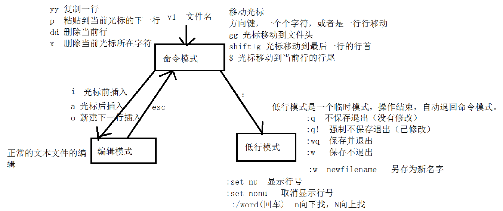

# Linux概述

## 操作系统是一套管理软件和硬件级的平台软件

- 桌面：windows, mac os

- 移动端：ios，Android、鸿蒙

- 服务器：Linux、Unix、Windows Server

- 嵌入式：Linux

## Linux是多任务多用户的网络服务器操作系统

- 大型互联网企业服务器一般都是用Linux。

- 政府，金融民生等领域使用的服务器。

- 嵌入式，制造业，工业领域。

## Linu特点

- 开源，免费，高安全性。高可靠性，高性能。

## Linux版本

- 内核版本，分为开发版和稳定版

- 发行版本，在内核版本上添加界面，文件管理系统，常用软件的Linux版本，有收费和免费的。

  - Red Hat ,主流的收费版本，发行公司叫红帽，由红帽公司提供售后服务和技术支持。

  - CentOS，是基于红帽系统开发的开源，免费版本。

  - Ubuntu，主要给个人用户使用。

## Linux的目录结构

- 所有的目录都起源于一个根目录 /

- /tmp，临时文件存放目录

- /home，普通用户的家目录

- /root，管理员用户的家

- /etc，系统和应用程序所需要的各种配置文件存放的目录

- /mnt，挂在目录，有的系统是media

- /opt， 一般用于安装一些第三方的应用程序

- /var，存放快速增长的文件，比如日志文件

- /bin，二进制文件，存放一些Linux的指令

- /sbin，管理员命令存放的目录

- /boot， 开机启动的一些系统引导文件

- /dev，存放各个硬件设备的目录

- /lib，存放的系统共享库

- /proc，进程相关信息的目录

- /usr，用于存放系统应用程序的目录。

- Linux通常通过ssh、sftp协议远程访问。ssh用于输入命令操作Linux，sftp用于文件传输。支持ssh的工具由xshell，putty等等，支持sftp的工具由xftp，filezilla等等。

## Linux基本命令

### Linux命令格式

- 命令关键字 参数1 参数2  ... 操作对象

- 命令，参数，操作对象名区分大小写。参数可以分开写，也可以合起来写。

### 用户相关操作

#### 新建用户：

`useradd 用户名`  , 给新建用户添加密码：` passwd 用户名`

#### 切换用户： 

`su 用户名 `

- 若省略用户名，则默认表示切换到超级用户。
- 切换用户同时切换至家目录，添加 -l参数，l可以省略，只写

#### 删除用户：

`userdel -r 用户名 `

#### 系统时间命令

- 查看系统时间:` date`

- 修改系统时间：`date -s "时间" `例如： date -s "2026-02-12 14:06:00"

#### 管理软件包

- 搜索软件包: `yum search `软件包名 例如yum search tree

- 安装软件包：`yum install `软件报名。例如yum install tree。-y参数可以避免在安装过程中交互输入y,例如：yum -有install tree

- 查看经安装了哪些软件包：` yum list installed`
- 卸载软件包：`yum remove 软件包名`。例如yum remove tree。-y参数可以避免在卸载过程中交互输入y,例如：yum remove -y tree

#### 查看系统发行版本： 

`cat /etc/*-release`

#### 关机和重启

- `poweroff `立即关机

- 使用shutdown命名配合不同的参数，可以实现关机、重启，定时关机、重启。

  - `shutdown -h now` 代表立即关机。

  - `shutdown -h 10 `代表10分钟后关机。

  - `shutdown -h 20:00:00` 代表晚上8点整关机。

  - 重启将-h换成-r参数即可，例如`shutdown -r 10` 代表10分钟后重启。

  - `shutdown -c `代表取消关机或重启操作。

- 注销命令

  - `exit或ctrl+d`
  - `logout` 当切换到登录用户时才能使用。

### Linux常用快捷操作

- 上下方向键，翻阅命令历史。history命令查看使用过的的命令。

- tab键，用于自动补全名称。

- ctrl+c 终止当前进程

- clear 命令或ctrl+l清屏

### 系统信息和性能相关命令

#### 查看硬盘的使用情况：

` df -Th `

- T参数显示类型，-h参数以易读的方式显示大小

  

- 一般主要关注硬盘的大小，以及已用和未用空间的大小

#### 查看目录占用的空间: 

`du -sh <目录名>1` 

- -s参数，统计目录及其子目录中有所有文件占用的总大小。-h以易读的方式显示。

- 查看内存使用情况：` free -m `, -m参数表示以兆为单位显示内存大小

  

  - 查询结果

    - 行：mem表示实际内存，swap表示交换区

    - 列：total表示总大小,used表示已用大小，free表示空闲大小

    -  可用内存 = free+buff/cache

#### 动态监控系统状态： top

- top命令输出的内容是是动态的，每隔三秒刷新一次，按q或ctrl+c退出。

- 第一行：系统的整体负载情况

  - 当前系统时间

  - 系统连续运行的时间

  - 当前登录的用户数

  - 平均负载load average: 分别显示从当前时间往前1分钟、5分钟、15分钟的平均负载

- 第二行： 进程的具体运行情况

  - total: 一共有多少个进程

  - running: 代表了有几个进程正在运行

  - sleep：表示有多少个进程正在休眠

  - stopped: 表示停止的进程数

  - zombin:  表示僵尸进程

- 第三行：CPU占用情况

  - us(user) 用户CPU使用率
    - 运行普通用户进程（非内核）所占用的CPU百分比。例如，应用程序、脚本等。

  - sy(system)内核CPU使用率
    - Linux系统本身所占用的CPU百分比。

  - ni(nice)低优先级(nice >0)的用户进程的CPU使用率。
    - 被人为降低优先级的任务所消耗的CPU

  - id(idle) CPU空闲时间百分比。

  - wa(iowait) I/O等待时间百分比
    - 处在CPU空闲但是未完成硬盘I/O请求状态的进程占比。

  - hi (hardware interrupts)  硬件中断处理占用的CPU百分比
    - 数值高可能表示硬件频繁打断CPU工作，如网发生络风暴时，网卡触发的高中断请求。

  - si(software interrupts) 软件中断处理占用的CPU百分比
    - si高表示系统正在大量处理软中断，例如Nginx高并发请求场景。

  - st (steal time) 虚拟机“被偷走”的时间的百分比
    - 仅在虚拟机环境中出现，表示虚拟机因宿主机资源竞争而无法获得的时间，st高说明宿主机过载。

- 第四行：mem表示物理内存状态，单位为kb

- 第五行：swap代表交换区的状态，重点关注used字段，如果used字段是一个变换的数字，说明内存不足。

- 第六行开始为进程信息：

  - PID，进程id

  - USER，进程所属用户

  - PR：进程优先级，数字越小，优先级越高。

  - NI是一个nice值，NI=PR-20， 数字越小，优先级越高。

  - VIRT/RES/SHR三列用于描述进程的内存使用情况：

    - VIRT是进程占用的虚拟地址空间的总大小。
      - 它包括映射到物理内存(RAM)、交换区(swap)以及尚未分配的区域。

    - RES常驻物理内存，进程当前实际驻留物理RAM的内存大小。

    - SHR共享内存大小，RES中可被其它进程共享的部分，如共享库(glibc等)。SHR包含在RES中，不是额外内存。

    - 这三列之间的关系： RES 小于等于 VIRT，SHR小于等于RES，RES-SHR约等于 进程独占的物理内存。

  - S表示进程状态

    - s表示休眠

    - r表示正在运行

    - t表示停止

    - z表是僵尸状态

  - %CPU：进程CPU占用百分比

  - %MEM:   进程占用内存百分比

  - TIME+: 进程运行时间，指进程使用CPU时间总计。

  - COMMAND： 进程的名称或命令名。

#### 网络相关命令

- 查看网络配置信息 ifconfig

  

- 测试网络连通性：ping <ip地址或主机名>  

- 查看网络端口: lsof -i  <:端口号>。注意，端口前要加上冒号

  

### 目录和文件相关命令

#### 打印当前目录：

pwd

#### 切换目录: 

cd 相对路径或绝对路径

- 相对路径：相对于当前位置的路径

- 绝对路径：从根目录开始的一个路径

- ..代表上一级目录

- .代表当前目录

- ~代表用户家目录，cd ~ 代表切换到家目录，其中~可以省略。

- cd - 代表返回上一次所在的目录

#### 查看目录内容: ls <路径>

- ls 路径可以是相对路径或绝对路径，省略路径时查看当前目录的内容。

- -l参数，查看详细信息。 ls -l可以简写为ll

- -a参数，查看目录下所有的文件，包含隐藏文件。
  - linux系统以. 开头的文件或目录是隐藏的。

- -h,以易读的方式显示文件详细信息。

- 结果说明

  - 第一列表示文件的类型和权限

    - 第一个字母表示文件的类型

      - d表示目录

      - -表示文件

      - l表示软连接

    - rwxrwxrwx表示权限

      - 前三位表示文件所有者的权限

      - 中间三位表示文件所属组的权限

      - 后三位表示其他人的权限

  - 第二列数字表示硬链接的个数

  - 第三列表示文件所有者

  - 第四列表示文件所有i组

  - 第五列数组表示文件的大小

  - 第六到第八列表示文件最后修改的日期。

  - 最后一列是文件名

#### 创建目录：

mkdir 目录名或路径

- 支持一次性创建多个目录,例如mkdir a b

- 支持一次性创建多级目录，创建多级目录时，一般使用-p参数，例如:mkdir -p a/b/c
  - -p参数，如果创建多级目录的路径中某个上级目录不存在，则自动创建

#### 查找文件或目录 

find

- 通配符：* 匹配0到多个任意字符，?匹配1个字符

- `find 目录名 -name 文件名 -type 类型`
  - 类型：d代表目录，f代表目录，l代表连接
  - `find . -name ?.txt`  查找当前目录及其子目录中，以一个字符开头，且以.txt结尾的所有文件。
  - `find . -name *.txt`  查找当前目录及其子目录中，所有以.txt结尾的所有文件。
  - `find /etc -name firewalld -type d`  查找/etc目录及其子目录中，所有以名为firewalld 的目录。
  - `find /etc -name firewalld -type f`  查找/etc目录及其子目录中，所有以名为firewalld 的文件。

#### 复制文件

- `cp 源文件 目标文件` 拷贝文件

- `cp -r 源目录 目标目录` 拷贝目录，包含子目录

- `cp -r 多个源文件或目录 目标目录`  复制多个文件或目录到目标目录中，如果只拷贝文件，可以省略-r参数。

#### 删除文件 

- `rm 要删除的文件` 删除文件

- `rm -r 要删除的目录 `删除目录
- -f 参数，不需要确认，直接删除。rm -rf 要删除的目录，直接删除目录及其子目录

#### 移动文件

`mv 源 目标`同一个父目录下，会重命名文件或目录，不同父目录下会移动文件或目录。

#### 创建空文件： 

touch 文件名

- touch 不存在的文件，会创建新的空文件；touch 存在的文件，会修改已经存在的文件的最后修改时间。

#### 查看文件

##### head 文件名 

​	默认查看前10行文件，head -5 文件名 查看前5行文件.

##### tail 文件名 

​	默认查看后10行文件

​	拓展：

- `tail -5 文件名` 	查看后5行文件.
- `tail -5f 文件名`        查看文件的后5行，并监控文件更新。

##### cat 文件名 

​	输出文件全部内容

##### less <参数> 文件名 显示文件内容

- 参数： 

  - -i 忽略搜索时的大小写

  - -m 显示百分比

  - -N显示每行的行号

- 命令

  - /字符串 向下搜索"字符串"

  - n 重复之前的一个搜索，N 反向重复之前的搜索。

  - 上、下键，上一行或下一行；PageUp、PageDown上一页或下一页。

  - q退出

##### more 文件名

- 参数： 
  - +n从第n行开始显示。 more +10 文件 表示从第10行开始看

- 命令

  - Enter向下n行。默认n==1

  - 空格键，向下一屏

  - Ctrl+b，向上一屏

  - =输出当前行的行号

  - q退出

- more与less对比

  - less可以按键盘上下方向将显示以上内容，more不能，但是可以通过ctrl+b返回上一页。

  - less 不必读整个文件，加载速度会更快。

  - less退出后不会留下刚显示的内容，more会。

##### vi、vim文本编辑

- vi编辑器是Linux系统自带的命令行编辑器，vim是vi的增强版本某些系统上需要安装，vi和vim的操作方式相同，vim兼容vi的命令。

- vi编辑器三种工作模式

  

- 命令模式

  - vi编辑器刚进去就是这种模式，这种模式可以输入命令进行操作

  - 在命令模式下，按i、a、o键可以进入编辑模式

    - 按i键，在光标签插入

    - 按a键，在光标后插入

    - 按o键，在光标后重新插入一行

  - 在命令模式下，按:可以进入低行模式

  - 在编辑模式或低行模式下，可以按Esc键返回命名模式

  - 使用 $ 符号将光标跳转至当前行尾部

  - 使用G(shift+g)使光标跳转到最后一行行首

  - 使用gg使光标跳转至首行行首

  - 使用0将光标跳转至当前行行首

  - 使用x删除光标所在处字符

  - 使用dd可以删除光标所在的整行

  - 使用yy复制一行，使用P粘贴一行

  - 使用u回退当前操作

- 编辑模式

  - 可以进行编辑工作

  - 按Esc退出编辑模式，返回命令模式

- 低行模式

  - 在低行模式下可以输入命令完成一些操i做

  - 保存并退出

    - w写入

    - q 退出

    - !强制

  - n使光标跳转的指定的行

  - m,nd表示删除m到n行的所有内容，若只写m表示只删除m行。

  - /关键字检索, n向下搜，N向上搜。

  - set ic忽略大小写,set noic关闭忽略大小写。

  - set nu显示行号，set nonu关闭显示行号。

  - m,ns/旧字符串/新字符串/g表示将m到n行的旧内容全部替换为新内容。

    - g表示全部替换，若无g表示替换一个

    - 若n为$表示替换到最后一行。

    - 若要替换所有行可以使用%替代1,$

### 权限管理命令 

`chmod [对象 操作项 权限] 文件名` 

- 对象

  - u表示文件所属者

  - g表示文件所属组

  - o表示文件其他人

  - a表示所有人

- 操作项

  - +附加权限

  - -去除权限

  - =让权限等于

- 权限

  - 可读 r
  - 可写 w
  - 可执行 x

- 使用数字模式来修改权限

  - 使用0到7的数字代表权限，4表示可读（r），2表示可写（w），1表示可执行（x），0表示没有权限。

  - 5=4+1表示可读可执行

  - 6=4+2表示可读可写

  - 7=4+2+1表示可读可写可执行

  - chmod 777 文件名表示文件权限变为所有人可读，可写可执行。

### 打包、解包，压缩，解压命令

#### 压缩与解压

1. `gzip 文件名`压缩文件，压缩文件默认后置为.gz；gzip -d 文件名 解压文件。

2. `bzip2 文件名`压缩文件，压缩文件默认后置为.bz2bzip2 -d 文件名 解压文件。

3. tar带压缩格式的打包和拆包

   参数：

   - -c新建打包文件

   - -x拆包

   - -z使用gzip压缩或解压

   - -j使用bzip2压缩或解压

   - -v打印出打包或者拆包的过程

   - -f被处理的文件

   - tar czvf 打包后的文件名 多个要打包的文件或者文件夹 打包多个文件或文件夹，并使用gzip压缩

   - -C切换工作目录。tar xzvf log.tar.gz -C 解压目录。不使用-C参数时，解压到默认目录，使用时解压到指定目录。

   - -P使用绝对路径,tar czvf 打包后的文件名 -P 多个要打包的文件或者文件夹
     - 使用-P参数后，压缩绝对路径不告警

### 重定向和管道符

- 重定向可以将Linux命令的输出结果输出到文件中而不是打印在屏幕上

  - `>` 输出到指定文件，文件不存在时会创建新文件，存在时会覆盖文件。

  - `>>` 输出到指定文件，追加到文件末尾。

  - `2>&1`  表示重定向正常和错误信息到文件中，放在命令最后。

  - `/dev/null` 重定向到空设备，表示不输出任何结果。

- 管道符 |,将前一个命令的输出作为后一个命令的输入。例如ls -l | grep fire,在ls的输出中过滤出包含fire的行。

### 进程管理相关命令

#### ps查看进程状态

- -e显示所有进程，包括各个用户进程；不带参数默认显示当前终端的进程。

- -f更为完整详细的输入进程相关内容。

- 输出：

  - UID:  用户

  - PID：进程ID

  - PPID: 父进程ID

  - C: 表示CPU占用率

  - STIME: 开始时间

  - TTY：进程对应的终端

- ps 经常和管道符、grep联合使用。例如 ps -eaf | grep sleep 用于从所有进程信息中，过滤出sleep进程相关的信息。

#### kill 进程ID终止进程

- -9参数强制终止进程

#### Linux三剑客

- 简介

  - grep、sed、awk是社区广泛认可的"Linux 三剑客"，这三者配合管道使用，可以实现灵活的数据提取，日志分析和文本自动化处理，是Linux系统管理和运维的核心共组。

  - grep：用于搜索文本，支持正则表达式，可以快速过滤出包含特定模式的行。

  - sed: 用于流式编辑文本，常用于替换、删除、插入等批量文本修改。

  - awk:用于结构化文本处理，擅长按列处理和生成报告。

##### grep命令详解

- 格式：grep 关键字 文件名 代表了在文件中查找关键字

- 参数

  - `-i`忽略大小写

  - `-n`显示行号

  - `-v`显示不匹配的

- grep常用正则表达式

  - `^`匹配行首，`grep ^a`匹配以“a”开头的行。

  - `$`匹配行尾，`grep a$` 匹配以“a”结尾的行。

  - `.`匹配任意单个字符，`grep a.c` 匹配abc,adc,a2c等等。

  - `*`匹配任意0到多个\*前的字符，`grep a*c` 匹配aac,aaaaaac,axxxxxc等等。

  - `[]`匹配字符集合，`grep [aeiou]` 匹配包含任意元音字母的。

##### sed命令详解

- 格式： sed [参数][动作] 文件名

- 参数：

  - -e 可以指定多个命令
    - sed -e '2a World' -e '3,4d' s.txt  在第二行后增加一行，并删除3，4行的内容。

  - -n取消默认控制台输出，

  - -ised默认不修改原文件，除非使用-i参数

- 动作

  - a新增

    - sed '2a Hello' s.txt 在第2行后新增一行内容

    - sed '1,3a Hello' s.txt 在第1行到第3行后各新增一行内容

    - sed '$a Hello' s.txt 在最后一行后增一行内容

  - d删除
    - sed '1,3d ' s.txt 删除第1到3行

  - c替换整行

    - sed '2c Hello' s.txt替换第2行整行的内容

    - sed '1,2c Hello' s.txt 讲第1~2行的内容替换为指定的内容

  - i插入

    - sed '2i Hello' s.txt 在第2行前新增一行内容

    - sed '1,3i Hello' s.txt 在第1行到第3行前各新增一行内容

    - sed '$i Hello' s.txt 在最后一行前增一行内容

  - p打印，经常和-n参数连用打印指定内容。

    - sed '2p' s.txt重复打印第2行

    - sed -n'2p' s.txt只打印第2行

  - s替换关键字

    - sed 's/old/new/' s.txt 匹配每一个行的第一个old替换为new 

    - sed 's/old/new/gi' s.txt 匹配每一个行的所有old替换为new 。g代表替换全部，i代表忽略大小写

##### awk命令详解

- awk 逐行读取输入，默认空白字符作为字段分割符，将每行分割为多个字段，并允许对这些字段进行处理并可选择性的输出结果。

- 语法:awk [选项] ‘条件[编辑指令]’ 文件

- 选项-F分隔符 分隔符默认为空格，可以使用-F指定分隔符
  - -F[分隔符1分隔符2]使用多个分隔符

- 编辑指令

  - {print $大于0的数字}输出某一个列，{print $0}输出整行

  - {print NR}行号，

  - {print NF}字段个数，{print $NF}输出最后一列

- 条件

  - 行操作

    - 取一行：NR表示行号，例如awk 'NR==2''{print $1,$NF}' test.txt 取第二行的第一列和最后一列。

    - 取多行：awk 'NR>=2&&NR<=4''{print $1,$NF}' test.txt 取第二行的第一列和最后一列。

    - 过滤：awk '/5a/''{print $1,$NF}' test.txt 取包含5a的行的第一列和最后一列。

  - - BEGIN和END

      - BEGIN：在awk读取任何输入行之前执行指定的的编辑指令

      - END：在awk读取所有输入行之后执行指定的的编辑指令

      - 示例：awk 'BEGIN {print "BEGIN","BEGIN"} {print $1,$NF} END {print "END","END"} ' test.txt