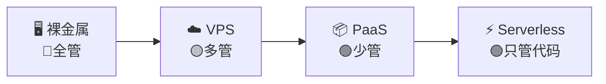
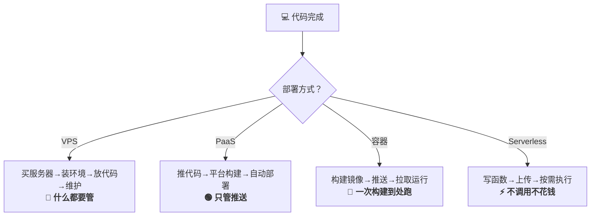

# 网站部署完整流程

> 从代码编写完成到上线可用，部署是最后也是最关键的一步。本文涵盖常见的部署方式与完整流程。

---

## 一、部署前的准备工作

### 1. 代码准备
- [ ] 代码已合并到主分支（`main` / `master`）
- [ ] 删除 `.env`、`application.yml` 等敏感配置（或确保在 `.gitignore` 中）
- [ ] 确保 `package.json` / `pom.xml` 等构建配置正确
- [ ] 本地构建测试通过

### 2. 环境准备
- [ ] 购买服务器 / 域名
- [ ] 服务器 SSH 登录配置
- [ ] 安装必要软件（Node.js / Java / Nginx / Docker 等）
- [ ] 配置防火墙（开放 80、443 等端口）
- [ ] 域名 DNS 解析到服务器 IP

### 3. 数据库准备（后端项目）
- [ ] 数据库服务已安装运行
- [ ] 创建数据库和用户
- [ ] 执行初始化 SQL / 迁移脚本

---

## 二、部署的本质差异：到底部署到哪里？

### 💡 核心认知

> 所有部署**最终都是运行在服务器上**的。区别不在于"有没有服务器"，而在于：
> - **谁管理服务器**（你 vs 平台）？
> - **代码以什么形式运行**（静态文件 vs 进程 vs 容器）？
> - **资源如何分配**（固定 vs 弹性）？

### 部署方式分层对比

从"自己管服务器"到"只管写代码"，部署方式形成一个光谱：



### 四种部署范式的本质区别

|     | 维度        | 🖥️ 自建服务器 / VPS      | ☁️ PaaS 平台            | 🐳 容器化部署               | ⚡ Serverless                  |
| --- | --------- | -------------------- | --------------------- | ---------------------- | ----------------------------- |
|     | **本质**    | 你自己有一台(或几台)机器，在上面跑程序 | 你只管交代码，平台帮你跑          | 你把应用和依赖打包成镜像，到哪都能跑     | 你只写函数，平台按需执行                  |
|     | **服务器管理** | 你全权负责（SSH、更新、安全）     | 平台负责，你无需接触服务器         | 你管理容器引擎，宿主机平台管         | 你完全不需要知道服务器在哪                 |
|     | **代码形态**  | 源码直接运行 / 编译后运行       | 源码推送，平台自动构建           | Docker 镜像（包含 OS、依赖、应用） | 单个函数 / 模块                     |
|     | **扩缩容**   | 手动（加机器 / 改配置）        | 自动（平台根据流量）            | 手动或自动（编排工具）            | 自动（毫秒级弹性）                     |
|     | **计费方式**  | 按月/按年固定费用            | 按资源使用量                | 按服务器资源                 | 按调用次数 + 执行时间                  |
|     | **冷启动**   | 无（进程常驻）              | 部分平台有                 | 无（容器常驻）                | 有（不活跃时休眠）                     |
|     | **典型代表**  | 阿里云 ECS、搬瓦工          | Vercel、Railway、Heroku | Docker Compose、K8s     | AWS Lambda、Cloudflare Workers |
|     | **运维成本**  | 🔴 高                 | 🟢 低                  | 🟡 中                   | 🟢 低                          |
|     | **灵活度**   | 🟢 最高                | 🔴 最低                 | 🟡 中                   | 🔴 受平台限制                      |
|     | **适合项目**  | 复杂业务、定制环境            | 前端、全栈快速原型             | 微服务、统一环境               | 轻量 API、事件任务                   |

### 一张图看懂：部署的本质



### 📌 常见误区澄清

|     | 误区                 | 正解                                               |
| --- | ------------------ | ------------------------------------------------ |
|     | "Vercel 部署不需要服务器"  | Vercel 底层**也是服务器**（AWS Lambda + 全球 CDN），只是你不用自己管 |
|     | "Docker 不是部署到服务器"  | Docker 是**打包方式**，最终还是要跑在服务器上（或容器平台）              |
|     | "Serverless 没有服务器" | Serverless = **你不用管服务器**，但代码仍在别人的服务器上运行          |
|     | "上云就是上服务器"         | 阿里云 ECS 是服务器，但阿里云函数计算是 Serverless，两者完全不同         |

---

## 三、部署方式分类

|     | 类型             | 适用场景          | 本质                   | 典型方案                                    |
| --- | -------------- | ------------- | -------------------- | --------------------------------------- |
|     | **静态网站**       | 纯前端、无后端       | 纯静态文件托管，无需运行环境       | Vercel / Netlify / GitHub Pages / Nginx |
|     | **单页应用 + API** | 前后端分离         | 前端托管 + 后端进程，各自部署     | 前端 CDN，后端 VPS / 云服务器               |
|     | **全栈应用**       | SSR / 传统服务端渲染 | 需要 Node.js 运行时持续运行   | Vercel / Railway / 云服务器 PM2          |
|     | **容器化部署**      | 微服务 / 复杂应用    | 应用 + 环境打包为镜像，标准化运行  | Docker + Docker Compose                 |
|     | **Kubernetes** | 大规模集群         | 容器编排，自动调度、扩缩容、自愈    | K8s + Helm                              |

---

## 四、常见部署方案详解

### 方案 1：前端静态部署到 Vercel（推荐）

适用于：**Next.js / React / Vue 等前端项目**

```
1. 推送代码到 GitHub
2. 登录 [Vercel](https://vercel.com) → New Project
3. 导入 GitHub 仓库
4. Vercel 自动检测框架（Next.js / React / Vue）
5. 配置环境变量（如有）
6. 点击 Deploy → 自动构建部署
7. 绑定自定义域名（Settings → Domains）
```

**特点**：零配置、自动 HTTPS、自动 CI/CD、免费额度充足。

---

### 方案 2：前端静态部署到 Nginx

适用于：**自有服务器 / VPS**

```bash
# 1. 构建前端项目
npm run build           # 生成 dist/ 或 build/ 目录

# 2. 将构建产物上传到服务器
scp -r ./dist root@your-server:/var/www/myapp/

# 3. 配置 Nginx（/etc/nginx/sites-available/myapp）
```

**Nginx 配置示例**：

```nginx
server {
    listen 80;
    server_name your-domain.com;
    
    root /var/www/myapp/dist;
    index index.html;

    # 处理 SPA 路由（关键！）
    location / {
        try_files $uri $uri/ /index.html;
    }

    # 静态资源缓存
    location ~* \.(js|css|png|jpg|jpeg|gif|ico|svg)$ {
        expires 1y;
        add_header Cache-Control "public, immutable";
    }

    # 开启 Gzip 压缩
    gzip on;
    gzip_types text/plain text/css application/json application/javascript;
}
```

```bash
# 4. 启用站点并重启
sudo ln -s /etc/nginx/sites-available/myapp /etc/nginx/sites-enabled/
sudo nginx -t          # 测试配置
sudo systemctl reload nginx

# 5. 配置 HTTPS（SSL 证书）
sudo apt install certbot python3-certbot-nginx
sudo certbot --nginx -d your-domain.com
```

---

### 方案 3：后端部署（Node.js / Express / NestJS）

```bash
# 1. 服务器环境准备
curl -fsSL https://deb.nodesource.com/setup_20.x | sudo -E bash -
sudo apt install -y nodejs git

# 2. 拉取代码并安装依赖
git clone https://github.com/your/repo.git /opt/myapp
cd /opt/myapp
npm install --production

# 3. 配置环境变量
cp .env.example .env
vi .env   # 编辑配置（数据库连接、JWT 密钥等）

# 4. 使用 PM2 进程管理（推荐）
npm install -g pm2
pm2 start npm --name "myapp" -- start
pm2 save
pm2 startup   # 设置开机自启

# 5. 配置反向代理（Nginx）
```

**Nginx 反向代理配置**：

```nginx
server {
    listen 80;
    server_name api.your-domain.com;

    location / {
        proxy_pass http://127.0.0.1:3000;
        proxy_http_version 1.1;
        proxy_set_header Upgrade $http_upgrade;
        proxy_set_header Connection 'upgrade';
        proxy_set_header Host $host;
        proxy_set_header X-Real-IP $remote_addr;
        proxy_set_header X-Forwarded-For $proxy_add_x_forwarded_for;
        proxy_set_header X-Forwarded-Proto $scheme;
        proxy_cache_bypass $http_upgrade;
    }
}
```

**PM2 常用命令**：

```bash
pm2 list                    # 查看所有进程
pm2 logs                    # 查看日志
pm2 restart myapp           # 重启
pm2 stop myapp              # 停止
pm2 monit                   # 监控面板
pm2 flush                   # 清空日志
```

---

### 方案 4：后端部署（Java / Spring Boot）

```bash
# 1. 安装 Java 运行环境
sudo apt update
sudo apt install openjdk-17-jdk -y

# 2. 构建项目（本地或 CI）
mvn clean package -DskipTests
# 或使用 Gradle: ./gradlew bootJar

# 3. 上传 jar 包到服务器
scp target/myapp-0.0.1.jar root@your-server:/opt/myapp/

# 4. 启动（使用 systemd 管理）
```

**Systemd 服务配置**（`/etc/systemd/system/myapp.service`）：

```ini
[Unit]
Description=My Spring Boot Application
After=network.target

[Service]
Type=simple
User=ubuntu
WorkingDirectory=/opt/myapp
ExecStart=/usr/bin/java -jar /opt/myapp/myapp-0.0.1.jar --spring.profiles.active=prod
Restart=on-failure
RestartSec=10

[Install]
WantedBy=multi-user.target
```

```bash
sudo systemctl daemon-reload
sudo systemctl enable myapp
sudo systemctl start myapp
sudo systemctl status myapp
```

---

### 方案 5：Docker 部署（推荐）

适用于：**统一环境、前后端一起部署**

**Dockerfile 示例（前端）**：

```dockerfile
# 构建阶段
FROM node:20-alpine AS builder
WORKDIR /app
COPY package*.json ./
RUN npm ci
COPY . .
RUN npm run build

# 运行阶段
FROM nginx:alpine
COPY --from=builder /app/dist /usr/share/nginx/html
COPY nginx.conf /etc/nginx/conf.d/default.conf
EXPOSE 80
CMD ["nginx", "-g", "daemon off;"]
```

**Dockerfile 示例（后端 - Spring Boot）**：

```dockerfile
FROM openjdk:17-slim
WORKDIR /app
COPY target/myapp-*.jar app.jar
EXPOSE 8080
ENTRYPOINT ["java", "-jar", "app.jar", "--spring.profiles.active=prod"]
```

**Dockerfile 示例（后端 - Node.js）**：

```dockerfile
FROM node:20-alpine
WORKDIR /app
COPY package*.json ./
RUN npm ci --production
COPY . .
EXPOSE 3000
CMD ["node", "dist/main.js"]
```

**docker-compose.yml（前后端 + 数据库）**：

```yaml
version: '3.8'

services:
  postgres:
    image: postgres:15
    environment:
      POSTGRES_DB: myapp
      POSTGRES_USER: myapp
      POSTGRES_PASSWORD: ${DB_PASSWORD}
    volumes:
      - postgres_data:/var/lib/postgresql/data
    restart: always

  redis:
    image: redis:7-alpine
    restart: always

  backend:
    build: ./backend
    ports:
      - "8080:8080"
    environment:
      SPRING_PROFILES_ACTIVE: prod
      DB_URL: jdbc:postgresql://postgres:5432/myapp
      DB_USERNAME: myapp
      DB_PASSWORD: ${DB_PASSWORD}
      REDIS_HOST: redis
    depends_on:
      - postgres
      - redis
    restart: always

  frontend:
    build: ./frontend
    ports:
      - "80:80"
    depends_on:
      - backend
    restart: always

volumes:
  postgres_data:
```

```bash
# 部署命令
docker-compose up -d                    # 启动所有服务
docker-compose down                     # 停止
docker-compose logs -f                  # 查看日志
docker-compose pull                     # 更新镜像
docker-compose up -d --build            # 重新构建并启动
```

---

### 方案 6：CI/CD 自动化部署

#### GitHub Actions 示例

**前端自动部署到 Vercel**：

```yaml
# .github/workflows/deploy-frontend.yml
name: Deploy Frontend

on:
  push:
    branches: [main]
    paths:
      - 'frontend/**'

jobs:
  deploy:
    runs-on: ubuntu-latest
    steps:
      - uses: actions/checkout@v4
      
      - name: Setup Node.js
        uses: actions/setup-node@v4
        with:
          node-version: 20
          
      - name: Install & Build
        run: |
          cd frontend
          npm ci
          npm run build
          
      - name: Deploy to Vercel
        uses: amondnet/vercel-action@v25
        with:
          vercel-token: ${{ secrets.VERCEL_TOKEN }}
          vercel-org-id: ${{ secrets.VERCEL_ORG_ID }}
          vercel-project-id: ${{ secrets.VERCEL_PROJECT_ID }}
          vercel-args: '--prod'
```

**后端自动部署到服务器（SSH）**：

```yaml
# .github/workflows/deploy-backend.yml
name: Deploy Backend

on:
  push:
    branches: [main]
    paths:
      - 'backend/**'

jobs:
  deploy:
    runs-on: ubuntu-latest
    steps:
      - uses: actions/checkout@v4
      
      - name: Setup Java
        uses: actions/setup-java@v4
        with:
          java-version: 17
          distribution: 'temurin'
          
      - name: Build with Maven
        run: |
          cd backend
          mvn clean package -DskipTests
          
      - name: Deploy via SSH
        uses: appleboy/scp-action@v0.1.7
        with:
          host: ${{ secrets.SERVER_HOST }}
          username: ${{ secrets.SERVER_USER }}
          key: ${{ secrets.SSH_PRIVATE_KEY }}
          source: "backend/target/*.jar"
          target: "/opt/myapp/"
          strip_components: 2
          
      - name: Restart Service
        uses: appleboy/ssh-action@v1.0.3
        with:
          host: ${{ secrets.SERVER_HOST }}
          username: ${{ secrets.SERVER_USER }}
          key: ${{ secrets.SSH_PRIVATE_KEY }}
          script: |
            cd /opt/myapp
            sudo systemctl restart myapp
```

#### Docker + GitHub Actions 推送到容器仓库

```yaml
name: Build & Push Docker Image

on:
  push:
    branches: [main]

jobs:
  docker:
    runs-on: ubuntu-latest
    steps:
      - uses: actions/checkout@v4
      
      - name: Login to Docker Hub
        uses: docker/login-action@v3
        with:
          username: ${{ secrets.DOCKER_USERNAME }}
          password: ${{ secrets.DOCKER_PASSWORD }}
          
      - name: Build and Push
        uses: docker/build-push-action@v5
        with:
          context: .
          push: true
          tags: |
            yourusername/myapp:latest
            yourusername/myapp:${{ github.sha }}
```

然后在服务器上拉取新镜像重启：

```bash
docker pull yourusername/myapp:latest
docker-compose up -d --build
```

---

## 六、部署后检查清单

### 基础检查
- [ ] 网站能否通过域名正常访问（HTTP / HTTPS）
- [ ] API 接口是否正常返回数据
- [ ] 页面加载速度是否正常（使用 Lighthouse 测试）
- [ ] 移动端适配是否正常
- [ ] 控制台有无报错信息

### 安全检查
- [ ] HTTPS 已配置（SSL 证书有效）
- [ ] 敏感环境变量未泄露
- [ ] CORS 配置正确
- [ ] 数据库端口未对外开放（仅内网访问）
- [ ] SSH 禁用密码登录（使用密钥登录）

### 运维检查
- [ ] 日志是否正确记录（访问日志 / 错误日志）
- [ ] PM2 / Systemd 设置了开机自启
- [ ] 服务器监控已配置（CPU / 内存 / 磁盘）
- [ ] 数据库定期备份已设置
- [ ] 域名续费提醒已开启

---

## 七、常见问题与解决方案

|     | 问题                  | 原因              | 解决                                          |
| --- | ------------------- | --------------- | ------------------------------------------- |
|     | 502 Bad Gateway     | Nginx 无法连接到后端服务 | 检查后端是否启动，端口是否正确                             |
|     | 404 Not Found       | 路由配置错误          | SPA 需要配置 `try_files $uri $uri/ /index.html` |
|     | CORS 错误             | 跨域请求被拦截         | 后端配置 CORS 中间件                               |
|     | WebSocket 连接失败      | Nginx 未正确代理     | 添加 `proxy_set_header Upgrade` 等配置           |
|     | 504 Gateway Timeout | 请求超时            | 调大 `proxy_read_timeout`                     |
|     | 端口被占用               | 服务端口冲突          | 修改端口或 `kill` 占用进程                           |
|     | 磁盘空间不足              | 日志未清理           | 配置 `logrotate` 自动轮转日志                       |

---

## 八、推荐部署平台总览

|     | 平台                                       | 类型              | 适合                | 价格          |
| --- | ---------------------------------------- | --------------- | ----------------- | ----------- |
|     | [Vercel](https://vercel.com)             | 前端 / Serverless | Next.js、React、Vue | 免费套餐充足      |
|     | [Netlify](https://netlify.com)           | 前端 / Serverless | 静态网站、SPA          | 免费套餐充足      |
|     | [Railway](https://railway.app)           | 全栈              | 小型全栈应用            | 按量计费（有免费额度） |
|     | [Fly.io](https://fly.io)                 | 容器              | Docker 应用         | 按量计费        |
|     | [AWS](https://aws.amazon.com)            | 云平台             | 企业级应用             | 按量计费        |
|     | [阿里云](https://aliyun.com)                | 云平台             | 国内应用              | 按量计费        |
|     | [腾讯云](https://cloud.tencent.com)         | 云平台             | 国内应用              | 按量计费        |
|     | [VPS（搬瓦工/OVH等）](https://www.vultr.com)   | 虚拟服务器           | 自定义部署             | $5-20/月     |
|     | [GitHub Pages](https://pages.github.com) | 静态托管            | 个人项目 / 文档站        | 免费          |

---

## 九、完整部署流程总结图

```
代码推送 → CI/CD 触发 → 代码检测（Lint/Test）
         ↓
      构建（Build）
         ↓
      镜像/制品打包
         ↓
      推送至仓库
         ↓
      部署至服务器
         ↓
      健康检查
         ↓
      ✅ 上线完成
```

> **推荐学习顺序**：
> 1. 先用 Vercel / Netlify 部署前端（最简单）
> 2. 用 VPS + PM2 部署后端（理解传统部署）
> 3. 用 Docker + Compose 统一部署（容器化）
> 4. 用 GitHub Actions 实现自动化（CI/CD）
> 5. 进阶学习 Kubernetes（K8s）编排
