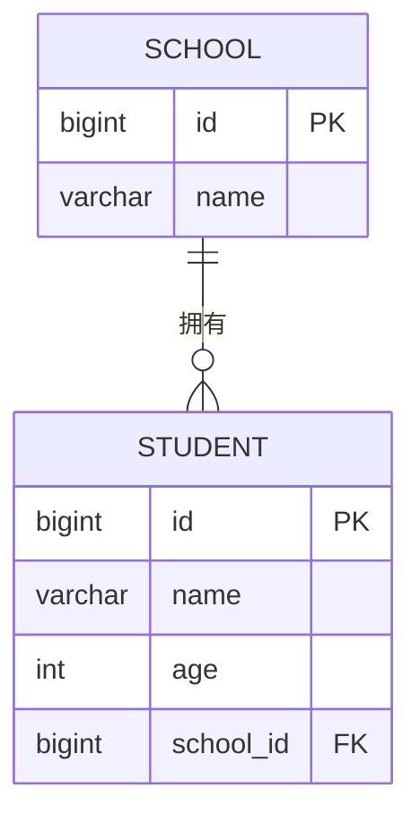
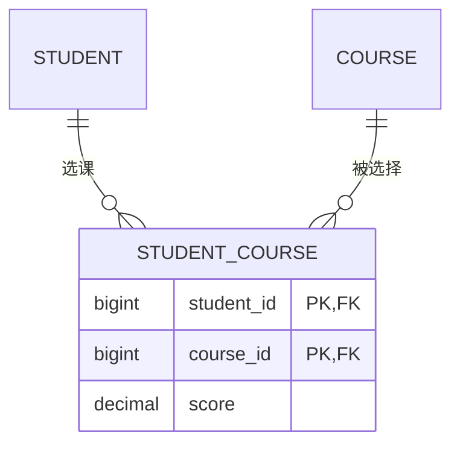
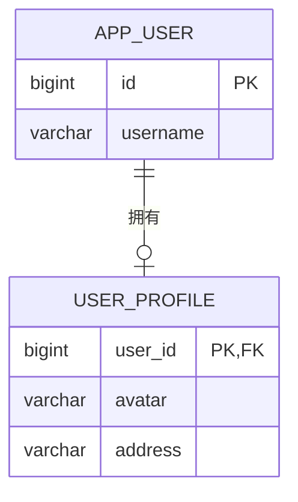

---
tags:
  - mysql
  - 数据库
  - mybatis-plus
  - 笔记
aliases:
  - MySQL
  - 数据库学习
updated: 2026-10-10
---

# 📑 目录

- [[#Part 1：MySQL 基础|Part 1：MySQL 基础]]
  - [[#1. 数据类型|1. 数据类型]]
  - [[#2. DDL（数据定义语言）|2. DDL]]
  - [[#3. DML（数据操作语言）|3. DML]]
  - [[#4. DQL（数据查询语言）（重点）|4. DQL（重点）]]
  - [[#5. 表设计原则（三范式）|5. 表设计原则]]
- [[#Part 2：MySQL 进阶（开发必备）|Part 2：MySQL 进阶（开发必备）]]
  - [[#6. 视图（View）|6. 视图]]
  - [[#7. 索引（Index）|7. 索引]]
  - [[#8. 事务（Transaction）（面试高频）|8. 事务]]
  - [[#9. 锁机制|9. 锁机制]]
  - [[#10. SQL 性能优化（实战重点）|10. SQL 性能优化]]
  - [[#11. 常用函数与语法|11. 常用函数]]
- [[#Part 3：MyBatis-Plus（开发实战）|Part 3：MyBatis-Plus]]
  - [[#12. 快速开始|12. 快速开始]]
  - [[#13. CRUD 接口|13. CRUD 接口]]
  - [[#14. 条件构造器 Wrapper（重点）|14. 条件构造器（重点）]]
  - [[#15. 分页插件|15. 分页插件]]
  - [[#16. 自动填充|16. 自动填充]]
  - [[#17. 逻辑删除|17. 逻辑删除]]
  - [[#18. 乐观锁|18. 乐观锁]]
  - [[#19. 代码生成器|19. 代码生成器]]
  - [[#20. 多数据源|20. 多数据源]]
  - [[#21. MyBatis-Plus 高级技巧（面试/实战）|21. 高级技巧]]

---

# Part 1：MySQL 基础

> 如果你是刚开始学 MySQL，这部分帮你快速入门。如果已熟悉，可以直接跳到 Part 2 进阶内容。

# 1. 数据类型

## 1.1 整数类型

| | 类型 | 存储字节 | 范围（有符号） | 常用场景 |
| :-: | :---: | :---: | :---: | :--- |
| | `TINYINT` | 1 | -128 ~ 127 | 状态码、boolean（0/1） |
| | `SMALLINT` | 2 | -32768 ~ 32767 | 枚举值、小范围统计 |
| | `INT` | 4 | -21 亿 ~ 21 亿 | **主键、常规数字** |
| | `BIGINT` | 8 | ±922 亿亿 | 雪花 ID、大数据量主键 |

> **开发建议**：主键用 `BIGINT` 或 `INT UNSIGNED`。状态字段用 `TINYINT`（0/1）。

## 1.2 小数类型（定点数与浮点数）

| | 类型 | 存储字节 | 特点 | 常用场景 |
| :-: | :---: | :---: | :--- | :--- |
| | `FLOAT` | 4 | 单精度浮点数，约 7 位十进制有效数字 | 精度要求不高的测量数据 |
| | `DOUBLE` | 8 | 双精度浮点数，约 15 位十进制有效数字 | 科学计算、统计分析 |
| | `DECIMAL(M, D)` | 按 M、D 决定；`DECIMAL(10, 2)` 为 5 字节 | 定点数，十进制精确存储 | 金额、价格、税率 |

```sql
DECIMAL(10, 2)   -- 最多 10 位数，其中 2 位小数，如 12345678.90
FLOAT            -- 单精度近似值
DOUBLE           -- 双精度近似值
```

> [!warning] 精度注意
> - `FLOAT` 和 `DOUBLE` 是近似值，不适合存储金额，也不应直接使用 `=` 判断小数是否完全相等。
> - 金额字段使用 `DECIMAL`，例如 `DECIMAL(10, 2)`。
> - `FLOAT(M, D)` 和 `DOUBLE(M, D)` 是 MySQL 非标准且已废弃的写法，新代码直接使用 `FLOAT` 或 `DOUBLE`。

```sql
-- 浮点数比较应使用允许误差，不要直接判断相等
SELECT * FROM sensor_data
WHERE ABS(measure_value - 0.3) < 0.000001;
```

## 1.3 字符串类型

| | 类型 | 存储字节 | 最大长度 | 开发建议 |
| :-: | :---: | :--- | :---: | :--- |
| | `VARCHAR(n)` | `L + 1` 或 `L + 2` | `n` 表示字符数；实际受单行 65,535 字节上限约束 | **最常用**，按实际内容占用空间 |
| | `CHAR(n)` | 通常为 `n × w` | 255 字符 | 适合长度固定的值 |
| | `TEXT` | `L + 2` | 65,535 字节（不是字符数） | 文章正文等长文本 |
| | `LONGTEXT` | `L + 4` | 4,294,967,295 字节（约 4 GB） | 极长文本 |

> [!note] 字符串存储公式
> `L` 是实际内容的字节数，`w` 是字符集中单个字符的最大字节数。`utf8mb4` 每个字符占 1~4 字节，因此字符数不等于字节数。
> `VARCHAR` 的 1/2 字节是长度前缀：列最大长度不超过 255 字节时用 1 字节，否则用 2 字节。
> 例如：`VARCHAR(100)` 最多存 100 个字符；在 `utf8mb4` 下内容最多可占 400 字节。`TEXT` 最多是 65,535 字节；若全部是 4 字节字符，最多约 16,383 个字符。

> ==**VARCHAR vs CHAR 选择**：字段长度变化小用 CHAR（如性别、状态码），变化大用 VARCHAR（如用户名、地址）。==

## 1.4 日期时间类型

| | 类型 | 存储字节 | 格式 | 范围 | 开发建议 |
| :-: | :---: | :---: | :--- | :--- | :--- |
| | `DATETIME` | 5 + 小数秒 0~3 | YYYY-MM-DD HH:MM:SS | 1000-01-01 ~ 9999-12-31 | 业务时间常用 |
| | `TIMESTAMP` | 4 + 小数秒 0~3 | YYYY-MM-DD HH:MM:SS | 1970 ~ 2038 | 受时区影响，注意 2038 问题 |
| | `DATE` | 3 | YYYY-MM-DD | 1000-01-01 ~ 9999-12-31 | 只存日期 |
| | `TIME` | 3 + 小数秒 0~3 | HH:MM:SS | -838:59:59 ~ 838:59:59 | 时间或时长 |

> [!note] 小数秒的额外存储
> `FSP` 为 0 时不增加字节；1~2 位小数秒增加 1 字节，3~4 位增加 2 字节，5~6 位增加 3 字节。

> ==**开发建议**：`DATETIME` 比 `TIMESTAMP` 范围更大，推荐所有时间字段都用 `DATETIME`。==

## 1.5 其他常用类型

|     |        类型         |      存储字节       | 说明                                        |
| :-: | :---------------: | :-------------: | :---------------------------------------- |
|     |      `JSON`       | 可变，取决于内容和二进制元数据 | MySQL 5.7+，使用内部二进制格式；格式介绍见 [[数据交换格式]]                      |
|     |      `ENUM`       |      1 或 2      | 单选：最多 255 个枚举值时占 1 字节，256~65,535 个时占 2 字节 |
|     |       `SET`       |   1、2、3、4 或 8   | 多选：最多 64 个成员，按位集合存储                       |
|     |   `TINYINT(1)`    |        1        | `(1)` 不代表 1 bit，常用作 0/1 布尔值               |
|     | `BIGINT UNSIGNED` |        8        | 非负大整数，常用作主键                               |

```sql
-- ENUM：只能选择一个值
`status` ENUM('draft', 'published', 'archived')

-- SET：可以同时选择多个值
`permissions` SET('read', 'write', 'delete')
```

> [!tip] `ENUM` 与 `SET` 的选择
> - 单选使用 `ENUM`，多选使用 `SET`。
> - 只适合取值少且长期稳定的字段。频繁增删选项需要修改表结构，此时应改用字典表或关联表。
> - 不要在 `ENUM` 中定义看起来像数字的字符串，容易与内部序号混淆。
> - ENUM可以重复，而SET不可以


# 2. DDL（数据定义语言）

## 2.1 数据库操作

```sql
CREATE DATABASE `db_name` DEFAULT CHARSET utf8mb4 COLLATE utf8mb4_unicode_ci;
DROP DATABASE `db_name`;
USE `db_name`;
```

> ==**MySQL 8.0 之后，建库建表统一用 `utf8mb4`**（真正的 UTF-8，支持 emoji），不要再用 `utf8`（MySQL 的 utf8 最多 3 字节）。==

## 2.2 创建表（开发标准模板）

```sql
CREATE TABLE `user` (
    `id`         BIGINT UNSIGNED NOT NULL AUTO_INCREMENT COMMENT '主键',
    `username`   VARCHAR(50)     NOT NULL COMMENT '用户名',
    `password`   VARCHAR(255)    NOT NULL COMMENT '密码（加密后）',
    `email`      VARCHAR(100)    DEFAULT NULL COMMENT '邮箱',
    `phone`      VARCHAR(20)     DEFAULT NULL COMMENT '手机号',
    `age`        INT             DEFAULT 0 COMMENT '年龄',
    `status`     TINYINT         DEFAULT 1 COMMENT '状态：1正常 0禁用',
    `deleted`    TINYINT         DEFAULT 0 COMMENT '逻辑删除：0未删 1已删',
    `version`    INT             DEFAULT 0 COMMENT '乐观锁版本号',
    `create_by`  VARCHAR(50)     DEFAULT NULL COMMENT '创建人',
    `update_by`  VARCHAR(50)     DEFAULT NULL COMMENT '更新人',
    `create_time` DATETIME       DEFAULT CURRENT_TIMESTAMP COMMENT '创建时间',
    `update_time` DATETIME       DEFAULT CURRENT_TIMESTAMP ON UPDATE CURRENT_TIMESTAMP COMMENT '更新时间',
    PRIMARY KEY (`id`) USING BTREE,
    KEY `idx_username` (`username`) USING BTREE,
    KEY `idx_email` (`email`) USING BTREE
) ENGINE=InnoDB DEFAULT CHARSET=utf8mb4 COMMENT='用户表';
```

> ==**建表规范要点**：==
> 1. ==主键用 `BIGINT UNSIGNED AUTO_INCREMENT`==
> 2. ==所有表都要有 `create_time` 和 `update_time`（开发规范）==
> 3. ==引擎统一用 `InnoDB`（支持事务、行锁）==
> 4. ==字符集统一 `utf8mb4`==
> 5. ==字段尽量 `NOT NULL`，并给 DEFAULT 值==
> 6. ==建立合适的索引（`username`、`email` 等查询字段）==

## 2.3 修改表结构

```sql
-- 添加字段
ALTER TABLE `user` ADD COLUMN `nickname` VARCHAR(50) DEFAULT NULL COMMENT '昵称' AFTER `username`;

-- 修改字段类型
ALTER TABLE `user` MODIFY COLUMN `nickname` VARCHAR(100) NOT NULL COMMENT '昵称';

-- 修改字段名
ALTER TABLE `user` CHANGE COLUMN `nickname` `nick_name` VARCHAR(50) DEFAULT NULL COMMENT '昵称';

-- 删除字段
ALTER TABLE `user` DROP COLUMN `nickname`;

-- 添加索引
ALTER TABLE `user` ADD INDEX `idx_age` (`age`);
ALTER TABLE `user` ADD UNIQUE INDEX `idx_phone` (`phone`);

-- 删除索引
DROP INDEX `idx_age` ON `user`;
```

## 2.4 约束（Constraint）

约束用于限制表中允许存储的数据，保证数据的完整性和一致性。

|     | 约束            | 作用              | 关键说明                         |
| :-: | :------------ | :-------------- | :--------------------------- |
|     | `PRIMARY KEY` | 唯一标识一行数据        | 唯一且非空；一张表只能有一个主键，但主键可由多列组成   |
|     | `NOT NULL`    | 禁止字段存储 `NULL`   | 必填字段应显式声明                    |
|     | `UNIQUE`      | 保证字段或字段组合不重复    | MySQL 允许唯一键中存在多个 `NULL`      |
|     | `DEFAULT`     | 未提供字段值时使用默认值    | 默认值不能替代业务校验                  |
|     | `CHECK`       | 校验字段或字段组合是否满足条件 | 低版本不支持，MySQL 8.0.16+ 才真正执行检查 |
|     | `FOREIGN KEY` | 保证子表引用的数据在父表中存在 | 常用于维护表之间的引用完整性               |

> [!note] `AUTO_INCREMENT` 不是约束
> `AUTO_INCREMENT` 是列属性，用于自动生成递增值；它通常与主键配合使用，但不负责唯一性校验。

### 列级约束与表级约束

列级约束和表级约束的核心区别是**声明位置与作用范围**，并不是约束强度不同。

| | 对比项 | 列级约束 | 表级约束 |
| :-: | :--- | :--- | :--- |
| | 声明位置 | 紧跟在字段定义之后 | 所有字段定义之外，作为表定义的一部分 |
| | 作用范围 | 只能约束当前字段 | 可以约束一个或多个字段 |
| | 联合约束 | 不支持 | 支持联合主键、联合唯一键和联合外键 |
| | 跨字段检查 | 列级 `CHECK` 只能引用当前字段 | 表级 `CHECK` 可以同时引用多个字段 |
| | 常用场景 | `NOT NULL`、`DEFAULT`、单列 `CHECK` | 命名约束、组合约束、外键和跨字段校验 |

#### 列级约束

约束直接写在字段后面，语法紧凑，适合只涉及当前字段的简单规则：

```sql
CREATE TABLE `employee_column_constraint` (
    `id`     BIGINT UNSIGNED NOT NULL AUTO_INCREMENT PRIMARY KEY,
    `email`  VARCHAR(100)    NOT NULL UNIQUE,
    `age`    TINYINT UNSIGNED NOT NULL DEFAULT 18 CHECK (`age` BETWEEN 18 AND 65),
    `status` TINYINT          NOT NULL DEFAULT 1
) ENGINE=InnoDB DEFAULT CHARSET=utf8mb4;
```

其中：

- `NOT NULL`、`DEFAULT 18` 和 `CHECK (...)` 只作用于所在字段。
- 单列 `PRIMARY KEY`、`UNIQUE` 可以使用列级写法。
- 列级 `CHECK` 不能引用其他字段。

#### 表级约束

约束单独写在字段列表中，适合显式命名、约束多个字段或表达表之间的关系：

```sql
-- 假设 department 表已经存在
CREATE TABLE `employee_table_constraint` (
    `id`         BIGINT UNSIGNED NOT NULL AUTO_INCREMENT,
    `dept_id`    BIGINT UNSIGNED DEFAULT NULL,
    `email`      VARCHAR(100)    NOT NULL,
    `start_date` DATE            NOT NULL,
    `end_date`   DATE            DEFAULT NULL,
    PRIMARY KEY (`id`),
    CONSTRAINT `uk_employee_table_email` UNIQUE (`email`),
    CONSTRAINT `chk_employee_table_date`
        CHECK (`end_date` IS NULL OR `end_date` >= `start_date`),
    CONSTRAINT `fk_employee_table_department`
        FOREIGN KEY (`dept_id`) REFERENCES `department` (`id`)
        ON DELETE RESTRICT
        ON UPDATE CASCADE
) ENGINE=InnoDB DEFAULT CHARSET=utf8mb4;
```

> [!warning] 外键必须使用表级写法
> 不要写成 `` `dept_id` BIGINT REFERENCES `department` (`id`) ``。MySQL 会解析但忽略这种行内 `REFERENCES`，不会真正创建外键。应单独使用 `FOREIGN KEY (...) REFERENCES ...`。

> [!tip] 如何选择
> - `NOT NULL`、`DEFAULT` 必须跟随字段定义，使用列级写法。
> - 单字段的简单规则可以使用列级写法。
> - 联合约束、外键、跨字段 `CHECK` 必须使用表级写法。
> - 实际项目中，`PRIMARY KEY`、`UNIQUE`、`CHECK` 和 `FOREIGN KEY` 推荐使用表级写法并显式命名，便于定位报错和后续维护。

### 常用约束详解

#### 1. 主键约束（PRIMARY KEY）

主键用于唯一标识表中的一行数据，同时具有**唯一**和**非空**两项规则。

```sql
CREATE TABLE `user_account` (
    `id`       BIGINT UNSIGNED NOT NULL AUTO_INCREMENT,
    `username` VARCHAR(50)     NOT NULL,
    PRIMARY KEY (`id`)
) ENGINE=InnoDB DEFAULT CHARSET=utf8mb4;

-- 联合主键：必须由两列组合后才能唯一标识一行
CREATE TABLE `order_item` (
    `order_id`   BIGINT UNSIGNED NOT NULL,
    `product_id` BIGINT UNSIGNED NOT NULL,
    `quantity`   INT             NOT NULL DEFAULT 1,
    PRIMARY KEY (`order_id`, `product_id`)
);
```

主键的核心规则：

1. 一张表只能有一个主键，但主键可以包含多个字段。
2. 主键字段不能为 `NULL`，也不能出现重复值。
3. `AUTO_INCREMENT` 不是主键约束，但通常与整数主键配合使用。
4. InnoDB 使用主键组织表数据，因此主键应尽量短、稳定且不频繁修改。

> [!warning] 联合主键
> `PRIMARY KEY (order_id, product_id)` 限制的是两列组合不能重复，单独的 `order_id` 或 `product_id` 仍然可以重复。

#### 2. 唯一约束（UNIQUE）

唯一约束用于保证某个字段或字段组合不重复，一张表可以定义多个唯一约束。

```sql
CREATE TABLE `user_profile` (
    `id`       BIGINT UNSIGNED NOT NULL AUTO_INCREMENT,
    `email`    VARCHAR(100)    NOT NULL,
    `phone`    VARCHAR(20)     DEFAULT NULL,
    `tenant_id` BIGINT UNSIGNED NOT NULL,
    `username` VARCHAR(50)     NOT NULL,
    PRIMARY KEY (`id`),
    CONSTRAINT `uk_user_profile_email` UNIQUE (`email`),
    CONSTRAINT `uk_user_profile_phone` UNIQUE (`phone`),
    CONSTRAINT `uk_user_profile_tenant_username`
        UNIQUE (`tenant_id`, `username`)
);
```

> [!warning] `UNIQUE` 与 `NULL`
> MySQL 的唯一约束允许出现多个 `NULL`。如果字段必须有值且必须唯一，应同时使用 `NOT NULL` 和 `UNIQUE`。

| | 对比项 | `PRIMARY KEY` | `UNIQUE` |
| :-: | :--- | :--- | :--- |
| | 数量 | 每张表只能有一个 | 每张表可以有多个 |
| | `NULL` | 不允许 | 允许多个 `NULL` |
| | 主要用途 | 标识数据行 | 防止业务字段重复 |
| | InnoDB 索引 | 聚簇索引 | 唯一二级索引 |

#### 3. 非空约束（NOT NULL）

非空约束要求字段必须有值，只能使用列级写法。

```sql
CREATE TABLE `customer` (
    `id`   BIGINT UNSIGNED NOT NULL AUTO_INCREMENT PRIMARY KEY,
    `name` VARCHAR(50)     NOT NULL,
    `email` VARCHAR(100)   DEFAULT NULL
);
```

- `NOT NULL` 只禁止 SQL 的 `NULL`，不会禁止空字符串 `''`、数字 `0` 或空 JSON。
- 是否允许为空应根据业务语义决定，不要为了省事给所有字段设置无意义的默认值。
- 使用 `ALTER TABLE ... MODIFY COLUMN` 添加或删除 `NOT NULL` 时，需要重新写出完整字段定义。

```sql
ALTER TABLE `customer`
MODIFY COLUMN `email` VARCHAR(100) NOT NULL COMMENT '邮箱';
```

#### 4. 默认值约束（DEFAULT）

插入数据时省略某个字段，MySQL 会使用该字段的默认值。

```sql
CREATE TABLE `task` (
    `id`          BIGINT UNSIGNED NOT NULL AUTO_INCREMENT PRIMARY KEY,
    `status`      TINYINT         NOT NULL DEFAULT 0,
    `retry_count` INT             NOT NULL DEFAULT 0,
    `create_time` DATETIME        NOT NULL DEFAULT CURRENT_TIMESTAMP
);

-- status 使用默认值 0
INSERT INTO `task` (`retry_count`) VALUES (1);
```

> [!note] 省略字段与显式传 `NULL` 不同
> 省略字段时才使用 `DEFAULT`。显式插入 `NULL` 时，如果字段允许 `NULL` 就会保存 `NULL`；如果字段是 `NOT NULL`，通常会报错。默认值不能代替业务合法性校验。

#### 5. 检查约束（CHECK）

检查约束要求写入的数据满足指定条件，适合限制数值范围、状态集合和跨字段关系。

```sql
CREATE TABLE `coupon` (
    `id`         BIGINT UNSIGNED NOT NULL AUTO_INCREMENT,
    `amount`     DECIMAL(10, 2)  NOT NULL,
    `status`     TINYINT         NOT NULL DEFAULT 0,
    `start_time` DATETIME        NOT NULL,
    `end_time`   DATETIME        NOT NULL,
    PRIMARY KEY (`id`),
    CONSTRAINT `chk_coupon_amount` CHECK (`amount` > 0),
    CONSTRAINT `chk_coupon_status` CHECK (`status` IN (0, 1, 2)),
    CONSTRAINT `chk_coupon_time` CHECK (`end_time` > `start_time`)
);
```

- `CHECK` 结果为 `FALSE` 时拒绝写入；结果为 `TRUE` 或 `UNKNOWN` 时允许写入。
- 必填字段仍需配合 `NOT NULL`，不能只依赖 `CHECK`。
- MySQL 8.0.16 之前会解析但忽略 `CHECK`，升级旧系统时需要特别确认版本。

#### 6. 外键约束（FOREIGN KEY）

外键用于保证子表中的引用值在父表中真实存在，避免产生无效关联数据。

```sql
CREATE TABLE `orders` (
    `id`      BIGINT UNSIGNED NOT NULL AUTO_INCREMENT,
    `user_id` BIGINT UNSIGNED NOT NULL,
    PRIMARY KEY (`id`),
    CONSTRAINT `fk_orders_user`
        FOREIGN KEY (`user_id`) REFERENCES `user_account` (`id`)
        ON DELETE RESTRICT
        ON UPDATE CASCADE
) ENGINE=InnoDB;
```

外键的核心规则：

1. 子表外键字段与父表被引用字段的数据类型和有无符号属性应一致。
2. 字符串外键还应保持字符集和排序规则一致。
3. 外键字段和父表被引用字段必须具备可用索引；MySQL 必要时会为子表自动创建索引。
4. `SET NULL` 要求子表外键字段允许为 `NULL`。
5. 建议显式指定 `ON DELETE` 和 `ON UPDATE`，避免删除、更新行为含糊不清。

### 创建表时添加约束

```sql
CREATE TABLE `department` (
    `id`   BIGINT UNSIGNED NOT NULL AUTO_INCREMENT,
    `name` VARCHAR(100)    NOT NULL,
    PRIMARY KEY (`id`),
    CONSTRAINT `uk_department_name` UNIQUE (`name`)
) ENGINE=InnoDB DEFAULT CHARSET=utf8mb4 COMMENT='部门表';

CREATE TABLE `employee` (
    `id`      BIGINT UNSIGNED NOT NULL AUTO_INCREMENT,
    `dept_id` BIGINT UNSIGNED DEFAULT NULL,
    `email`   VARCHAR(100)    NOT NULL,
    `age`     TINYINT UNSIGNED NOT NULL DEFAULT 18,
    `status`  TINYINT          NOT NULL DEFAULT 1,
    PRIMARY KEY (`id`),
    CONSTRAINT `uk_employee_email` UNIQUE (`email`),
    CONSTRAINT `chk_employee_age` CHECK (`age` BETWEEN 18 AND 65),
    CONSTRAINT `chk_employee_status` CHECK (`status` IN (0, 1)),
    CONSTRAINT `fk_employee_department`
        FOREIGN KEY (`dept_id`) REFERENCES `department` (`id`)
        ON DELETE RESTRICT
        ON UPDATE CASCADE
) ENGINE=InnoDB DEFAULT CHARSET=utf8mb4 COMMENT='员工表';
```

> [!warning] `CHECK` 与 `NULL`
> `CHECK` 表达式结果为 `TRUE` 或 `UNKNOWN` 时都能通过，因此必填字段仍要同时声明 `NOT NULL`。MySQL 8.0.16 之前只解析 `CHECK` 语法，并不会真正执行约束。

### 外键级联规则

| | 规则 | 父表数据被删除或更新时的行为 |
| :-: | :--- | :--- |
| | `RESTRICT` | 存在关联数据时拒绝操作 |
| | `NO ACTION` | 对 InnoDB 而言等同于 `RESTRICT` |
| | `ON DELETE CASCADE` | 删除父表记录时，自动删除子表中的关联记录 |
| | `ON UPDATE CASCADE` | 更新父表被引用键时，自动更新子表的外键值 |
| | `SET NULL` | 删除或更新父表记录时，将子表外键设为 `NULL` |

```sql
-- 级联删除、级联更新
FOREIGN KEY (`user_id`) REFERENCES `user` (`id`)
ON DELETE CASCADE
ON UPDATE CASCADE

-- 删除父表记录时，保留子表记录并将外键置空
FOREIGN KEY (`user_id`) REFERENCES `user` (`id`)
ON DELETE SET NULL
```

> [!note] 置空条件
> 使用 `ON DELETE SET NULL` 或 `ON UPDATE SET NULL` 时，子表外键字段不能声明为 `NOT NULL`。

> ==**级联操作应谨慎使用**：`ON DELETE CASCADE` 可能一次删除大量关联数据。核心业务表通常优先使用 `RESTRICT`，由业务代码显式处理删除流程。==

### 修改和删除约束

```sql
-- 删除唯一约束：UNIQUE 通过唯一索引实现，按索引名删除
ALTER TABLE `employee` DROP INDEX `uk_employee_email`;

-- 重新添加唯一约束
ALTER TABLE `employee`
ADD CONSTRAINT `uk_employee_email` UNIQUE (`email`);

-- 删除并重新添加检查约束
ALTER TABLE `employee` DROP CHECK `chk_employee_status`;

ALTER TABLE `employee`
ADD CONSTRAINT `chk_employee_status` CHECK (`status` IN (0, 1));

-- 删除并重新添加外键约束
ALTER TABLE `employee` DROP FOREIGN KEY `fk_employee_department`;

ALTER TABLE `employee`
ADD CONSTRAINT `fk_employee_department`
FOREIGN KEY (`dept_id`) REFERENCES `department` (`id`)
ON DELETE RESTRICT ON UPDATE CASCADE;
```

### 联合约束

```sql
-- 同一用户不能重复拥有同一角色
CONSTRAINT `uk_user_role` UNIQUE (`user_id`, `role_id`)

-- 联合主键：两列组合后唯一
PRIMARY KEY (`order_id`, `product_id`)

-- 联合外键：字段数量、顺序和类型必须与父表被引用键一致
CONSTRAINT `fk_order_product`
FOREIGN KEY (`category_id`, `product_id`)
REFERENCES `product` (`category_id`, `id`)
```

> [!tip] 约束命名建议
> MySQL 主键名称固定显示为 `PRIMARY`。其他约束建议使用 `uk_表名_字段`、`fk_子表_父表`、`chk_表名_规则`；显式命名便于查看报错以及使用 `ALTER TABLE` 删除约束。

> ==**开发建议**：能由数据库稳定表达的底线规则应使用约束，例如非空、唯一和合法取值范围。若因分库分表等原因不使用外键，仍需为关联字段建立索引，并通过业务校验和数据巡检保证引用一致性。==

# 3. DML（数据操作语言）

## 3.1 插入

```sql
-- 单条插入
INSERT INTO `user` (`username`, `password`, `email`) VALUES ('张三', 'abc123', 'zhangsan@example.com');

-- 批量插入（推荐，性能远超逐条插入）
INSERT INTO `user` (`username`, `password`, `email`) VALUES
('张三', 'abc123', 'a@example.com'),
('李四', 'def456', 'b@example.com'),
('王五', 'ghi789', 'c@example.com');

-- 冲突处理：ON DUPLICATE KEY UPDATE
INSERT INTO `user` (`id`, `username`, `email`) VALUES (1, '张三', 'new@example.com')
ON DUPLICATE KEY UPDATE `username` = VALUES(`username`), `email` = VALUES(`email`);

-- 替换（先删后插，谨慎使用）
REPLACE INTO `user` (`id`, `username`, `email`) VALUES (1, '张三', 'new@example.com');
```

> ==**开发建议**：批量插入性能远高于逐条插入，但单次不要超过 1000 条。==

## 3.2 更新

```sql
-- 基础更新（WHERE 条件必加，否则全表更新！）
UPDATE `user` SET `email` = 'new@example.com' WHERE `id` = 1;

-- 多字段更新
UPDATE `user` SET `age` = 18, `status` = 1 WHERE `username` = '张三';
```

> ==**⚠️ 更新必加 WHERE 条件**，否则全表被更新！==

## 3.3 删除

```sql
-- 物理删除（慎用）
DELETE FROM `user` WHERE `id` = 1;

-- 逻辑删除（推荐：UPDATE 状态字段）
UPDATE `user` SET `deleted` = 1 WHERE `id` = 1;
```

> ==**开发规范：企业项目禁止物理删除，统一用逻辑删除！**==


# 4. DQL（数据查询语言）（重点）

## 4.1 基本查询

### DQL 的书写顺序与执行顺序

```sql
SELECT ...       -- 书写顺序 1 / 执行顺序 5
FROM ...         -- 书写顺序 2 / 执行顺序 1
WHERE ...        -- 书写顺序 3 / 执行顺序 2
GROUP BY ...     -- 书写顺序 4 / 执行顺序 3
HAVING ...       -- 书写顺序 5 / 执行顺序 4
ORDER BY ...     -- 书写顺序 6 / 执行顺序 6
LIMIT ...;       -- 书写顺序 7 / 执行顺序 7
```

- **书写顺序**：`SELECT` → `FROM` → `WHERE` → `GROUP BY` → `HAVING` → `ORDER BY` → `LIMIT`
- **逻辑执行顺序**：`FROM` → `WHERE` → `GROUP BY` → `HAVING` → `SELECT` → `ORDER BY` → `LIMIT`

> [!tip] 为什么 `WHERE` 中通常不能使用 `SELECT` 定义的别名？
> 因为 `WHERE` 在 `SELECT` 之前逻辑执行，此时别名还没有生成。`ORDER BY` 在 `SELECT` 之后执行，因此可以使用查询列别名。

```sql
-- 查询指定字段
SELECT `id`, `username`, `email` FROM `user`;

-- 查询所有字段（开发中尽量避免，明确列出需要的字段）
-- SELECT * FROM user;  -- 不推荐

-- 别名
SELECT `username` AS `name`, `age` FROM `user`;

-- 去重
SELECT DISTINCT `status` FROM `user`;

-- 条件查询
SELECT * FROM `user` WHERE `age` > 18 AND `status` = 1;
SELECT * FROM `user` WHERE `age` BETWEEN 18 AND 30;
SELECT * FROM `user` WHERE `username` IN ('张三', '李四');
```

## 4.2 模糊查询

```sql
-- % 表示任意多个字符，_ 表示一个字符
SELECT * FROM `user` WHERE `username` LIKE '张%';    -- 以张开头的
SELECT * FROM `user` WHERE `username` LIKE '%三%';   -- 包含三的（==性能差，不走索引==）
SELECT * FROM `user` WHERE `username` LIKE '张_';    -- 张+一个字
```

> ==**LIKE 性能问题**：`LIKE '%xxx'` 以通配符开头会导致索引失效。全文搜索推荐用 `Elasticsearch` 或 MySQL 的全文索引。==

## 4.3 排序与分页

```sql
-- 排序（ASC 升序 / DESC 降序）
SELECT * FROM `user` ORDER BY `create_time` DESC;
SELECT * FROM `user` ORDER BY `age` ASC, `create_time` DESC;

-- 分页（LIMIT 偏移量, 条数）
SELECT * FROM `user` ORDER BY `id` DESC LIMIT 0, 10;    -- 第1页，每页10条
SELECT * FROM `user` ORDER BY `id` DESC LIMIT 10, 10;   -- 第2页

-- 分页优化（深分页问题：偏移量大时性能差）
-- ❌ 深分页性能差（OFFSET 大）
SELECT * FROM `user` ORDER BY `id` LIMIT 100000, 10;

-- ✅ 优化方案：子查询用覆盖索引
SELECT * FROM `user` 
WHERE `id` > (SELECT `id` FROM `user` ORDER BY `id` LIMIT 100000, 1) 
ORDER BY `id` LIMIT 10;
```

> ==**深分页优化**：偏移量大时 `LIMIT 100000, 10` 需要扫描前 100010 行。优化方案是先用子查询定位起始 ID，再取数据。==

## 4.4 聚合与分组

```sql
-- 聚合函数
SELECT COUNT(*) FROM `user`;                     -- 总数
SELECT COUNT(DISTINCT `status`) FROM `user`;     -- 去重统计
SELECT MAX(`age`), MIN(`age`), AVG(`age`) FROM `user`;
SELECT SUM(`score`) FROM `user` WHERE `status` = 1;

-- 分组统计
SELECT `status`, COUNT(*) AS `count` FROM `user` GROUP BY `status`;

-- HAVING：对分组结果过滤（WHERE 在分组前过滤，HAVING 在分组后过滤）
SELECT `status`, COUNT(*) AS `count` 
FROM `user` 
GROUP BY `status` 
HAVING COUNT(*) > 10;

-- 分组后排序
SELECT `status`, COUNT(*) AS `count` 
FROM `user` 
GROUP BY `status` 
ORDER BY `count` DESC;
```

> ==**WHERE vs HAVING**：`WHERE` 先过滤后分组（减少分组数据量），`HAVING` 后过滤分组结果。能用 WHERE 的优先用 WHERE。==

## 4.5 多表连接（==重中之重==）

```sql
-- INNER JOIN（内连接：两表匹配的数据）
SELECT u.`username`, o.`order_no`, o.`amount`
FROM `user` u
INNER JOIN `order` o ON u.`id` = o.`user_id`;

-- LEFT JOIN（左连接：左表全部 + 右表匹配的数据，不匹配的用 NULL）
SELECT u.`username`, o.`order_no`
FROM `user` u
LEFT JOIN `order` o ON u.`id` = o.`user_id`;

-- RIGHT JOIN（右连接：右表全部 + 左表匹配的数据）
SELECT u.`username`, o.`order_no`
FROM `user` u
RIGHT JOIN `order` o ON u.`id` = o.`user_id`;

-- 多表连接
SELECT u.`username`, o.`order_no`, oi.`product_name`
FROM `user` u
INNER JOIN `order` o ON u.`id` = o.`user_id`
INNER JOIN `order_item` oi ON o.`id` = oi.`order_id`;
```

> ==**JOIN 选择规则**：==
> - ==`INNER JOIN`：只要两表都有的数据==
> - ==`LEFT JOIN`：主表数据必须全部保留（最常用）==
> - ==**多表 JOIN 时，不要超过 3 张表**，否则考虑冗余字段或 ES==
> - ==**JOIN 的字段必须建索引**，否则性能极差==

## 4.6 子查询

```sql
-- WHERE 子查询
SELECT * FROM `user` WHERE `id` IN (SELECT `user_id` FROM `order` WHERE `amount` > 100);

-- EXISTS 子查询（性能通常优于 IN）
SELECT * FROM `user` u 
WHERE EXISTS (SELECT 1 FROM `order` o WHERE o.`user_id` = u.`id` AND o.`amount` > 100);

-- FROM 子查询（派生表）
SELECT `dept_id`, AVG(`salary`) AS `avg_salary`
FROM (SELECT * FROM `employee` WHERE `status` = 1) AS `active_emp`
GROUP BY `dept_id`;
```

> ==**IN vs EXISTS**：==
> - ==**子表数据量大**时用 `EXISTS`（`EXISTS` 只返回 true/false，不用查全部）==
> - ==**主表数据量大**时用 `IN`==
> - ==MySQL 5.6+ 对 `IN` 有优化（半连接），差距缩小了==

## 4.7 UNION 合并查询

```sql
-- UNION（去重合并）
SELECT `username` FROM `user_a`
UNION
SELECT `username` FROM `user_b`;

-- UNION ALL（不去重合并，性能优于 UNION）
SELECT `username` FROM `user_a`
UNION ALL
SELECT `username` FROM `user_b`;
```
==注意： union和union all都可以的情况下，优先使用union all🟡==

### 实际开发：`IN` 还是 `UNION`

> [!important] 先记结论
> `IN` 本身不会导致索引失效，开发中也不是一律优先 `UNION`。先根据查询目的选择，再用 `EXPLAIN` 验证索引。

| 场景 | 建议 |
| --- | --- |
| 同一张表、同一字段匹配多个值 | 优先 `IN` |
| 合并多张表或多个独立查询的结果 | 优先 `UNION ALL` |
| 合并后必须去重 | 使用 `UNION` |
| `IN` 查询确实慢 | 先查索引和执行计划，不要直接改成 `UNION ALL` |

#### `IN` 什么情况可能不走索引

1. **类型不一致**：字符串索引列与数字比较，发生隐式类型转换。
2. **索引列被计算**：对列使用函数或运算，普通索引难以直接匹配。
3. **不符合联合索引的最左前缀**：绕过了联合索引的前导列。
4. **命中数据太多**：优化器计算后认为全表扫描更便宜。这是主动选择扫描，不是 `IN` 让索引语法失效。

```sql
-- 可以使用 user_id 索引
SELECT id, amount FROM orders WHERE user_id IN (101, 102, 103);

-- phone 是 VARCHAR：数字常量会引发隐式转换，可能无法用索引
SELECT id FROM user WHERE phone IN (13800138000, 13900139000);

-- 正确：保持与 VARCHAR 列类型一致
SELECT id FROM user WHERE phone IN ('13800138000', '13900139000');
```

#### 什么时候 `UNION ALL` 更合适

`UNION ALL` 适合真正需要合并多个查询的场景。每个查询分支独立使用自己的索引。

```sql
SELECT id, amount FROM orders_2025 WHERE user_id = 101
UNION ALL
SELECT id, amount FROM orders_2026 WHERE user_id = 101;
```

> ==只是同一列的多个值时，不要为了“走索引”就机械地把 `IN` 拆成多段 `UNION ALL`。只有 `EXPLAIN` 和实际测试证明改写更快时，才进行调整。==

## 4.8 JSON 字段查询

假设 `product.attributes` 为 `JSON` 字段，内容如下：

```json
{
  "brand": "Apple",
  "price": 5999,
  "spec": {"color": "black", "memory": 256},
  "tags": ["phone", "5g"]
}
```

### JSON 路径语法

| | 路径 | 含义 |
| :-: | --- | --- |
| | `$` | 整个 JSON 文档 |
| | `$.brand` | 对象的 `brand` 属性 |
| | `$.spec.color` | 嵌套对象的 `color` 属性 |
| | `$.tags[0]` | 数组第一个元素，下标从 0 开始 |
| | `$.tags[*]` | 数组中的所有元素 |
| | `$**.color` | 递归查找任意层级的 `color` 属性 |

### 提取属性值

```sql
-- -> 返回 JSON 值：字符串会保留双引号
SELECT `attributes`->'$.brand' AS `brand_json` FROM `product`;

-- ->> 返回去除 JSON 引号后的普通文本，适合查询展示和字符串比较
SELECT `attributes`->>'$.brand' AS `brand` FROM `product`;

-- 等价写法
SELECT JSON_EXTRACT(`attributes`, '$.spec.color') AS `color_json`
FROM `product`;

SELECT JSON_UNQUOTE(JSON_EXTRACT(`attributes`, '$.spec.color')) AS `color`
FROM `product`;
```

> [!tip] `->` 与 `->>`
> `attributes->'$.brand'` 返回 JSON 字符串 `"Apple"`；`attributes->>'$.brand'` 返回普通字符串 `Apple`。一般查询 JSON 对象或数组时用 `->`，字符串比较和展示时用 `->>`。

### 按 JSON 属性筛选

```sql
-- 字符串精确匹配
SELECT * FROM `product`
WHERE `attributes`->>'$.brand' = 'Apple';

-- 嵌套属性匹配
SELECT * FROM `product`
WHERE `attributes`->>'$.spec.color' = 'black';

-- 数值比较：先转换为数值类型，避免按字符串比较
SELECT * FROM `product`
WHERE CAST(`attributes`->>'$.price' AS DECIMAL(10, 2)) >= 5000;

-- 模糊查询
SELECT * FROM `product`
WHERE `attributes`->>'$.brand' LIKE 'App%';
```

### 判断路径和值是否存在

```sql
-- 指定路径是否存在：one 表示任意一个存在，all 表示全部存在
SELECT * FROM `product`
WHERE JSON_CONTAINS_PATH(`attributes`, 'one', '$.brand', '$.spec.color');

-- JSON 对象是否包含指定键值
SELECT * FROM `product`
WHERE JSON_CONTAINS(`attributes`, '{"brand": "Apple"}');

-- tags 数组是否包含字符串 "5g"
SELECT * FROM `product`
WHERE JSON_CONTAINS(`attributes`, '"5g"', '$.tags');

-- 在 JSON 字符串值中搜索；找到时返回路径，找不到时返回 NULL
SELECT * FROM `product`
WHERE JSON_SEARCH(`attributes`, 'one', 'black') IS NOT NULL;
```

> [!warning] JSON 类型必须一致
> JSON 中的数字 `5` 与字符串 `"5"` 是不同值。传给 `JSON_CONTAINS()` 的候选值必须是合法 JSON，因此查询 JSON 字符串时需要写成 `'"5g"'`。

### 将 JSON 数组展开为多行（MySQL 8.0+）

```sql
SELECT p.`id`, jt.`tag`
FROM `product` p
JOIN JSON_TABLE(
    p.`attributes`,
    '$.tags[*]' COLUMNS (`tag` VARCHAR(50) PATH '$')
) AS jt ON TRUE;
```

### JSON 查询索引优化

直接对 JSON 路径查询通常不能使用普通索引。高频查询的属性可生成独立列，再为生成列建立索引：

```sql
ALTER TABLE `product`
ADD COLUMN `brand` VARCHAR(50)
    GENERATED ALWAYS AS (`attributes`->>'$.brand') STORED,
ADD INDEX `idx_brand` (`brand`);

-- 查询生成列才能直接使用 idx_brand
SELECT * FROM `product` WHERE `brand` = 'Apple';
```

> ==**开发建议**：结构稳定且经常用于筛选、排序、关联的属性应拆成普通字段；JSON 更适合存储结构不固定、查询频率低的扩展属性。==

# 5. 表设计原则（三范式）

## 常见表关系设计

> [!important] 关系设计口诀
> - 一对多：两张表，外键放在“多”的一方。
> - 多对多：增加一张中间表，保存双方主键。
> - 一对一：使用共享主键，或给外键添加唯一约束。

### 1. 一对多

一个学校可以有多个学生，但一个学生只属于一个学校，因此在学生表中保存学校外键。



```sql
CREATE TABLE `school` (
    `id`   BIGINT UNSIGNED NOT NULL AUTO_INCREMENT,
    `name` VARCHAR(100)    NOT NULL,
    PRIMARY KEY (`id`)
) ENGINE=InnoDB DEFAULT CHARSET=utf8mb4 COMMENT='学校表';

CREATE TABLE `student` (
    `id`        BIGINT UNSIGNED NOT NULL AUTO_INCREMENT,
    `name`      VARCHAR(50)     NOT NULL,
    `age`       TINYINT UNSIGNED DEFAULT NULL,
    `school_id` BIGINT UNSIGNED NOT NULL,
    PRIMARY KEY (`id`),
    KEY `idx_student_school_id` (`school_id`),
    CONSTRAINT `fk_student_school`
        FOREIGN KEY (`school_id`) REFERENCES `school` (`id`)
        ON DELETE RESTRICT ON UPDATE CASCADE
) ENGINE=InnoDB DEFAULT CHARSET=utf8mb4 COMMENT='学生表';
```

> **关键点**：外键放在“多”的一方，即 `student.school_id`。如果学生可以暂时不属于任何学校，可将该字段改为允许 `NULL`。

### 2. 多对多

一个学生可以选择多门课程，一门课程也可以被多个学生选择。不能直接在任一表中保存一串 ID，应增加选课中间表。



```sql
CREATE TABLE `course` (
    `id`   BIGINT UNSIGNED NOT NULL AUTO_INCREMENT,
    `name` VARCHAR(100)    NOT NULL,
    PRIMARY KEY (`id`)
) ENGINE=InnoDB DEFAULT CHARSET=utf8mb4 COMMENT='课程表';

CREATE TABLE `student_course` (
    `student_id` BIGINT UNSIGNED NOT NULL,
    `course_id`  BIGINT UNSIGNED NOT NULL,
    `score`      DECIMAL(5, 2)   DEFAULT NULL,
    PRIMARY KEY (`student_id`, `course_id`),
    KEY `idx_student_course_course_id` (`course_id`),
    CONSTRAINT `fk_student_course_student`
        FOREIGN KEY (`student_id`) REFERENCES `student` (`id`)
        ON DELETE CASCADE,
    CONSTRAINT `fk_student_course_course`
        FOREIGN KEY (`course_id`) REFERENCES `course` (`id`)
        ON DELETE CASCADE
) ENGINE=InnoDB DEFAULT CHARSET=utf8mb4 COMMENT='学生选课关系表';
```

> **关键点**：联合主键 `PRIMARY KEY (student_id, course_id)` 保证同一学生不会重复选择同一课程。中间表还可以保存成绩、选课时间等关系自身的属性。

### 3. 一对一

一个用户最多对应一份扩展资料。一对一通常用于拆分大字段、敏感字段或低频字段；如果两部分数据总是同时创建和查询，直接合并成一张表更简单。



#### 方案一：共享主键

从表主键同时作为外键，天然保证每个用户最多只有一条扩展记录，适合依赖关系较强的扩展表。

```sql
-- 假设 app_user 表已存在，主键为 id
CREATE TABLE `user_profile_shared_pk` (
    `user_id` BIGINT UNSIGNED NOT NULL,
    `avatar`  VARCHAR(255)    DEFAULT NULL,
    `address` VARCHAR(255)    DEFAULT NULL,
    PRIMARY KEY (`user_id`),
    CONSTRAINT `fk_profile_shared_user`
        FOREIGN KEY (`user_id`) REFERENCES `app_user` (`id`)
        ON DELETE CASCADE
) ENGINE=InnoDB DEFAULT CHARSET=utf8mb4 COMMENT='用户扩展资料表';
```

#### 方案二：外键唯一

从表保留自己的主键，同时为外键增加 `UNIQUE`，适合从表需要独立标识的场景。

```sql
-- 假设 app_user 表已存在，主键为 id
CREATE TABLE `user_profile_unique_fk` (
    `id`      BIGINT UNSIGNED NOT NULL AUTO_INCREMENT,
    `user_id` BIGINT UNSIGNED NOT NULL,
    `avatar`  VARCHAR(255)    DEFAULT NULL,
    `address` VARCHAR(255)    DEFAULT NULL,
    PRIMARY KEY (`id`),
    CONSTRAINT `uk_profile_unique_user` UNIQUE (`user_id`),
    CONSTRAINT `fk_profile_unique_user`
        FOREIGN KEY (`user_id`) REFERENCES `app_user` (`id`)
        ON DELETE CASCADE
) ENGINE=InnoDB DEFAULT CHARSET=utf8mb4 COMMENT='用户扩展资料表';
```

| | 关系 | 推荐设计 | 数据库保证方式 |
| :-: | :--- | :--- | :--- |
| | 一对多 | “多”的表保存外键 | 外键字段可重复 |
| | 多对多 | 建立中间关系表 | 两个外键 + 联合主键或联合唯一约束 |
| | 一对一 | 共享主键或唯一外键 | `PRIMARY KEY + FOREIGN KEY` 或 `UNIQUE + FOREIGN KEY` |

## 三范式速记

|     |           范式 | 核心要求 | 通俗解释 | 反例 |
| :-: |:----:|:--------|:--------|:----:|
|     |           **1NF** | 字段不可再分 | 每个字段存一个值 | "爱好"字段存"篮球,游泳" |
|     |           **2NF** | 非主键字段完全依赖于主键 | 联合主键时，不要只依赖部分主键 | (学生,课程) → 成绩合理，但→ 学生姓名不合理 |
|     |           **3NF** | 非主键字段不传递依赖于主键 | 不要有A→B→C的传递依赖 | 订单表中有"用户所属部门"（应从用户表关联） |
 ==**实际开发不要死守三范式**：适当冗余字段可以避免 JOIN 查询，提高性能（空间换时间）。==

## 字段设计规范

```sql
-- 推荐
CREATE TABLE `order` (
    `id`           BIGINT UNSIGNED AUTO_INCREMENT PRIMARY KEY,
    `order_no`     VARCHAR(64)     NOT NULL COMMENT '订单号（唯一）',
    `user_id`      BIGINT UNSIGNED NOT NULL COMMENT '用户ID',
    `user_name`    VARCHAR(50)     DEFAULT NULL COMMENT '用户名（冗余字段）',
    `total_amount` DECIMAL(10, 2)  NOT NULL COMMENT '总金额',
    `status`       TINYINT         NOT NULL DEFAULT 0 COMMENT '状态',
    `create_time`  DATETIME        NOT NULL DEFAULT CURRENT_TIMESTAMP,
    `update_time`  DATETIME        NOT NULL DEFAULT CURRENT_TIMESTAMP ON UPDATE CURRENT_TIMESTAMP,
    UNIQUE KEY `uk_order_no` (`order_no`),
    KEY `idx_user_id` (`user_id`)
) ENGINE=InnoDB DEFAULT CHARSET=utf8mb4 COMMENT='订单表';
```

**冗余字段技巧**：在 `order` 表中冗余 `user_name`，查询订单时不用 JOIN `user` 表，性能提升明显。适合数据不频繁变化的字段。


---

# Part 2：MySQL 进阶（开发必备）

# 6. 视图（View）

视图是由查询语句定义的**虚拟表**，通常不单独存储数据。查询视图时，MySQL 会从基础表中读取最新数据。它适合用来简化复杂查询，或只向使用者暴露部分字段和数据。

```sql
-- 创建视图：只展示正常用户的常用字段
CREATE VIEW `active_user_view` AS
SELECT `id`, `username`, `email`
FROM `user`
WHERE `status` = 1;

-- 像查询普通表一样查询视图
SELECT * FROM `active_user_view`;

-- 查看视图定义
SHOW CREATE VIEW `active_user_view`;

-- 删除视图，不会删除基础表中的数据
DROP VIEW `active_user_view`;
```

> [!note] 使用注意
> 视图依赖基础表，基础表结构变更可能导致视图失效；包含聚合、分组、去重等复杂查询的视图通常不可直接更新。


## 6.1 视图的作用

1. **降低维护成本**：将复杂且需要重复使用的 SQL 封装为视图。业务查询只需访问视图，SQL 发生变化时通常只需修改视图定义，不必逐一修改程序中的查询语句。
2. **提升安全性**：通过视图隐藏密码、身份证号等敏感字段，只向特定用户或部门暴露其需要的数据，限制数据访问范围。


# 7. 索引（Index）

## 7.1 索引类型

|     |           索引类型 | 特点 | 使用场景 |
| :-: |:--------:|:----|:--------|
|     |           **B+Tree 索引** | MySQL 默认索引结构，有序 | **绝大多数场景** |
|     |           HASH 索引 | 等值查询极快，不支持范围查询 | Memory 引擎专用 |
|     |           FULLTEXT 索引 | 全文检索 | 大文本搜索 |
|     |           **聚簇索引** | InnoDB 主键索引，叶子节点存整行数据 | 主键（自动创建） |
|     |           **二级索引** | 非主键索引，叶子节点存主键值 | 普通索引 |

## 7.2 B+Tree 索引原理（==面试高频==）

```
MySQL InnoDB B+Tree 特点：
┌─────────────────────────────────────────┐
│ 1. 只有叶子节点存数据，非叶子节点只存索引     │
│ 2. 叶子节点之间通过双向链表连接，支持范围查询   │
│ 3. 所有数据都在叶子节点，查询任何数据都走相同    │
│    的 IO 次数（树高度，一般 3-4 层）         │
│ 4. 一个节点 = 一个数据页（默认 16KB）        │
│ 5. 主键建议用自增 BIGINT（页分裂少）         │
│ 6. 非主键索引的叶子节点存的是主键值（回表）     │
└─────────────────────────────────────────┘
```

> ==**B+Tree vs B-Tree 核心区别**：B+Tree 非叶子节点不存数据，能存放更多索引，树更矮，查询更稳定。==

## 7.3 索引操作

```sql
-- 单列索引
CREATE INDEX `idx_username` ON `user` (`username`);

-- 联合索引（==最左前缀原则==）
CREATE INDEX `idx_name_age_status` ON `user` (`username`, `age`, `status`);

-- 唯一索引
CREATE UNIQUE INDEX `uk_email` ON `user` (`email`);

-- 查看索引
SHOW INDEX FROM `user`;

-- 删除索引
DROP INDEX `idx_username` ON `user`;

-- EXPLAIN 查看是否走索引（重点）
EXPLAIN SELECT * FROM `user` WHERE `username` = '张三';
```

## 7.4 联合索引最左前缀原则

```sql
-- 索引：(username, age, status)

-- ✅ 走索引
WHERE `username` = '张三'                          -- 第一列
WHERE `username` = '张三' AND `age` = 18           -- 第一、二列
WHERE `username` = '张三' AND `age` = 18 AND `status` = 1  -- 全部
WHERE `username` LIKE '张%'                        -- 范围匹配（走索引）

-- ❌ 不走索引
WHERE `age` = 18                                  -- 跳过了第一列
WHERE `status` = 1                                -- 跳过了第一、二列
WHERE `username` = '张三' AND `status` = 1         -- 跳过了第二列
```

> ==**联合索引核心：最左前缀原则**——查询条件必须从索引最左列开始，跳过任何一列，后面的列就走不了索引。==

## 7.5 索引失效场景（==开发避坑==）

```sql
-- ❌ 索引失效常见场景
-- 1. LIKE 以 % 开头
SELECT * FROM `user` WHERE `username` LIKE '%三%';

-- 2. 对索引列做函数操作
SELECT * FROM `user` WHERE SUBSTR(`username`, 1, 1) = '张';

-- 3. 类型隐式转换（phone 是 VARCHAR 类型，传入数字）
SELECT * FROM `user` WHERE `phone` = 13800138000;  -- 数字→字符串不走索引

-- 4. OR 条件中有非索引列
--    假设只有 username 有索引
SELECT * FROM `user` WHERE `username` = '张三' OR `age` = 18;

-- 5. != 或 <> 操作（大部分情况下不走索引）
SELECT * FROM `user` WHERE `status` != 1;

-- 6. IS NULL / IS NOT NULL（可能不走索引）
SELECT * FROM `user` WHERE `email` IS NULL;

-- 7. NOT IN / NOT EXISTS
SELECT * FROM `user` WHERE `id` NOT IN (1, 2, 3);
```

## 7.6 EXPLAIN 执行计划分析

```sql
EXPLAIN SELECT u.`username`, o.`order_no` 
FROM `user` u 
LEFT JOIN `order` o ON u.`id` = o.`user_id` 
WHERE u.`status` = 1 \G
```

**EXPLAIN 关键字段解读：**

|     |       字段        |         值         |         含义         |     |
| :-: | :-------------: | :---------------: | :----------------: | :-- |
|     |     `type`      |      `const`      |    唯一索引等值查找（最快）    |     |
|     |                 |       `ref`       |   非唯一索引等值查找（很快）    |     |
|     |                 |      `range`      |     范围查找（可接受）      |     |
|     |                 |      `index`      |     扫描全索引（一般）      |     |
|     |                 |       `ALL`       |    全表扫描（需要优化！）     |     |
|     | `possible_keys` |         —         |      可能用到的索引       |     |
|     |      `key`      |         —         | **实际用到的索引（重点看这个）** |     |
|     |    `key_len`    |         —         |  索引使用的字节数（越长越精确）   |     |
|     |     `rows`      |         —         |   **扫描行数（越小越好）**   |     |
|     |     `Extra`     |   `Using index`   |    覆盖索引，不回表（最优）    |     |
|     |                 |   `Using where`   |      回表后在内存过滤      |     |
|     |                 | `Using filesort`  |  需要额外排序（性能差，需优化）   |     |
|     |                 | `Using temporary` |  需要临时表（性能很差，需优化）   |     |

> ==**EXPLAIN 开发建议**：==
> - ==type 至少到 `range`，最好 `ref` 或 `const`==
> - ==避免 `ALL`（全表扫描）==
> - ==Extra 尽量避免 `filesort` 和 `temporary`==
> - ==rows 越小越好，说明扫描的数据量少==

## 7.7 覆盖索引与回表

```sql
-- 表有联合索引 idx_name_age (username, age)

-- ❌ 回表查询：select 了索引中没有的字段
SELECT `username`, `age`, `email` FROM `user` WHERE `username` = '张三';
-- 先查二级索引找到主键ID，再根据ID回主键索引查email

-- ✅ 覆盖索引：查询字段全在索引中，不用回表
SELECT `username`, `age` FROM `user` WHERE `username` = '张三';
-- 直接在二级索引中就能拿到所有数据（Extra: Using index）
```

> ==**覆盖索引优化**：尽量让 SELECT 的字段都在索引中，避免回表。Extra 显示 `Using index` 说明是覆盖索引，性能最优。==


# 8. 事务（Transaction）（面试高频）

## 8.1 ACID 特性

|     |           特性 | 含义 | 实现机制 |
| :-: |:----:|:----|:--------|
|     |           **A**tomicity（原子性） | 事务要么全成功要么全回滚 | undo log（回滚日志） |
|     |           **C**onsistency（一致性） | 数据始终满足约束规则 | 应用层 + 数据库约束 |
|     |           **I**solation（隔离性） | 并发事务互不干扰 | 锁 + MVCC |
|     |           **D**urability（持久性） | 提交后数据永久保存 | redo log（重做日志） |

## 8.2 隔离级别

|     |           隔离级别 | 脏读 | 不可重复读 | 幻读 | 说明 |
| :-: |:---------:|:----:|:----------:|:----:|:------|
|     |           READ UNCOMMITTED | ✅ | ✅ | ✅ | 能读到未提交数据（基本不用） |
|     |           **READ COMMITTED** | ❌ | ✅ | ✅ | 只能读已提交（**Oracle 默认**） |
|     |           **REPEATABLE READ** | ❌ | ❌ | ✅ | **MySQL 默认隔离级别** |
|     |           SERIALIZABLE | ❌ | ❌ | ❌ | 串行化，性能极差 |

```sql
-- 查看当前隔离级别
SELECT @@transaction_isolation;  -- MySQL 8.0
SELECT @@tx_isolation;           -- MySQL 5.x

-- 设置隔离级别（当前会话）
SET SESSION TRANSACTION ISOLATION LEVEL READ COMMITTED;
```

> ==**MySQL 默认是 REPEATABLE READ**，但很多互联网公司改为 **READ COMMITTED**（性能更好，配合 binlog row 模式可避免很多问题）。==

## 8.3 MVCC（多版本并发控制，==面试重难点==）

```
MVCC 核心组件：
┌─────────────────────────────────────┐
│ 1. 隐藏字段：                         │
│    - DB_TRX_ID：最后修改这个行的事务ID   │
│    - DB_ROLL_PTR：回滚指针（指向 undo log）│
│    - DB_ROW_ID：行ID（如果没主键时）    │
│                                      │
│ 2. undo log：记录数据的历史版本         │
│                                      │
│ 3. Read View（读视图）：               │
│    - m_ids：活跃事务ID列表             │
│    - min_trx_id：最小活跃事务ID         │
│    - max_trx_id：最大事务ID            │
│    - creator_trx_id：创建该视图的事务ID │
└─────────────────────────────────────┘
```

**MVCC 判断规则（当前事务能否看到某个版本）：**

```
数据行的 DB_TRX_ID ⊆ Read View：

1. DB_TRX_ID < min_trx_id   → ✅ 可见（已提交的老事务）
2. DB_TRX_ID > max_trx_id   → ❌ 不可见（未来的事务）
3. DB_TRX_ID == creator_trx_id → ✅ 可见（自己改的）
4. DB_TRX_ID ∈ m_ids        → ❌ 不可见（未提交的活跃事务）
```

> ==**MVCC + 间隙锁解决了 REPEATABLE READ 的幻读问题**（InnoDB 在 RR 级别下基本不会出现幻读）。==

## 8.4 事务操作

```sql
-- 开启事务
START TRANSACTION;
-- 或
BEGIN;

-- 执行 SQL
UPDATE `account` SET `balance` = `balance` - 100 WHERE `id` = 1;
UPDATE `account` SET `balance` = `balance` + 100 WHERE `id` = 2;

-- 提交
COMMIT;

-- 回滚
ROLLBACK;

-- 设置保存点
SAVEPOINT sp1;
ROLLBACK TO sp1;
```

## 8.5 Spring 事务使用

```java
// 在 Service 层使用 @Transactional
@Service
public class OrderService {
    
    @Autowired
    private AccountMapper accountMapper;
    
    @Transactional(rollbackFor = Exception.class)  // 所有异常都回滚
    public void transfer(Long fromId, Long toId, BigDecimal amount) {
        accountMapper.deduct(fromId, amount);      // 扣钱
        accountMapper.add(toId, amount);           // 加钱
        // 任何一步抛出异常，事务回滚
    }
    
    @Transactional(readOnly = true)                // 只读事务（优化查询）
    public Account getById(Long id) {
        return accountMapper.selectById(id);
    }
}
```

> ==**@Transactional 要点**：==
> - ==默认只回滚 `RuntimeException`，`rollbackFor = Exception.class` 使所有异常都回滚==
> - ==`readOnly = true` 优化查询性能==
> - ==事务必须通过代理对象调用才能生效（同类方法直接调用无效！）==


# 9. 锁机制

## 9.1 行锁（Row Lock）

```sql
-- 行锁是 InnoDB 默认锁机制，只锁住被操作的行
-- 锁是加在索引上的，不走索引的行锁会退化为表锁！

-- 共享锁（S锁）：允许其他事务读，不允许写
SELECT * FROM `user` WHERE `id` = 1 LOCK IN SHARE MODE;

-- 排他锁（X锁）：不允许其他事务读和写
SELECT * FROM `user` WHERE `id` = 1 FOR UPDATE;
```

> ==**行锁依赖索引**：如果 WHERE 条件不走索引，行锁会升级为表锁！==

## 9.2 表锁（Table Lock）

```sql
-- 手动加表锁
LOCK TABLES `user` READ;   -- 读锁（共享）
LOCK TABLES `user` WRITE;  -- 写锁（排他）

UNLOCK TABLES;             -- 释放表锁
```

## 9.3 间隙锁（Gap Lock）

```
间隙锁锁定一个范围（不包含记录本身），防止幻读。

例如：表中有 id = 1, 5, 10 三条记录

SELECT * FROM user WHERE id BETWEEN 3 AND 8 FOR UPDATE;

→ 间隙锁会锁住 (1,5) 和 (5,10) 这两个区间
→ 其他事务无法在 id=3 和 id=7 插入新记录
→ 这就是为什么 RR 级别下能防幻读
```

> ==**间隙锁只在 REPEATABLE READ 级别有效**，RC 级别没有间隙锁。==

## 9.4 死锁

```sql
-- 死锁排查（重要）
-- 1. 查看最近死锁
SHOW ENGINE INNODB STATUS \G

-- 2. 查看当前运行的事务
SELECT * FROM information_schema.INNODB_TRX \G

-- 3. 查看锁等待
SELECT * FROM information_schema.INNODB_LOCK_WAITS;

-- 4. 杀掉阻塞事务
KILL <trx_mysql_thread_id>;
```

> ==**死锁预防**：==
> 1. ==所有事务按相同顺序访问资源（统一先 user 后 order 顺序）==
> 2. ==尽量缩短事务时间==
> 3. ==大事务拆小事务==
> 4. ==合理设计索引，让行锁更精确==


# 10. SQL 性能优化（实战重点）

## 10.1 慢查询日志

```sql
-- 查看是否开启慢查询日志
SHOW VARIABLES LIKE 'slow_query%';
SHOW VARIABLES LIKE 'long_query_time';

-- 开启慢查询日志（生产环境谨慎）
SET GLOBAL slow_query_log = ON;
SET GLOBAL long_query_time = 1;       -- 超过 1 秒的 SQL
SET GLOBAL log_queries_not_using_indexes = ON;  -- 没走索引的也记录

-- 分析慢查询日志
mysqldumpslow -s t -t 10 /var/lib/mysql/slow.log  -- 按时间排序取前10
```

## 10.2 SQL 优化原则

```sql
-- ✅ 1. 避免 SELECT *，只查需要的字段
-- ❌ 不推荐
SELECT * FROM `user`;
-- ✅ 推荐
SELECT `id`, `username`, `email` FROM `user`;

-- ✅ 2. 分页查询不要 OFFSET 太大（深分页优化）
-- ❌ 不推荐（OFFSET 1000000 扫描大量数据）
SELECT * FROM `user` ORDER BY `id` LIMIT 1000000, 10;
-- ✅ 推荐（通过子查询先定位起始 ID）
SELECT * FROM `user` 
WHERE `id` > (SELECT `id` FROM `user` ORDER BY `id` LIMIT 1000000, 1) 
ORDER BY `id` LIMIT 10;

-- ✅ 3. WHERE 条件中避免函数操作
-- ❌ 不推荐
SELECT * FROM `user` WHERE DATE(`create_time`) = '2026-06-17';
-- ✅ 推荐（可走索引）
SELECT * FROM `user` WHERE `create_time` >= '2026-06-17 00:00:00' 
  AND `create_time` < '2026-06-18 00:00:00';

-- ✅ 4. 用 UNION ALL 替代 UNION（如果不需要去重）
-- ✅ 5. JOIN 字段必须建索引
-- ✅ 6. 用 EXISTS 替代 IN（当子表数据量大时）
```

## 10.3 优化口诀

```
全值匹配我最爱，最左前缀要遵守；
带头大哥不能死，中间兄弟不能断；
索引列上少计算，范围之后全失效；
LIKE百分写最右，覆盖索引不写星；
不等空值还有OR，索引失效要少用；
VAR引号不可丢，SQL优化有诀窍。
```

## 10.4 分表策略

```sql
-- 水平分表：按某个字段取模分表（按 user_id 分 16 张表）
-- 表名：user_0, user_1, ..., user_15
-- 路由规则：user_id % 16 = 表编号

-- 垂直分表：将大字段拆分到另一张表
-- user 表：id, username, email, password, status
-- user_detail 表：id, user_id, avatar, intro, address
```

> ==**分表场景**：单表超过 1000 万行或超过 50GB 时考虑分表。优先考虑索引优化、读写分离，最后才分表。==


# 11. 常用函数与语法

## 11.1 字符串函数

```sql
SELECT CONCAT('Hello', ' ', 'World');          -- 字符串拼接
SELECT CONCAT_WS(',', 'a', 'b', 'c');          -- 带分隔符拼接 → a,b,c
SELECT LENGTH('你好');                          -- 字节数（utf8mb4: 6）
SELECT CHAR_LENGTH('你好');                     -- 字符数（2）
SELECT UPPER('hello'), LOWER('HELLO');          -- 大小写转换
SELECT TRIM('  hello  ');                       -- 去除首尾空格
SELECT REPLACE('hello world', 'world', 'mysql');-- 替换
SELECT SUBSTRING('hello', 1, 2);                -- 截取 → he（下标从1开始！）
SELECT LOWER                                    --转小写
SELECT UPPER                                    --转大写
SELECT TRIM                                     --去除字符串前后空白

```

## 11.2 数字函数

```sql
SELECT ABS(-12.5);                            -- 绝对值: 12.5
SELECT CEIL(3.14), FLOOR(3.86);               -- 向上取整: 4 / 向下取整: 3
SELECT ROUND(123.456, 2);                     -- 四舍五入保留 2 位: 123.46
SELECT TRUNCATE(123.456, 2);                  -- 直接截断保留 2 位: 123.45
SELECT MOD(10, 3), 10 % 3;                    -- 求余: 1
SELECT POW(2, 3), SQRT(9);                    -- 幂运算: 8 / 平方根: 3
SELECT SIGN(-8), SIGN(0), SIGN(8);            -- 符号: -1 / 0 / 1
SELECT RAND();                                 -- [0, 1) 之间的随机数
SELECT FORMAT(1234567.8, 2);                   -- 格式化: '1,234,567.80'
```

> ==**金额处理**：存储使用 DECIMAL；ROUND 用于展示或按规则计算；FORMAT 返回字符串，不要用于继续数值运算。==

## 11.3 分组（聚合）函数

```sql
-- COUNT(*) 统计所有行，COUNT(字段) 忽略 NULL
SELECT COUNT(*) AS total_count, COUNT(email) AS email_count FROM user;
SELECT COUNT(DISTINCT status) AS status_count FROM user;  -- 去重统计

SELECT SUM(score), AVG(score), MAX(score), MIN(score) FROM exam;

-- 按状态分组后求每组人数与平均年龄
SELECT status, COUNT(*) AS user_count, AVG(age) AS avg_age
FROM user
GROUP BY status
HAVING COUNT(*) > 10;

-- 将每组的多个值拼接为一个字符串
SELECT status, GROUP_CONCAT(DISTINCT username ORDER BY username SEPARATOR ', ') AS usernames
FROM user
GROUP BY status;
```

> ==聚合函数通常与 `GROUP BY` 配合使用；`WHERE` 在分组前过滤，`HAVING` 在聚合后过滤。`SUM`、`AVG`、`MAX`、`MIN` 都会忽略 `NULL`。==

## 11.4 日期函数

```sql
SELECT NOW();                                   -- 当前日期时间
SELECT CURDATE();                               -- 当前日期
SELECT CURTIME();                               -- 当前时间
SELECT DATE_ADD(NOW(), INTERVAL 1 DAY);         -- 加一天
SELECT DATE_SUB(NOW(), INTERVAL 1 MONTH);       -- 减一月
SELECT DATEDIFF('2026-06-17', '2026-01-01');    -- 相差天数
SELECT DATE_FORMAT(NOW(), '%Y-%m-%d %H:%i:%s'); -- 格式化
SELECT UNIX_TIMESTAMP(NOW());                   -- 转时间戳
SELECT FROM_UNIXTIME(1718612345);               -- 时间戳转日期
```

## 11.5 条件与流程控制

```sql
-- IF 函数
SELECT `username`, IF(`status` = 1, '正常', '禁用') AS `status_name` FROM `user`;

-- CASE WHEN
SELECT `username`,
    CASE 
        WHEN `age` < 18 THEN '未成年'
        WHEN `age` BETWEEN 18 AND 60 THEN '成年'
        ELSE '老年'
    END AS `age_group`
FROM `user`;

-- IFNULL（处理 NULL）
SELECT `username`, IFNULL(`email`, '未填写') AS `email` FROM `user`;
```

## 11.6 窗口函数（MySQL 8.0+，==面试加分项==）

```sql
-- ROW_NUMBER()：排名（无重复）
SELECT `username`, `score`,
    ROW_NUMBER() OVER (ORDER BY `score` DESC) AS `rank`
FROM `exam`;

-- RANK()：排名（相同分数并列，会跳过排名）
SELECT `username`, `score`,
    RANK() OVER (ORDER BY `score` DESC) AS `rank`
FROM `exam`;

-- DENSE_RANK()：排名（相同分数并列，不跳过排名）
SELECT `username`, `score`,
    DENSE_RANK() OVER (ORDER BY `score` DESC) AS `rank`
FROM `exam`;

-- 分组排名
SELECT `dept_id`, `username`, `salary`,
    RANK() OVER (PARTITION BY `dept_id` ORDER BY `salary` DESC) AS `dept_rank`
FROM `employee`;

-- LAG/LEAD：前后行数据
SELECT `username`, `salary`,
    LAG(`salary`, 1) OVER (ORDER BY `id`) AS `prev_salary`,      -- 前一行
    LEAD(`salary`, 1) OVER (ORDER BY `id`) AS `next_salary`      -- 后一行
FROM `employee`;
```

> ==**窗口函数 vs GROUP BY**：GROUP BY 分组后每组只剩一行，窗口函数保留每行数据并在行上做计算。==


---

# Part 3：MyBatis-Plus（开发实战）

# 12. 快速开始

## 12.1 依赖引入（Spring Boot 3.x）

```xml
<dependency>
    <groupId>com.baomidou</groupId>
    <artifactId>mybatis-plus-spring-boot3-starter</artifactId>
    <version>3.5.7</version>
</dependency>
```

```xml
<!-- Spring Boot 2.x -->
<dependency>
    <groupId>com.baomidou</groupId>
    <artifactId>mybatis-plus-boot-starter</artifactId>
    <version>3.5.7</version>
</dependency>
```

## 12.2 配置 application.yml

```yaml
spring:
  datasource:
    url: jdbc:mysql://localhost:3306/db_name?useUnicode=true&characterEncoding=utf-8&serverTimezone=Asia/Shanghai
    username: root
    password: 123456
    driver-class-name: com.mysql.cj.jdbc.Driver
    # HikariCP 连接池配置（Spring Boot 2.0+ 默认连接池）
    hikari:
      minimum-idle: 5
      maximum-pool-size: 20
      idle-timeout: 300000
      max-lifetime: 1200000
      connection-timeout: 30000

mybatis-plus:
  configuration:
    log-impl: org.apache.ibatis.logging.stdout.StdOutImpl  # 开发时打印 SQL（生产去掉）
    map-underscore-to-camel-case: true       # 驼峰命名映射（默认开启）
  global-config:
    db-config:
      logic-delete-field: deleted            # 逻辑删除字段名
      logic-delete-value: 1                  # 逻辑已删除值
      logic-not-delete-value: 0              # 逻辑未删除值
      id-type: auto                          # 主键自增
  mapper-locations: classpath*:mapper/**/*.xml  # Mapper XML 路径
```

## 12.3 Spring Boot 启动类

```java
@SpringBootApplication
@MapperScan("com.example.demo.mapper")  // 扫描 Mapper 接口
public class Application {
    public static void main(String[] args) {
        SpringApplication.run(Application.class, args);
    }
}
```

## 12.4 实体类与 Mapper

```java
@Data
@TableName("user")           // 指定数据库表名
public class User {
    @TableId(type = IdType.AUTO)                   // 主键自增
    private Long id;
    
    @TableField("username")                        // 字段映射（驼峰自动转下划线可不写）
    private String username;
    
    private String password;
    private String email;
    private Integer age;
    private Integer status;
    
    @TableLogic                                     // 逻辑删除注解
    private Integer deleted;
    
    @Version                                        // 乐观锁
    private Integer version;
    
    @TableField(fill = FieldFill.INSERT)            // 插入时自动填充
    private LocalDateTime createTime;
    
    @TableField(fill = FieldFill.INSERT_UPDATE)     // 插入+更新时自动填充
    private LocalDateTime updateTime;
}

// === Mapper 接口：继承 BaseMapper 即可拥有 CRUD ===
@Mapper
public interface UserMapper extends BaseMapper<User> {
    // 无需写任何方法，BaseMapper 已经提供了常用的 CRUD
}
```

> ==**BaseMapper 内置方法**：`insert`、`deleteById`、`updateById`、`selectById`、`selectList`、`selectPage` 等，无需手写 SQL。==


# 13. CRUD 接口

## 13.1 Insert

```java
// 基础插入
User user = new User();
user.setUsername("张三");
user.setPassword("abc123");
user.setEmail("zhangsan@example.com");
int rows = userMapper.insert(user);          // 返回影响行数
Long id = user.getId();                      // 插入后主键自动回填到对象
```

## 13.2 Delete

```java
// 根据 ID 删除
userMapper.deleteById(1L);

// 根据条件删除
userMapper.delete(new QueryWrapper<User>()
    .eq("username", "张三"));

// 批量删除
userMapper.deleteBatchIds(Arrays.asList(1L, 2L, 3L));

// 逻辑删除（@TableLogic 注解后，delete 操作变成 UPDATE）
userMapper.deleteById(1L);   // 实际执行：UPDATE user SET deleted=1 WHERE id=1
```

## 13.3 Update

```java
// 根据 ID 更新
User user = new User();
user.setId(1L);
user.setEmail("new@example.com");
userMapper.updateById(user);  // 只更新非 null 字段

// 条件更新
userMapper.update(
    new User().setEmail("new@example.com"),
    new QueryWrapper<User>().eq("username", "张三")
);
```

> ==**updateById 特点**：只更新非 null 字段，配合 `@Version` 乐观锁时能防并发覆盖。==

## 13.4 Select

```java
// === 单个查询 ===
User user = userMapper.selectById(1L);

// 条件查询单条
User user = userMapper.selectOne(new QueryWrapper<User>()
    .eq("username", "张三"));

// === 列表查询 ===
// 查询全部
List<User> list = userMapper.selectList(null);

// 条件查询列表
List<User> list = userMapper.selectList(new QueryWrapper<User>()
    .eq("status", 1)
    .orderByDesc("create_time"));

// === 批量查询 ===
List<User> list = userMapper.selectBatchIds(Arrays.asList(1L, 2L, 3L));

// === 数量统计 ===
Long count = userMapper.selectCount(new QueryWrapper<User>()
    .eq("status", 1));

// === 分页查询 ===
Page<User> page = userMapper.selectPage(
    new Page<>(1, 10),                              // 第1页，每页10条
    new QueryWrapper<User>().eq("status", 1)
);
List<User> records = page.getRecords();             // 当前页数据
long total = page.getTotal();                       // 总记录数
long pages = page.getPages();                       // 总页数
```


# 14. 条件构造器 Wrapper（重点）

## 14.1 QueryWrapper（基本条件）

```java
// === 基础条件 ===
QueryWrapper<User> qw = new QueryWrapper<>();

qw.eq("username", "张三");         // = 等于
qw.ne("status", 0);               // <> 不等于
qw.gt("age", 18);                 // > 大于
qw.ge("age", 18);                 // >= 大于等于
qw.lt("age", 60);                 // < 小于
qw.le("age", 60);                 // <= 小于等于

// === 模糊查询 ===
qw.like("username", "张");        // LIKE '%张%'
qw.likeLeft("username", "张");    // LIKE '%张'
qw.likeRight("username", "张");   // LIKE '张%'

// === 范围查询 ===
qw.between("age", 18, 60);        // BETWEEN 18 AND 60
qw.notBetween("age", 18, 60);
qw.in("status", 0, 1, 2);         // IN (0,1,2)
qw.notIn("status", 0, 1);

// === NULL 处理 ===
qw.isNull("email");               // IS NULL
qw.isNotNull("email");            // IS NOT NULL

// === 排序 ===
qw.orderByAsc("age");             // ORDER BY age ASC
qw.orderByDesc("create_time");    // ORDER BY create_time DESC

// === 其他 ===
qw.exists("SELECT 1 FROM order WHERE user_id = user.id");
qw.notExists("...");
qw.groupBy("status");
qw.having("count(*) > 10");

// === 链式调用（推荐） ===
QueryWrapper<User> qw = new QueryWrapper<User>()
    .eq("status", 1)
    .like("username", "张")
    .orderByDesc("create_time")
    .last("LIMIT 10");            // 追加原生 SQL 片段
```

## 14.2 LambdaQueryWrapper（类型安全，推荐）

```java
// 使用 Lambda 表达式，不写字符串字段名（避免拼写错误）
LambdaQueryWrapper<User> lqw = new LambdaQueryWrapper<>();

lqw.eq(User::getUsername, "张三");          // username = '张三'
lqw.like(User::getEmail, "@example.com");   // email LIKE '%@example.com%'
lqw.ge(User::getAge, 18);                   // age >= 18
lqw.eq(User::getStatus, 1);                 // status = 1
lqw.orderByDesc(User::getCreateTime);       // ORDER BY create_time DESC

// 复杂条件
lqw.and(w -> 
    w.eq(User::getStatus, 1)
     .or()
     .eq(User::getStatus, 2)
);
```

> ==**开发推荐**：优先使用 `LambdaQueryWrapper`，避免写字符串字段名，编译期就能发现错误。==

## 14.3 UpdateWrapper（更新用）

```java
// 更新时使用 Wrapper 指定条件
UpdateWrapper<User> uw = new UpdateWrapper<>();

// set 部分字段
uw.set("email", "new@example.com")
  .set("status", 1)
  .eq("username", "张三");

userMapper.update(null, uw);  // 第一个参数为 null，用 wrapper 中的 set

// Lambda 写法
LambdaUpdateWrapper<User> lu = new LambdaUpdateWrapper<>();
lu.set(User::getEmail, "new@example.com")
  .set(User::getStatus, 1)
  .eq(User::getUsername, "张三");
userMapper.update(null, lu);
```

## 14.4 复杂查询示例

```java
// === 多条件组合查询 ===
LambdaQueryWrapper<User> lqw = new LambdaQueryWrapper<>();

// (status = 1 AND age > 18) OR (status = 2 AND username LIKE '张%')
lqw.and(w1 -> w1.eq(User::getStatus, 1).gt(User::getAge, 18))
   .or(w2 -> w2.eq(User::getStatus, 2).like(User::getUsername, "张"));

// === 指定查询字段（避免查所有字段） ===
LambdaQueryWrapper<User> lqw = new LambdaQueryWrapper<User>()
    .select(User::getId, User::getUsername, User::getEmail)  // 只查这几个字段
    .eq(User::getStatus, 1);

// === 子查询 ===
QueryWrapper<User> qw = new QueryWrapper<>();
qw.inSql("id", "SELECT user_id FROM `order` WHERE amount > 100");
```

## 14.5 Wrapper 方法速查表

|     |           方法 | SQL 片段 | 说明 |
| :-: |:----:|:---------|:----|
|     |           `eq` | `=` | 等于 |
|     |           `ne` | `<>` | 不等于 |
|     |           `gt` / `ge` | `>` / `>=` | 大于 / 大于等于 |
|     |           `lt` / `le` | `<` / `<=` | 小于 / 小于等于 |
|     |           `between` | `BETWEEN ... AND ...` | 范围查询 |
|     |           `like` | `LIKE '%值%'` | 模糊匹配 |
|     |           `likeLeft` | `LIKE '%值'` | 左模糊 |
|     |           `likeRight` | `LIKE '值%'` | 右模糊（走索引） |
|     |           `in` | `IN (v1, v2)` | 包含 |
|     |           `isNull` | `IS NULL` | 为空 |
|     |           `orderByAsc/Desc` | `ORDER BY` | 排序 |
|     |           `groupBy` | `GROUP BY` | 分组 |
|     |           `having` | `HAVING` | 分组后过滤 |
|     |           `last` | 追加原生 SQL | 拼接到 SQL 末尾 |
|     |           `apply` | 原生 SQL 片段 | 拼接任意 SQL |


# 15. 分页插件

## 15.1 配置分页插件

```java
@Configuration
public class MyBatisPlusConfig {
    
    @Bean
    public MybatisPlusInterceptor mybatisPlusInterceptor() {
        MybatisPlusInterceptor interceptor = new MybatisPlusInterceptor();
        
        // 分页插件（必须添加）
        PaginationInnerInterceptor pagination = new PaginationInnerInterceptor(DbType.MYSQL);
        pagination.setOverflow(false);                // 超出总页数是否回第一页
        pagination.setMaxLimit(500L);                  // 单页最大条数（防攻击）
        interceptor.addInnerInterceptor(pagination);
        
        // 乐观锁插件（建议添加）
        interceptor.addInnerInterceptor(new OptimisticLockerInnerInterceptor());
        
        return interceptor;
    }
}
```

## 15.2 分页使用

```java
// === 基本分页 ===
Page<User> page = userMapper.selectPage(
    new Page<>(1, 10),      // 第1页，每页10条
    new LambdaQueryWrapper<User>().eq(User::getStatus, 1)
);

page.getRecords();           // 当前页数据
page.getTotal();             // 总条数
page.getPages();             // 总页数
page.getCurrent();           // 当前页
page.getSize();              // 每页条数
page.hasNext();              // 是否有下一页
page.hasPrevious();          // 是否有上一页

// === 自定义 XML 分页（复杂查询用） ===
// Mapper 接口
Page<UserVO> selectUserPage(Page<UserVO> page, @Param("param") UserQueryParam param);

// XML
// <select id="selectUserPage" resultType="com.example.vo.UserVO">
//     SELECT u.*, o.order_count 
//     FROM user u 
//     LEFT JOIN (SELECT user_id, COUNT(*) order_count FROM `order` GROUP BY user_id) o 
//         ON u.id = o.user_id
//     WHERE u.status = #{param.status}
// </select>
```

> ==**分页注意**：自定义 XML 分页时，参数中必须有 `Page` 对象且为第一个参数，MP 会自动拦截 SQL 加 `LIMIT`。==


# 16. 自动填充

## 16.1 实现 MetaObjectHandler

```java
@Component
public class MyMetaObjectHandler implements MetaObjectHandler {
    
    @Override
    public void insertFill(MetaObject metaObject) {
        this.strictInsertFill(metaObject, "createTime", LocalDateTime.class, LocalDateTime.now());
        this.strictInsertFill(metaObject, "updateTime", LocalDateTime.class, LocalDateTime.now());
        this.strictInsertFill(metaObject, "createBy", String.class, getCurrentUser());
    }
    
    @Override
    public void updateFill(MetaObject metaObject) {
        this.strictUpdateFill(metaObject, "updateTime", LocalDateTime.class, LocalDateTime.now());
        this.strictUpdateFill(metaObject, "updateBy", String.class, getCurrentUser());
    }
    
    private String getCurrentUser() {
        // 从 Spring Security 或 Shiro 中获取当前用户
        // return SecurityUtils.getCurrentUsername();
        return "system";
    }
}
```

## 16.2 实体类配置

```java
@Data
public class User {
    // ... 其他字段
    
    @TableField(fill = FieldFill.INSERT)          // 插入时填充
    private LocalDateTime createTime;
    
    @TableField(fill = FieldFill.INSERT_UPDATE)   // 插入+更新时填充
    private LocalDateTime updateTime;
    
    @TableField(fill = FieldFill.INSERT)
    private String createBy;
    
    @TableField(fill = FieldFill.INSERT_UPDATE)
    private String updateBy;
}
```

> ==**自动填充 vs 数据库 DEFAULT**：推荐用 MP 自动填充（`MetaObjectHandler`）而非数据库的 `CURRENT_TIMESTAMP`。代码层面更可控，且能填充操作人字段。==


# 17. 逻辑删除

## 17.1 配置

```yaml
mybatis-plus:
  global-config:
    db-config:
      logic-delete-field: deleted         # 逻辑删除字段（实体类字段名）
      logic-delete-value: 1               # 已删除的值（默认 1）
      logic-not-delete-value: 0           # 未删除的值（默认 0）
```

## 17.2 实体类

```java
@Data
public class User {
    // ...
    @TableLogic
    @TableField("deleted")
    private Integer deleted;
}
```

## 17.3 使用效果

```java
// 删除→自动变成 UPDATE 逻辑删除
userMapper.deleteById(1L);
// 执行：UPDATE user SET deleted=1 WHERE id=1 AND deleted=0

// 查询→自动带上 deleted=0 条件
userMapper.selectList(null);
// 执行：SELECT * FROM user WHERE deleted=0

// 查全部（包含已删除的）
userMapper.selectList(new QueryWrapper<User>().last("AND deleted=1"));
// 注意：需要使用 last 覆盖自动条件
```

> ==**逻辑删除注意**：==
> - ==唯一索引要联合 `deleted` 字段（否则逻辑删除后不能新建相同值的记录）==
> - ==JOIN 时也要注意加上 `AND deleted=0`==
> - ==逻辑删除的字段也建议建索引==


# 18. 乐观锁

## 18.1 配置

```java
// 在 MybatisPlusInterceptor 中添加乐观锁插件
interceptor.addInnerInterceptor(new OptimisticLockerInnerInterceptor());
```

## 18.2 实体类

```java
@Data
public class User {
    // ...
    @Version
    @TableField("version")
    private Integer version;
}
```

## 18.3 使用效果

```java
// 先查询
User user = userMapper.selectById(1L);   // version = 0
// 修改
user.setEmail("new@example.com");
// 更新时自动带上 version 条件
userMapper.updateById(user);
// 执行：UPDATE user SET email='...', version=1 WHERE id=1 AND version=0
// 如果 version 不匹配（被其他线程改了），更新 0 行 → 重试或报错

// 更新失败处理
boolean success = userMapper.updateById(user) > 0;
if (!success) {
    // 乐观锁冲突，数据已被修改，需要重新查询再更新
    throw new BusinessException("数据已被他人修改，请刷新后重试");
}
```

> ==**乐观锁最佳实践**：==
> - ==适用于读多写少场景（如商品库存更新）==
> - ==写冲突频繁的场景用**悲观锁**（`FOR UPDATE`）==
> - ==更新时必须带上 `@Version` 字段的旧值==


# 19. 代码生成器

## 19.1 依赖

```xml
<dependency>
    <groupId>com.baomidou</groupId>
    <artifactId>mybatis-plus-generator</artifactId>
    <version>3.5.7</version>
</dependency>
<dependency>
    <groupId>org.apache.velocity</groupId>
    <artifactId>velocity-engine-core</artifactId>
    <version>2.3</version>
</dependency>
```

## 19.2 自动生成代码

```java
public class CodeGenerator {
    
    public static void main(String[] args) {
        FastAutoGenerator.create("jdbc:mysql://localhost:3306/db_name", "root", "123456")
            .globalConfig(builder -> builder
                .author("开发者")                     // 作者
                .outputDir("src/main/java")          // 输出目录
                .enableSwagger()                     // 开启 Swagger
            )
            .packageConfig(builder -> builder
                .parent("com.example.demo")          // 父包名
                .entity("entity")                    // 实体类包名
                .service("service")                  // Service 包名
                .controller("controller")            // Controller 包名
                .mapper("mapper")                    // Mapper 包名
            )
            .strategyConfig(builder -> builder
                .addInclude("user", "order")          // 要生成的表名
                .addTablePrefix("t_")                 // 表前缀过滤（t_user → User）
                .entityBuilder()
                    .enableLombok()                   // 使用 Lombok
                    .enableTableFieldAnnotation()     // 开启字段注解
                    .versionColumnName("version")     // 乐观锁字段
                    .logicDeleteColumnName("deleted") // 逻辑删除字段
                .controllerBuilder()
                    .enableRestStyle()                // @RestController
                .serviceBuilder()
                    .formatServiceFileName("%sService")  // UserService
                    .formatServiceImplFileName("%sServiceImpl")
            )
            .execute();
    }
}
```

> ==**生成器是提效神器**：数据库建好表后直接生成 Entity、Mapper、Service、Controller，几分钟就能完成基础 CRUD。==


# 20. 多数据源

## 20.1 依赖

```xml
<dependency>
    <groupId>com.baomidou</groupId>
    <artifactId>dynamic-datasource-spring-boot3-starter</artifactId>
    <version>4.3.1</version>
</dependency>
```

## 20.2 配置

```yaml
spring:
  datasource:
    dynamic:
      primary: master                   # 默认数据源
      strict: false                     # 未匹配到数据源是否抛异常
      datasource:
        master:
          url: jdbc:mysql://localhost:3306/db_master
          username: root
          password: 123456
          driver-class-name: com.mysql.cj.jdbc.Driver
        slave_1:
          url: jdbc:mysql://localhost:3307/db_slave
          username: root
          password: 123456
          driver-class-name: com.mysql.cj.jdbc.Driver
```

## 20.3 使用

```java
// Service 或 Mapper 上指定数据源
@Service
@DS("master")                    // 默认走主库
public class UserServiceImpl implements UserService {
    
    @Autowired
    private UserMapper userMapper;
    
    @DS("slave_1")               // 该方法走从库
    public List<User> list() {
        return userMapper.selectList(null);
    }
    
    @Transactional
    public void save(User user) {  // 默认走主库
        userMapper.insert(user);
    }
}
```


# 21. MyBatis-Plus 高级技巧（面试/实战）

## 21.1 Service 层 CRUD 封装

```java
// 继承 IService，直接获得更多封装好的 CRUD 方法
public interface UserService extends IService<User> {
    // 自定义业务方法
}

@Service
public class UserServiceImpl extends ServiceImpl<UserMapper, User> implements UserService {
    // 无需写基础 CRUD，ServiceImpl 已提供
    
    public List<User> getActiveUsers() {
        return lambdaQuery()                    // ServiceImpl 的快捷方法
            .eq(User::getStatus, 1)
            .orderByDesc(User::getCreateTime)
            .list();
    }
    
    public boolean batchSave(List<User> users) {
        return saveBatch(users, 1000);           // 批量插入，每批 1000 条
    }
    
    public User getOrFail(Long id) {
        return getById(id);                     // 如果不存在返回 null
    }
}
```

## 21.2 自定义 SQL + MyBatis-Plus 条件

```java
// Mapper 接口
@Mapper
public interface UserMapper extends BaseMapper<User> {
    // 自定义分页查询
    Page<UserVO> selectUserPage(Page<UserVO> page, @Param(Constants.WRAPPER) Wrapper<User> wrapper);
}

// XML 中：${ew.customSqlSegment} 直接拼接 Wrapper 条件
// <select id="selectUserPage" resultType="com.example.vo.UserVO">
//     SELECT u.*, o.order_count
//     FROM user u
//     LEFT JOIN (SELECT user_id, COUNT(*) order_count FROM `order` GROUP BY user_id) o
//         ON u.id = o.user_id
//     ${ew.customSqlSegment}
// </select>
```

## 21.3 类型处理器（TypeHandler）

```java
// 场景：JSON 字段自动序列化/反序列化
@TableName(value = "product", autoResultMap = true)
public class Product {
    private Long id;
    private String name;
    
    @TableField(typeHandler = JacksonTypeHandler.class)  // JSON 自动转换
    private List<String> tags;
}

// 依赖：mybatis-plus-extension 已内置 JacksonTypeHandler
// MySQL 字段类型：JSON
```

## 21.4 常见问题 FAQ

```java
// ❌ 问题1：updateById 更新 null 字段无效
// 解决方法：给实体字段设置值，MP 默认只更新非 null 字段
// 或使用 UpdateWrapper.set() 强制更新 null

// ❌ 问题2：分页查询不生效，返回数据不对
// 检查是否配置了 PaginationInnerInterceptor

// ❌ 问题3：逻辑删除后，唯一索引冲突
// 解决方法：唯一索引联合 deleted 字段，或改用唯一键+deleted 做唯一约束

// ❌ 问题4：@TableField(exist = false) 忽略实体中非数据库字段
@Data
public class User {
    @TableField(exist = false)      // 非数据库字段
    private String extraInfo;
}

// ✅ 总结：非数据库字段一定加 @TableField(exist = false) 注解
```


# 关联笔记

> [!info] 关联笔记
> - [[常用注解]] —— Spring 注解大全（@Transactional、JPA 持久化注解等）
> - [[java高级]] —— CompletableFuture 异步查询、Stream API
> - [[java基础]] —— ThreadLocal 连接管理、反射实现 ORM
> - [[java学习]] —— Java 学习索引
> - [[笔记规范]] —— 笔记格式规范（表格最左边添加一列等）
