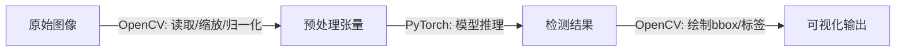

---
tags:
  - OpenCV
  - 计算机视觉
  - 图像处理
  - CV
aliases:
  - OpenCV笔记
  - 计算机视觉基础
created: 2026-06-10
---

> OpenCV（Open Source Computer Vision Library）是计算机视觉领域最核心的**开源算法库**，提供 2500+ 优化算法，涵盖图像处理、特征检测、目标识别、视频分析等。

---

# 🔗 与深度学习、YOLO 的关系

> 详细图解 → [[机器视觉#🔗 OpenCV、深度学习、YOLO 的关系]]

| 层次 | 代表 | 定位 |
|------|------|------|
| **工具层** | OpenCV | 图像读写的"手"，预处理/后处理的"管道工" |
| **方法论层** | 深度学习 | 从数据学习的"脑"，CNN/RNN/Transformer 均属此层 |
| **应用层** | YOLO | 深度学习方法论在检测领域的"一项具体技能" |

**实际协作流程**：



> 💡 OpenCV 的 DNN 模块也可以**直接加载和运行**深度学习模型（ONNX、TensorFlow、Caffe 等格式），无需 PyTorch/TensorFlow。

---

## 目录

- [一、安装与基础](#一、安装与基础)
- [二、图像I/O与基本操作](#二、图像I/O与基本操作)
- [三、基本变换](#三、基本变换)
- [四、颜色空间](#四、颜色空间)
- [五、图像滤波与卷积](#五、图像滤波与卷积)
- [六、阈值化与二值化](#六、阈值化与二值化)
- [七、形态学操作](#七、形态学操作)
- [八、边缘检测](#八、边缘检测)
- [九、特征检测与描述](#九、特征检测与描述)
- [十、轮廓检测](#十、轮廓检测)
- [十一、绘图函数](#十一、绘图函数)
- [十二、视频处理](#十二、视频处理)
- [十三、与深度学习集成](#十三、与深度学习集成)
- [十四、实战流程示例](#十四、实战流程示例)
- [十五、常见问题与陷阱](#十五、常见问题与陷阱)

---

# 一、安装与基础

## 安装

```bash
# 核心库
pip install opencv-python

# 包含 contrib 模块（SIFT、SURF 等专利算法）
pip install opencv-contrib-python

# 验证安装
python -c "import cv2; print(cv2.__version__)"
```

## 核心依赖

```python
import cv2
import numpy as np
import matplotlib.pyplot as plt

# OpenCV 图像本质是 NumPy ndarray
# 形状: (height, width, channels)
# 数据类型: uint8 (0-255)
```

> [!warning] OpenCV 的 BGR
> OpenCV 默认使用 **BGR** 颜色顺序（而非 RGB），这是历史原因。显示图像前或与其他库交互时务必转换！

---

# 二、图像I/O与基本操作

## 读取图像

```python
# 读取图像
img = cv2.imread("image.jpg")           # BGR 格式
img_gray = cv2.imread("image.jpg", 0)   # 灰度模式
img_unchanged = cv2.imread("image.jpg", cv2.IMREAD_UNCHANGED)  # 含 alpha 通道

# 检查是否读取成功
if img is None:
    print("图像读取失败!")
```

## 显示图像

```python
cv2.imshow("Window Title", img)
key = cv2.waitKey(0)        # 0 = 无限等待按键
cv2.destroyAllWindows()

# Matplotlib 显示（注意 BGR → RGB 转换）
plt.imshow(cv2.cvtColor(img, cv2.COLOR_BGR2RGB))
plt.show()
```

## 保存图像

```python
cv2.imwrite("output.jpg", img)
# 可指定压缩质量（JPEG: 0-100, PNG: 0-9）
cv2.imwrite("output.jpg", img, [cv2.IMWRITE_JPEG_QUALITY, 95])
```

## 图像属性

```python
print(img.shape)     # (height, width, channels)
print(img.size)      # 像素总数 = height × width × channels
print(img.dtype)     # 数据类型，通常 uint8
```

## ROI（感兴趣区域）与像素操作

```python
# ROI 裁剪 — 本质是 NumPy 切片
roi = img[100:300, 200:400]     # [y1:y2, x1:x2]

# 像素访问
px = img[50, 100]               # (B, G, R) 元组
blue = img[50, 100, 0]          # 第 0 通道 = Blue

# 通道分离与合并
b, g, r = cv2.split(img)
merged = cv2.merge([b, g, r])

# 更高效的方式（返回视图，避免拷贝）
b = img[:, :, 0]
```

> [!tip] NumPy 切片是 OpenCV 的基石
> OpenCV 图像即 NumPy 数组。掌握切片操作（详见 [[Python学习笔记#2.1 切片 (Slice)]]）至关重要。

---

# 三、基本变换

## 缩放

```python
# 按目标尺寸缩放
resized = cv2.resize(img, (640, 480))

# 按比例缩放
resized = cv2.resize(img, None, fx=0.5, fy=0.5)

# 插值方法选择
resized = cv2.resize(img, (640, 480), interpolation=cv2.INTER_LINEAR)   # 默认，通用
resized = cv2.resize(img, (640, 480), interpolation=cv2.INTER_AREA)     # 缩小推荐
resized = cv2.resize(img, (640, 480), interpolation=cv2.INTER_CUBIC)    # 放大推荐
```

## 翻转与旋转

```python
# 翻转
flip_h = cv2.flip(img, 1)   # 水平翻转
flip_v = cv2.flip(img, 0)   # 垂直翻转
flip_both = cv2.flip(img, -1)  # 水平+垂直

# 旋转（绕图像中心）
h, w = img.shape[:2]
center = (w // 2, h // 2)
M = cv2.getRotationMatrix2D(center, angle=45, scale=1.0)
rotated = cv2.warpAffine(img, M, (w, h))
```

## 仿射变换与透视变换

```python
# 仿射变换：保持平行线（3 个对应点）
src_pts = np.float32([[50, 50], [200, 50], [50, 200]])
dst_pts = np.float32([[10, 100], [200, 50], [100, 250]])
M_affine = cv2.getAffineTransform(src_pts, dst_pts)
affined = cv2.warpAffine(img, M_affine, (w, h))

# 透视变换：任意四边形映射（4 个对应点）
src_pts = np.float32([[56, 65], [368, 52], [28, 387], [389, 390]])
dst_pts = np.float32([[0, 0], [300, 0], [0, 300], [300, 300]])
M_persp = cv2.getPerspectiveTransform(src_pts, dst_pts)
persp = cv2.warpPerspective(img, M_persp, (300, 300))
```

## 裁剪与填充

```python
# 裁剪 — NumPy 切片
cropped = img[y1:y2, x1:x2]

# 填充（制作边框）
padded = cv2.copyMakeBorder(img, top=10, bottom=10, left=10, right=10,
                             borderType=cv2.BORDER_CONSTANT, value=[0, 0, 0])
# borderType: BORDER_CONSTANT / BORDER_REFLECT / BORDER_REPLICATE / BORDER_WRAP
```

---

# 四、颜色空间

## 常用颜色空间转换

```python
# BGR → 灰度
gray = cv2.cvtColor(img, cv2.COLOR_BGR2GRAY)

# BGR → RGB
rgb = cv2.cvtColor(img, cv2.COLOR_BGR2RGB)

# BGR → HSV（色调/饱和度/明度）
hsv = cv2.cvtColor(img, cv2.COLOR_BGR2HSV)

# BGR → Lab（亮度 + 色彩对立维度）
lab = cv2.cvtColor(img, cv2.COLOR_BGR2Lab)
```

## 颜色空间选型指南

| 颜色空间 | 适用场景 | 原因 |
|----------|---------|------|
| **BGR** | OpenCV 默认 | 历史原因（BGR 曾是相机厂商首选） |
| **RGB** | 显示、Matplotlib、深度学习框架 | 标准色彩顺序 |
| **灰度** | 特征提取、阈值化、边缘检测 | 降维、减少计算 |
| **HSV** | 颜色分割、物体跟踪 | 色调与亮度分离，对光照变化鲁棒 |
| **Lab** | 颜色距离计算、色彩校正 | 感知均匀（欧氏距离 ≈ 人眼感知差异） |

## 颜色范围提取（HSV 方式）

```python
# 提取红色区域
hsv = cv2.cvtColor(img, cv2.COLOR_BGR2HSV)

# 红色在 HSV 中有两段（环绕 0°/180°）
lower_red1 = np.array([0, 50, 50])
upper_red1 = np.array([10, 255, 255])
lower_red2 = np.array([170, 50, 50])
upper_red2 = np.array([180, 255, 255])

mask1 = cv2.inRange(hsv, lower_red1, upper_red1)
mask2 = cv2.inRange(hsv, lower_red2, upper_red2)
mask = mask1 | mask2

result = cv2.bitwise_and(img, img, mask=mask)
```

---

# 五、图像滤波与卷积

> 滤波本质是**卷积核在图像上的滑动运算**，原理见 [[深度学习笔记#三、卷积神经网络 CNN]]

## 低通滤波（平滑/去噪）

```python
# 均值滤波 — 最基础，取邻域平均值
blur = cv2.blur(img, (5, 5))

# 高斯滤波 — 加权平均，中心权重更大（最常用）
gaussian = cv2.GaussianBlur(img, (5, 5), sigmaX=0)

# 中值滤波 — 取邻域中值，椒盐噪声克星
median = cv2.medianBlur(img, 5)

# 双边滤波 — 保边去噪（美颜效果）
bilateral = cv2.bilateralFilter(img, d=9, sigmaColor=75, sigmaSpace=75)
```

| 滤波器 | 效果 | 适用场景 |
|--------|------|----------|
| 均值 | 简单平滑 | 快速模糊 |
| 高斯 | 自然平滑 | **预处理的标配**，降噪且不过度模糊 |
| 中值 | 去椒盐噪声 | 传感器坏点、灰尘噪声 |
| 双边 | 保边平滑 | 美颜、去噪同时保留边缘 |

## 高通滤波（边缘增强）

```python
# 自定义卷积核 — 锐化
kernel_sharpen = np.array([[0, -1, 0],
                            [-1, 5, -1],
                            [0, -1, 0]])
sharpened = cv2.filter2D(img, -1, kernel_sharpen)
```

## 形态学梯度（边缘提取的另一种方式）

```python
kernel = np.ones((3, 3), np.uint8)
gradient = cv2.morphologyEx(img, cv2.MORPH_GRADIENT, kernel)
```

---

# 六、阈值化与二值化

## 全局阈值

```python
# 简单阈值 — 手动指定阈值
ret, thresh = cv2.threshold(gray, 127, 255, cv2.THRESH_BINARY)

# 阈值类型速查
# cv2.THRESH_BINARY:     src > thresh → maxval, else 0
# cv2.THRESH_BINARY_INV: src > thresh → 0, else maxval (反色)
# cv2.THRESH_TRUNC:      src > thresh → thresh, else src
# cv2.THRESH_TOZERO:     src > thresh → src, else 0
# cv2.THRESH_TOZERO_INV: src > thresh → 0, else src
```

## 自适应阈值

> 对于光照不均匀的图像，全局阈值效果差。自适应阈值根据局部邻域计算阈值。

```python
# 均值自适应
adapt_mean = cv2.adaptiveThreshold(gray, 255,
    cv2.ADAPTIVE_THRESH_MEAN_C, cv2.THRESH_BINARY, blockSize=11, C=2)

# 高斯自适应（效果通常更好）
adapt_gauss = cv2.adaptiveThreshold(gray, 255,
    cv2.ADAPTIVE_THRESH_GAUSSIAN_C, cv2.THRESH_BINARY, blockSize=11, C=2)
```

## Otsu 二值化（自动找最佳阈值）

```python
# Otsu 自动计算最优阈值（直方图双峰时效果好）
ret_otsu, thresh_otsu = cv2.threshold(gray, 0, 255,
    cv2.THRESH_BINARY + cv2.THRESH_OTSU)
print(f"Otsu 阈值: {ret_otsu}")
```

---

# 七、形态学操作

> 形态学操作基于**集合论**，主要作用于二值图像，也可用于灰度图。

```python
kernel = cv2.getStructuringElement(cv2.MORPH_RECT, (5, 5))
# 核形状: MORPH_RECT (矩形) / MORPH_ELLIPSE (椭圆) / MORPH_CROSS (十字)
```

## 腐蚀与膨胀（基础操作）

```python
# 腐蚀 (Erosion)：白色区域缩小，消除小噪点
eroded = cv2.erode(binary, kernel, iterations=1)

# 膨胀 (Dilation)：白色区域扩大，填充空洞
dilated = cv2.dilate(binary, kernel, iterations=1)
```

## 开运算与闭运算（组合操作）

```python
# 开运算 = 先腐蚀后膨胀 → 消除小噪点、分离粘连物体
opening = cv2.morphologyEx(binary, cv2.MORPH_OPEN, kernel)

# 闭运算 = 先膨胀后腐蚀 → 填充小空洞、连接断裂区域
closing = cv2.morphologyEx(binary, cv2.MORPH_CLOSE, kernel)
```

## 其他形态学操作

```python
# 形态学梯度 = 膨胀 - 腐蚀 → 提取物体轮廓
gradient = cv2.morphologyEx(binary, cv2.MORPH_GRADIENT, kernel)

# 顶帽 = 原图 - 开运算 → 提取亮色噪点/细节
tophat = cv2.morphologyEx(binary, cv2.MORPH_TOPHAT, kernel)

# 黑帽 = 闭运算 - 原图 → 提取暗色区域
blackhat = cv2.morphologyEx(binary, cv2.MORPH_BLACKHAT, kernel)
```

| 操作 | 效果 | 用途 |
|------|------|------|
| 腐蚀 | 白色缩水 | 去噪点 |
| 膨胀 | 白色膨胀 | 填空洞 |
| 开运算 | 去噪+恢复大小 | 去小白点 |
| 闭运算 | 填洞+保持大小 | 填小黑洞 |
| 梯度 | 提取轮廓 | 边缘检测 |
| 顶帽 | 亮区细节 | 不均匀光照下的目标提取 |
| 黑帽 | 暗区细节 | 暗背景上的亮点提取 |

---

# 八、边缘检测

## Canny 边缘检测（最常用）

```python
# Canny: 多阶段算法（高斯平滑 → 梯度计算 → 非极大值抑制 → 双阈值筛选）
edges = cv2.Canny(img, threshold1=100, threshold2=200)

# threshold1: 低阈值（弱边缘）
# threshold2: 高阈值（强边缘）
# 经验值: threshold2 ≈ 2~3 × threshold1
```

## Sobel / Scharr / Laplacian

```python
# Sobel — 一阶导数，分别检测水平和垂直边缘
sobel_x = cv2.Sobel(gray, cv2.CV_64F, dx=1, dy=0, ksize=3)
sobel_y = cv2.Sobel(gray, cv2.CV_64F, dx=0, dy=1, ksize=3)
sobel_combined = cv2.magnitude(sobel_x, sobel_y)  # 合并梯度

# Scharr — Sobel 的增强版，对弱边缘更敏感
scharr_x = cv2.Scharr(gray, cv2.CV_64F, dx=1, dy=0)
scharr_y = cv2.Scharr(gray, cv2.CV_64F, dx=0, dy=1)

# Laplacian — 二阶导数，同时对各个方向敏感
laplacian = cv2.Laplacian(gray, cv2.CV_64F)
```

## 边缘检测实际流程

```python
# 标准预处理流程
gray = cv2.cvtColor(img, cv2.COLOR_BGR2GRAY)
blurred = cv2.GaussianBlur(gray, (5, 5), 0)   # 先去噪
edges = cv2.Canny(blurred, 50, 150)            # 再检测
```

---

# 九、特征检测与描述

## 角点检测

```python
# Harris 角点检测
gray = np.float32(gray)
harris = cv2.cornerHarris(gray, blockSize=2, ksize=3, k=0.04)
img[harris > 0.01 * harris.max()] = [0, 0, 255]  # 红色标记角点

# Shi-Tomasi 角点检测（常用，效果更好）
corners = cv2.goodFeaturesToTrack(gray, maxCorners=100,
                                   qualityLevel=0.01, minDistance=10)
corners = np.int32(corners)
for corner in corners:
    x, y = corner.ravel()
    cv2.circle(img, (x, y), 3, (0, 255, 0), -1)
```

## SIFT（尺度不变特征变换）

> SIFT 检测关键点并计算描述子，对**旋转、缩放、亮度变化**具有不变性。

```python
# 需要 opencv-contrib-python
sift = cv2.SIFT_create()

# 检测关键点 + 计算描述子
keypoints, descriptors = sift.detectAndCompute(gray, None)

# 绘制关键点
img_sift = cv2.drawKeypoints(img, keypoints, None,
                              flags=cv2.DRAW_MATCHES_FLAGS_DRAW_RICH_KEYPOINTS)
```

| 属性 | 说明 |
|------|------|
| 关键点 (Keypoint) | 位置 (x,y)、尺度、方向 |
| 描述子 (Descriptor) | 128 维浮点向量，描述关键点周围区域 |

## ORB（快速替代方案）

> ORB 是免费的、比 SIFT 更快的替代方案，适合实时应用。

```python
orb = cv2.ORB_create(nfeatures=500)
keypoints, descriptors = orb.detectAndCompute(gray, None)
```

## 特征匹配

```python
# BFMatcher（暴力匹配）
bf = cv2.BFMatcher(cv2.NORM_HAMMING, crossCheck=True)  # ORB 描述子用 HAMMING
matches = bf.match(des1, des2)
matches = sorted(matches, key=lambda x: x.distance)

# 绘制前 N 个匹配
result = cv2.drawMatches(img1, kp1, img2, kp2, matches[:30], None,
                          flags=cv2.DrawMatchesFlags_NOT_DRAW_SINGLE_POINTS)
```

## 特征检测选型

|     | 算法        | 速度  | 尺度不变 | 旋转不变 | 专利     | 适用         |
| --- | --------- | --- | ---- | ---- | ------ | ---------- |
|     | **SIFT**  | 慢   | ✅    | ✅    | 有（已过期） | 高精度匹配      |
|     | **SURF**  | 中   | ✅    | ✅    | 有      | SIFT 的加速版  |
|     | **ORB**   | 快   | ❌    | ✅    | 无      | **实时应用首选** |
|     | **BRISK** | 快   | ✅    | ✅    | 无      | 移动端        |
|     | **AKAZE** | 中   | ✅    | ✅    | 无      | 非线性尺度空间    |

---

# 十、轮廓检测

```python
# 1. 预处理：灰度 → 二值化
gray = cv2.cvtColor(img, cv2.COLOR_BGR2GRAY)
_, binary = cv2.threshold(gray, 127, 255, cv2.THRESH_BINARY)

# 2. 查找轮廓
contours, hierarchy = cv2.findContours(binary, cv2.RETR_TREE, cv2.CHAIN_APPROX_SIMPLE)

# RETR_EXTERNAL: 只取最外层
# RETR_TREE: 取所有轮廓，建立层级关系
# CHAIN_APPROX_SIMPLE: 压缩水平/垂直/对角线（节省内存）
```

## 轮廓分析

```python
for cnt in contours:
    # 面积
    area = cv2.contourArea(cnt)
    if area < 100:  # 过滤小轮廓
        continue

    # 周长
    perimeter = cv2.arcLength(cnt, closed=True)

    # 外接矩形
    x, y, w, h = cv2.boundingRect(cnt)                       # 正矩形
    rect = cv2.minAreaRect(cnt)                               # 最小旋转矩形
    box = cv2.boxPoints(rect); box = np.int32(box)           # 四个顶点

    # 最小外接圆
    (cx, cy), radius = cv2.minEnclosingCircle(cnt)

    # 多边形近似（减少顶点数）
    epsilon = 0.01 * perimeter
    approx = cv2.approxPolyDP(cnt, epsilon, closed=True)

    # 凸包
    hull = cv2.convexHull(cnt)

    # 矩（计算质心）
    M = cv2.moments(cnt)
    if M["m00"] != 0:
        cx = int(M["m10"] / M["m00"])
        cy = int(M["m01"] / M["m00"])
```

## 绘制轮廓

```python
# 绘制所有轮廓
cv2.drawContours(img, contours, contourIdx=-1, color=(0, 255, 0), thickness=2)

# 绘制单个轮廓
cv2.drawContours(img, [contours[i]], contourIdx=0, color=(0, 0, 255), thickness=3)
```

---

# 十一、绘图函数

> 绘图直接修改原图像，常与目标检测结果可视化配合使用。

```python
# 直线
cv2.line(img, (0, 0), (100, 100), color=(255, 0, 0), thickness=2)

# 矩形（最常用于绘制 bbox）
cv2.rectangle(img, (x1, y1), (x2, y2), color=(0, 255, 0), thickness=2)
# thickness=-1: 填充矩形

# 圆形
cv2.circle(img, (cx, cy), radius=30, color=(0, 0, 255), thickness=-1)

# 椭圆
cv2.ellipse(img, (cx, cy), (axes_x, axes_y), angle=0, startAngle=0,
            endAngle=360, color=(255, 255, 0), thickness=2)

# 多边形
pts = np.array([[10, 5], [20, 30], [70, 20], [50, 10]], np.int32)
cv2.polylines(img, [pts], isClosed=True, color=(0, 255, 255), thickness=2)

# 文字（常用于标注标签）
cv2.putText(img, "Label: Cat", (x, y - 10),
            cv2.FONT_HERSHEY_SIMPLEX, fontScale=0.5, color=(0, 255, 0), thickness=1)
```
---

# 十二、视频处理

## 读取视频

```python
cap = cv2.VideoCapture("video.mp4")
# cap = cv2.VideoCapture(0)  # 摄像头

while True:
    ret, frame = cap.read()
    if not ret:
        break

    cv2.imshow("Video", frame)
    if cv2.waitKey(1) & 0xFF == ord('q'):
        break

cap.release()
cv2.destroyAllWindows()
```

## 写入视频

```python
fourcc = cv2.VideoWriter_fourcc(*'mp4v')                     # 编码器
out = cv2.VideoWriter("output.mp4", fourcc, fps=30.0,
                       frameSize=(width, height))

while True:
    ret, frame = cap.read()
    if not ret:
        break
    out.write(frame)  # 写入处理后的帧

out.release()
```

## 视频属性

```python
fps = cap.get(cv2.CAP_PROP_FPS)
frame_count = int(cap.get(cv2.CAP_PROP_FRAME_COUNT))
width = int(cap.get(cv2.CAP_PROP_FRAME_WIDTH))
height = int(cap.get(cv2.CAP_PROP_FRAME_HEIGHT))
```

---

# 十三、与深度学习集成

## 方式一：OpenCV DNN 模块（无 PyTorch/TF 依赖）

```python
# 加载 ONNX / TensorFlow / Caffe 等格式的模型
net = cv2.dnn.readNet("model.onnx")
# net = cv2.dnn.readNetFromTensorflow("model.pb")
# net = cv2.dnn.readNetFromCaffe("deploy.prototxt", "model.caffemodel")

# 预处理
blob = cv2.dnn.blobFromImage(img, scalefactor=1/255.0, size=(224, 224),
                              mean=(0.485, 0.456, 0.406), swapRB=True)
net.setInput(blob)
output = net.forward()
```

## 方式二：与 PyTorch / TensorFlow 配合（推荐）

```python
import torch
import torchvision.transforms as T

# OpenCV 读取 + 预处理（NumPy 格式）
img = cv2.imread("image.jpg")
img_rgb = cv2.cvtColor(img, cv2.COLOR_BGR2RGB)
img_resized = cv2.resize(img_rgb, (640, 640))

# 转 PyTorch Tensor
transform = T.Compose([
    T.ToTensor(),  # HWC → CHW + 归一化到 [0,1]
])
tensor = transform(img_resized).unsqueeze(0)  # [1, 3, 640, 640]

# 推理
with torch.no_grad():
    predictions = model(tensor)

# OpenCV 后处理 — 绘制结果
for box in predictions:
    x1, y1, x2, y2 = box.xyxy.int().tolist()
    cv2.rectangle(img, (x1, y1), (x2, y2), (0, 255, 0), 2)
```

## YOLO 使用示例（Ultralytics）

```python
from ultralytics import YOLO

# 加载模型
model = YOLO("yolov8n.pt")

# OpenCV 读取
img = cv2.imread("street.jpg")

# 推理
results = model(img)  # 支持 BGR 格式直接输入

# 可视化
annotated = results[0].plot()  # 自动绘制 bbox + 标签
cv2.imshow("YOLO Detection", annotated)
```

---

# 十四、实战流程示例

## 示例 1：目标尺寸测量

```python
# 1. 读取 + 灰度 + 滤波
img = cv2.imread("object.jpg")
gray = cv2.cvtColor(img, cv2.COLOR_BGR2GRAY)
blurred = cv2.GaussianBlur(gray, (5, 5), 0)

# 2. 边缘检测 + 轮廓提取
edges = cv2.Canny(blurred, 50, 150)
contours, _ = cv2.findContours(edges, cv2.RETR_EXTERNAL, cv2.CHAIN_APPROX_SIMPLE)

# 3. 分析最大轮廓
largest = max(contours, key=cv2.contourArea)
x, y, w, h = cv2.boundingRect(largest)

# 4. 绘制结果
cv2.rectangle(img, (x, y), (x + w, y + h), (0, 255, 0), 2)
cv2.putText(img, f"{w} x {h} px", (x, y - 10),
            cv2.FONT_HERSHEY_SIMPLEX, 0.6, (0, 255, 0), 2)
```

## 示例 2：颜色物体检测与追踪

```python
# 1. 转 HSV
hsv = cv2.cvtColor(img, cv2.COLOR_BGR2HSV)

# 2. 颜色范围提取
mask = cv2.inRange(hsv, lower_range, upper_range)

# 3. 形态学去噪
mask = cv2.erode(mask, None, iterations=2)
mask = cv2.dilate(mask, None, iterations=2)

# 4. 找轮廓 + 定位
contours, _ = cv2.findContours(mask, cv2.RETR_EXTERNAL, cv2.CHAIN_APPROX_SIMPLE)
for cnt in contours:
    if cv2.contourArea(cnt) > 500:
        (x, y), radius = cv2.minEnclosingCircle(cnt)
        center = (int(x), int(y))
        cv2.circle(img, center, int(radius), (0, 255, 0), 2)
```

## 示例 3：YOLO + OpenCV 完整检测 pipeline

```python
from ultralytics import YOLO

# --- 初始化 ---
model = YOLO("yolov8n.pt")
cap = cv2.VideoCapture(0)

while True:
    ret, frame = cap.read()
    if not ret:
        break

    # --- OpenCV 预处理 ---
    frame_resized = cv2.resize(frame, (640, 640))

    # --- YOLO 推理 ---
    results = model(frame_resized, verbose=False)

    # --- OpenCV 后处理 ---
    annotated = results[0].plot()

    # --- 显示 ---
    cv2.imshow("Real-time Detection", annotated)
    if cv2.waitKey(1) & 0xFF == ord('q'):
        break

cap.release()
cv2.destroyAllWindows()
```

---

# 十五、常见问题与陷阱

## 1. BGR vs RGB

```python
# ❌ 直接用 Matplotlib 显示 OpenCV 图像（颜色错误）
plt.imshow(img)    # 颜色怪异！

# ✅ 先转换再显示
plt.imshow(cv2.cvtColor(img, cv2.COLOR_BGR2RGB))
```

## 2. 坐标顺序：OpenCV vs NumPy

```python
# OpenCV: (width, height) — 如 resize(img, (640, 480))
# NumPy shape: (height, width, channels)
# ROI 索引: img[y1:y2, x1:x2]  ← 先 y 后 x！
```

## 3. 图像类型与数值范围

```python
# 显示时图像必须是 uint8 [0, 255]
# 计算时常用 float32/float64
img_norm = img.astype(np.float32) / 255.0

# 显示前需要转回 uint8
img_display = (img_norm * 255).astype(np.uint8)
```

## 4. waitKey 的坑

```python
# ❌ 忘记 waitKey 会导致窗口无响应
cv2.imshow("Win", img)

# ✅ 必须配合 waitKey
cv2.imshow("Win", img)
cv2.waitKey(0)                # 0 = 无限等待
cv2.destroyAllWindows()       # 关闭所有窗口
```

## 5. 视频编码选择

```python
# Windows 推荐
fourcc = cv2.VideoWriter_fourcc(*'mp4v')   # .mp4
fourcc = cv2.VideoWriter_fourcc(*'XVID')   # .avi

# Linux/macOS
fourcc = cv2.VideoWriter_fourcc(*'avc1')   # .mp4 (H.264)
```

---

# 🔗 关联笔记

|     | 笔记           | 关系                          |
| --- | ------------ | --------------------------- |
|     | [[机器视觉]]     | 机器视觉总览，含 OpenCV/DL/YOLO 关系图 |
|     | [[深度学习笔记]]     | CNN/Transformer/YOLO 详细理论   |
|     | [[Python学习笔记]] | NumPy 切片、类型注解等基础技能          |

---

# 📚 外部资源

- [OpenCV 官方文档](https://docs.opencv.org/)
- [OpenCV Python 教程](https://docs.opencv.org/master/d6/d00/tutorial_py_root.html)
- [PyImageSearch](https://pyimagesearch.com/) — 大量 OpenCV 实战教程
- [LearnOpenCV](https://learnopencv.com/) — 深度学习 + OpenCV 结合教程
