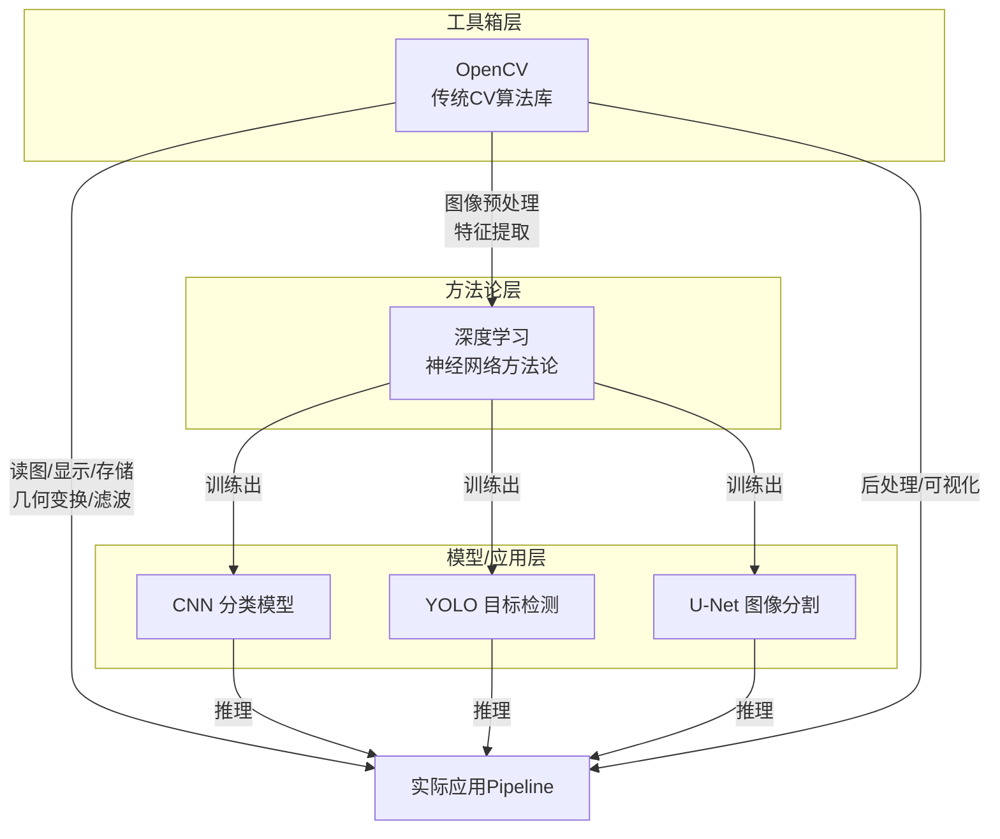
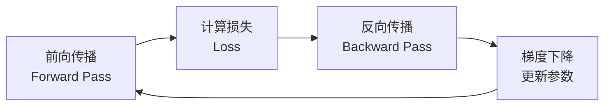

---
tags:
  - 机器视觉
  - 计算机视觉
  - CV
  - deep-learning
aliases:
  - Machine Vision
  - 计算机视觉
created: 2026-06-10
---

# 机器视觉

> 机器视觉（Machine Vision / Computer Vision）是人工智能的核心分支之一，致力于让计算机从图像和视频中"看懂"世界。

---

## 🔗 OpenCV、深度学习、YOLO 的关系

> 这三者常被并列提及，但属于**不同层次**的概念，在实际项目中**协同工作**。



### 三层关系解析

|     | 层次       | 代表         | 本质                                                     | 类比         |
| --- | -------- | ---------- | ------------------------------------------------------ | ---------- |
|     | **工具层**  | **OpenCV** | 图像处理的**工具箱**——提供 2500+ 算法，涵盖 I/O、滤波、变换、特征提取、绘图、视频处理等   | 🔧 锤子、扳手   |
|     | **方法论层** | **深度学习**   | 让模型从数据中**自动学习**特征的范式——CNN/RNN/Transformer 等架构都属于此层     | 📐 建筑学理论   |
|     | **应用层**  | **YOLO**   | 深度学习方法论在目标检测领域的**具体实现**——用 CNN 做 backbone，输出 bbox + 类别 | 🏠 一栋具体的房子 |

### 实际项目中的协作流程

```
图像采集 → [OpenCV] 预处理(缩放/归一化/颜色转换)
         → [PyTorch] YOLO 模型推理
         → [OpenCV] 后处理(绘制边界框/标签/保存结果)
```

- **OpenCV** 负责"搬砖"——图像读写、尺寸调整、颜色空间转换、结果可视化
- **深度学习框架**（PyTorch/TensorFlow）负责"思考"——加载模型、前向推理
- **YOLO** 是那个"思考的内容"——一个已经训练好的目标检测模型

> 💡 **一句话总结**：OpenCV 是**手**（操作图像），深度学习是**脑**（学习方法），YOLO 是**一项具体技能**（检测物体）。三者从不互斥——实际项目中几乎总是**同时使用** OpenCV + 一个深度学习模型。

---

## 📌 知识体系导航

本笔记是机器视觉学习的**总入口**，各模块详情见对应子笔记：

|     | 模块        | 子笔记          | 核心内容                          |
| --- | --------- | ------------ | ----------------------------- |
|     | 计算机视觉基础   | [[OpenCV笔记]] | 图像处理、特征提取、传统CV算法、OpenCV实战     |
|     | 深度学习基础    | [[深度学习笔记]]     | 全连接网络、CNN、模型评定、YOLO           |
|     | Python 工具 | [[Python学习笔记]] | Streamlit / Gradio 等 AI UI 框架 |

---

## 一、神经网络基础

> 详细内容 → [[深度学习笔记#一、全连接神经网络]]

### 1.1 核心流程

神经网络的训练由以下循环构成：



| 阶段 | 作用 | 方向 |
|------|------|------|
| **前向传播** | 输入 → 模型各层 → 预测值 | 输入 → 输出 |
| **反向传播** | 从损失函数链式求导，计算每个参数的梯度 | 输出 → 输入 |
| **梯度下降** | 沿梯度反方向更新参数，使 loss 逐步减小 | — |

> 核心思想：**反向传播求梯度，梯度下降更新参数。** 反复迭代直到收敛。

### 1.2 梯度下降算法

![[梯度下降算法思想.png]]

- **本质**：沿损失函数梯度的**负方向**迭代更新参数
- **关键超参数**：学习率（learning rate）—— 控制每次更新的步长
- **变体**：批量梯度下降 / 随机梯度下降 / 小批量梯度下降

**PyTorch 示例**：

```python
import torch

x = torch.tensor([2.0], requires_grad=True)
y = torch.tensor([3.0], requires_grad=True)

learning_rate = 0.02
epochs = 500

for epoch in range(epochs):
    z = x ** 2 + y ** 2 - 1
    z.backward()

    with torch.no_grad():
        x -= learning_rate * x.grad
        y -= learning_rate * y.grad

    x.grad.zero_()
    y.grad.zero_()
```

### 1.3 全连接网络结构

![[全连接神经网络.png]]

三层核心结构：**输入层 → 隐藏层 → 输出层**，层间节点全连接。

![[全连接神经网络三层结构.png]]

---

## 二、卷积神经网络（CNN）

> 详细内容 → [[深度学习笔记#二、卷积神经网络（CNN）]]

### 2.1 为什么用互相关代替卷积？

深度学习中的"卷积"实际上是**互相关（cross-correlation）**运算。真正的卷积需要先将核旋转 180° 再做点乘。

但由于**核参数是通过学习得到的**，无论用卷积还是互相关，最终学到的核只是翻转关系，**输出结果完全相同**。因此实践中直接用互相关运算，简化计算。

![[互相关运算演示.png]]

### 2.2 Padding 公式速查

> 输入尺寸 $W \times H$，卷积核 $F \times F$，步长 $S$，填充 $P$

**输出特征图尺寸**：

$$W_{out} = \left\lfloor \frac{W - F + 2P}{S} \right\rfloor + 1$$

$$H_{out} = \left\lfloor \frac{H - F + 2P}{S} \right\rfloor + 1$$

![[卷积填充.png]]

### 2.3 卷积核为何总是奇数？

> ✅ **奇数核有唯一的中心锚点**，保持对称性处理，避免边缘信息损失。

常见尺寸：$1 \times 1$、$3 \times 3$、$5 \times 5$、$7 \times 7$

### 2.4 池化（Pooling）

对特征图进行下采样，降低计算量、增强平移不变性。

| 池化类型 | 操作 | 适用场景 |
|----------|------|----------|
| **Max Pooling** | 取局部区域最大值 | 保留显著特征（纹理、形状） |
| **Average Pooling** | 取局部区域平均值 | 保留整体特征、减少噪声 |

> 池化核常用 $2 \times 2$，步长通常等于池化核大小。

---

## 三、模型评定

> 详细内容 → [[深度学习笔记#三、模型评定]]

### 3.1 混淆矩阵

![[二分类混淆矩阵.png]]

| 缩写 | 含义 | 通俗理解 |
|------|------|----------|
| **TP** | 真正例（True Positive） | 真的 → 判成真的 ✅ |
| **TN** | 真负例（True Negative） | 假的 → 判成假的 ✅ |
| **FP** | 假正例（False Positive） | 假的 → 判成真的 ❌（误报） |
| **FN** | 假负例（False Negative） | 真的 → 判成假的 ❌（漏报） |

> 记忆技巧：**真/假** = 判断对/错，**正/负** = 判定为正/负样本

### 3.2 评价指标速查

![[分类模型评价指标.png]]

| 指标 | 公式 | 关注点 |
|------|------|--------|
| **Accuracy**（准确率） | $\frac{TP + TN}{TP + TN + FP + FN}$ | 整体正确率 |
| **Precision**（精确率） | $\frac{TP}{TP + FP}$ | 预测为正的样本中有多少是真的 |
| **Recall**（召回率） | $\frac{TP}{TP + FN}$ | 真实正样本中有多少被找出 |
| **F1-Score** | $2 \times \frac{P \times R}{P + R}$ | Precision 和 Recall 的调和平均 |

---

## 四、YOLO 目标检测

> 详细内容 → [[深度学习笔记#四、YOLO学习]]

- **YOLO**（You Only Look Once）是一种**单阶段（one-stage）目标检测算法**
- 核心思想：将检测问题转化为**回归问题**，一次前向传播即可输出边界框和类别
- 优势：速度快，适合实时检测场景

**训练参数说明**：

![[yolo训练参数意义.png]]

---

## 五、Python 工具

> 详细内容 → [[Python学习笔记]]

| 框架 | 用途 |
|------|------|
| **Streamlit** | 快速搭建 AI 应用的 Web UI，纯 Python 即可 |
| **Gradio** | 同上，特别擅长搭建机器学习模型演示页面 |
| **ElementUI** | Vue 前端的 UI 组件库（非 Python，Web 前端用） |
| **Ant Design** | Vue/React 前端 UI 组件库 |

---

## 📚 经典 CNN 架构速查

| 架构 | 年份 | 核心创新 | 特点 |
|------|------|----------|------|
| **LeNet-5** | 1998 | 卷积+池化+全连接 | 开山之作，手写数字识别 |
| **AlexNet** | 2012 | ReLU、Dropout、GPU 训练 | 掀起深度学习热潮 |
| **VGGNet** | 2014 | 深层网络（16/19层），$3 \times 3$ 小卷积核堆叠 | 结构简洁统一 |
| **GoogLeNet** | 2014 | Inception 模块，多尺度卷积并行 | 参数效率高 |
| **ResNet** | 2015 | 残差连接（Skip Connection） | 解决深层网络退化，可达 152 层+ |

> 💡 ResNet 的残差连接是 CV 领域最重要的结构创新之一，让"网络越深效果越差"成为历史。

---

## 🔗 外部资源

### 参数计算
- [一文搞懂 FFN / RNN / CNN 的参数量计算公式](https://cloud.tencent.com/developer/article/2409461)

### 卷积理解
- [如何通俗易懂地解释卷积？](https://www.zhihu.com/question/22298352)
- [一文看懂卷积与互相关运算的区别](http://blog.csdn.net/qq_42589613/article/details/128297091)

### 经典架构
- [LeNet / AlexNet / VGG / GoogLeNet 汇总](https://www.cnblogs.com/chuqianyu/p/17938228)
- [VGGNet 架构剖析](https://blog.csdn.net/2501_90186640/article/details/147660857)
- [GoogLeNet 论文精读+代码实战](https://zhuanlan.zhihu.com/p/28851135887)
- [ResNet 残差网络详解](https://blog.csdn.net/wh1236666/article/details/149322829)
- [ResNet 通俗理解](https://zhuanlan.zhihu.com/p/67860570)

### 模型评估
- [多分类 Precision / Recall / Accuracy 计算](https://blog.csdn.net/m0_38052500/article/details/122208218)

---

## 📝 待补充

- [x] 经典计算机视觉（边缘检测、SIFT、HOG 等） → [[OpenCV笔记]]
- [x] OpenCV 实战 → [[OpenCV笔记]]
- [ ] 图像分割（U-Net, Mask R-CNN 等）
- [ ] Transformer 在视觉中的应用（ViT, DETR 等）
- [ ] 生成模型（GAN, Diffusion 等）
