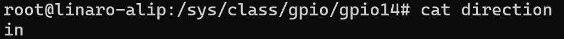
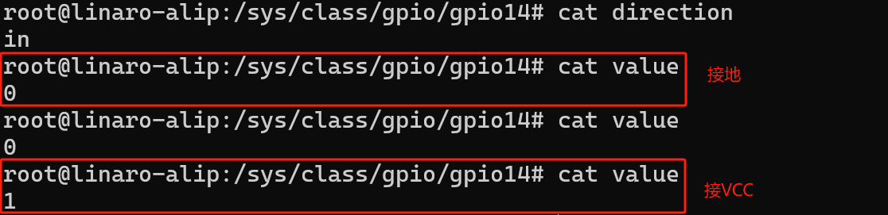

/sys/class/gpio/export
# 总目录
[[瑞星微RK3506_linux学习]]
# 学习目标：

- 掌握`/sys/class/gpio`节点的核心文件（export/unexport、direction、value、edge）的使用方法
    
- 能独立完成 GPIO 的导出、方向配置、电平读写操作
    
- 学会通过`edge`配置中断触发方式，并结合`poll`实现用户态中断检测
    
- 理解该调试方式的优缺点与适用场景


# 一、GPIO sysfs节点介绍

`Linux`开发平台实现了通用`GPIO`的驱动，用户通过`Shell`命令或系统调用即能控制`GPIO`的输出和读取其输入值。其属性文件均在`/sys/class/gpio` 目录下，如：

```Plain
root@rk3506-buildroot:/sys/class/gpio# ls
export       gpiochip0    gpiochip128  gpiochip32   gpiochip64   gpiochip96   unexport
```

属性文件有 `export` 和 `unexpor`t。其余几个个文件为符号链接（`gpiochip0`，`gpiochip32`，`gpiochip64`，`gpiochip96`…），指向管理对应设备的目录。

## 1.1、导出与去导出：

导出GPIO引脚需要这样做：

导出（export）：

1. 使用前必须先导出引脚才能使用
    
2. 操作方式：向/sys/class/gpio/export文件写入引脚编号 例：导出编号24的引脚 →ls
    

```Plain
/sys/class/gpio# echo 24 > export
root@rk3506-buildroot:/sys/class/gpio# ls
export       gpio24       gpiochip0    gpiochip128  gpiochip32   gpiochip64   gpiochip96   unexport
```

3. 注意事项：
    
    1. 这个文件只能写入不能读取
        
    2. 如果引脚已被占用（已被导出或被系统使用），操作会失败
        

取消导出（unexport）：

1. 使用完引脚后需要删除导出状态
    
2. 操作方式：向/sys/class/gpio/unexport文件写入引脚编号 例：取消导出GPIO0_PB6 → 先查清它的实际编号（比如是8），然后`echo 8 > /sys/class/gpio/unexport`
    
3. 同样只能写入不能读取
    

::: 简单总结： 导出=给export文件写编号 → 开启引脚使用 取消导出=给unexport文件写编号 → 关闭引脚使用 操作前要确保知道引脚对应的实际编号，且引脚未被其他程序占用 :::

## 1.2、导出成功后：

```Plain
root@rk3506-buildroot:/sys/class/gpio/gpio24# ls
active_low  device      direction   edge        power       subsystem   uevent      value
```
#### 1.方向设置（direction）
- **作用**：设置GPIO为输入或输出模式。
    
- **操作**：
    
    - **读取**：查看当前模式（输入或输出）。
        
    - **写入**：设置模式（“in"或"out”）。
        
- **默认值**：输入模式（“in”）。
    

```Plain
root@rk3506-buildroot:/sys/class/gpio/gpio24# cat direction
in
root@rk3506-buildroot:/sys/class/gpio/gpio24# echo out > direction
root@rk3506-buildroot:/sys/class/gpio/gpio24# cat direction
out
```

---

#### 2. 极性反转（active_low）
- **作用**：反转GPIO的高低电平逻辑。
    
- **默认值**：0（不反转）。---- 默认
    
    ```Plain
    root@rk3506-buildroot:/sys/class/gpio/gpio24# cat active_low
    0
    ```
    
- **操作**：
    
    - **读取**：查看当前设置（0或1）。
        
    - **写入**：设置为0或1。
        
- **效果**：
    
    - 当值为 **0** 时：
        
        - `value=1` → 输出高电平（3.3V/5V）
            
        - `value=0` → 输出低电平（0V）
            
    - 当值为 **1** 时：
        
        - `value=0` → 输出高电平
            
        - `value=1` → 输出低电平
#### 3.电平控制（value）
```Plain
root@rk3506-buildroot:/sys/class/gpio/gpio24# cat value
0
root@rk3506-buildroot:/sys/class/gpio/gpio24# echo 1 > value
root@rk3506-buildroot:/sys/class/gpio/gpio24# echo 0 > value
```

- **作用**：
    
    - **输出模式**：设置GPIO输出高低电平。
        
    - **输入模式**：读取外部输入的电平状态。
        
- **操作**：
    
    - **写入（仅输出模式有效）**：
        
    - **读取（输入或输出模式均可）**：
        

---

#### 4. 中断触发模式（edge）
- **作用**：设置GPIO的中断触发方式（需先设为输入模式）。
    
- **操作**：
    
    - **写入触发模式**：
        
- **注意**：必须先将GPIO设为输入模式（`direction`设为"in"）才能配置中断。


# 二、命令行控制GPIO

在应用层我们可以通过 `Shell` 命令操作 `GPIO`。通过以下步骤，就可以控制 `GPIO` 输入输出。下面步骤是以 `GPIO` 的输入输出功能进行介绍。

对GPIO0_D0 进行操作：24（gpio）

1. 导出GPIO
    

向`export`文件写入需要操作的`GPIO`排列序号`N`，就可以导出对应的`GPIO`设备目录。 操作命令如下：

```C
echo 24 > /sys/class/gpio/export
```


通过以上操作后在`/sys/class/gpio`目录下生成 `gpio4`目录，通过读写该设备目录下的属性文件（位于 `gpio14` 下）就可以操作这个 `GPIO` 的输入和输出。以此类推可以导出其它 `GPIO` 设备目录。如果 GPIO 已经被系统占用，导出时候会提示资源占用。

---

2. 设置GPIO方向
    

`GPIO` 导出后默认为输入功能。向 `direction` 文件写入“`in`”字符串，表示设置为输入功能；向 `direction` 文件写入“`out`”字符串，表示设置为输出功能。读 `direction` 文件，会返回 `in/out` 字符串，`in` 表示当前 `GPIO` 作为输入，`out` 表示当前 `GPIO` 作为输出。方向查看和设置命令如下：

```C
# cat /sys/class/gpio/gpio24/direction #查看方向
# echo out > /sys/class/gpio/gpio24/direction #设置为输出
# echo in > /sys/class/gpio/gpio24/direction #设置为输入
```

例如，查看排列序号为 `14` 的 `GPIO` 的方向，在 `Shell` 下，可以用如下命令：

```C
# cat /sys/class/gpio/gpio24/direction
```



3. GPIO输入电平读取
    

当 `GPIO` 被设为输入时，`value` 文件记录 `GPIO` 引脚的输入电平状态：`1` 表示输入的是高电平；`0` 表示输入的是低电平。通过查看 `value` 文件可以读取 `GPIO` 的电平，查看命令如下：

```C
# echo in >/sys/class/gpio/gpio24/direction #设置 GPIO 排列序号为 N 的 GPIO 方向为输入
# cat /sys/class/gpio/gpio24/value #查看 GPIO 排列序号为 N 的 GPIO 电平
```

例如，查看排列序号为 2`4` 的 `GPIO` 的电平状态，在 `Shell` 下，可以用如下命令：

```C
# echo in > /sys/class/gpio/gpio24/direction
# cat /sys/class/gpio/gpio14/value
```



---

4. GPIO输出电平设置
    

当 `GPIO` 被设为输出时，通过向 `value` 文件写入 `0` 或 `1`（`0` 表示输出低电平；`1` 表示输出高电平）可以设置输出电平的状态，输出命名如下：

```C
# echo out > /sys/class/gpio/gpioN/direction #设置GPIO排列序号为 N 的 GPIO 方向为输出
# echo 0 > /sys/class/gpio/gpioN/value #输出低电平
# echo 1 > /sys/class/gpio/gpioN/value #输出高电平
```

例如，设置排列序号为 14 的 `GPIO` 的电平为高电平，在 `Shell` 下，可以用如下命令：

```C
# echo out > /sys/class/gpio/gpio14/direction
# echo 0 > /sys/class/gpio/gpio14/value
```