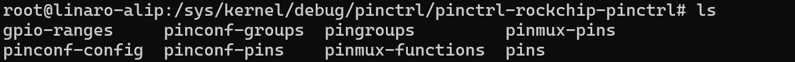
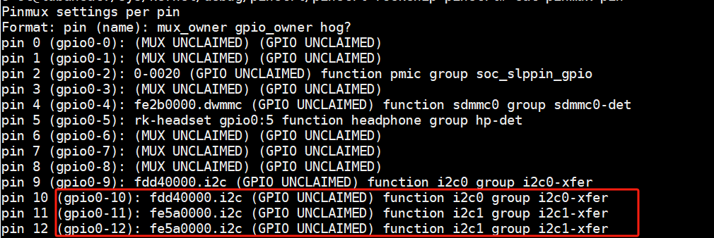

/sys/kernel/debug/gpio

# 总目录
[[瑞星微RK3506_linux学习]]

# 学习目标：

- 理解`/sys/kernel/debug/gpio`文件的输出格式与各字段含义
    
- 学会通过该文件查看 GPIO 的方向、电平、使用状态、中断配置等信息
    
- 能快速定位 GPIO 被其他驱动占用、复用配置错误等问题
    
- 对比两种调试方式的适用场景，根据需求选择合适的调试方法

# 一、/sys/kernel/debug/gpio 目录
debugfs 是 Linux 内核提供的一个调试文件系统， 可以用于查看和调试内核中的各种信息，包括 GPIO 的使用情况。 通过挂载 debugfs 文件系统， 并查看/sys/kernel/debug/目录下的相关文件， 可以获取 GPIO 的状态， 配置和其他调试信息。 如下图所示， 我们进入/sys/kernel/debug/目录下。

如果上图目录/sys/kernel/debug 目录下没有文件， 需要在 Linux 内核源码配置 debugfs， 如下图所示：
宏：DEBUG_FS

配置好之后， 重新编译内核源码， 烧写内核镜像。如果没有 debugfs， 可以使用以下命令进行挂载:
mount -t debugfs none /sys/kernel/debug/

如果有 debugfs， 可以使用以下命令查看 GPIO 的信息。
cat /sys/kernel/debug/gpio

# 二、/sys/kernel/debug/pinctrl 目录
/sys/kernel/debug/pinctrl/pinctrl-rockchip-pinctrl

- gpio-ranges
    
作用：显示 GPIO 和引脚控制器（Pinctrl）之间的映射关系。
- pinconf-groups
    
作用：列出所有引脚组（groups）支持的配置参数（如上下拉、驱动强度等）。
- pingroups
    
作用：显示所有引脚组的定义，包括组名和包含的引脚。
- pinmux-pins

作用：显示每个引脚当前的复用功能（MUX）和所有者（如哪个驱动占用）。
- pinconf-config
    

作用：动态修改引脚的配置参数（需写入特定格式的字符串）。

- pinconf-pins
    

作用：显示每个引脚的当前配置状态。

- pinmux-functions
    

作用：列出所有支持的复用功能（如 UART、I2C、GPIO 等）。

- pins
    

作用：显示所有引脚的物理信息（编号、名称、当前状态）。

当你进入/sys/kernel/debug/pinctrl 目录时， 你可以获取有关 GPIO 控制器的调试信息。 在该目录下， 通常会有以下文件和目录：

1. /sys/kernel/debug/pinctrl/*/pinmux-pins： 这些文件列出了每个 GPIO 引脚的引脚复用配置。你可以查看每个引脚的功能模式、 引脚复用选择以及其他相关的配置信息。 我们进入到/sys/kernel/debug/pinctrl/pinctrl-rockchip-pinctrl/下面， 输入“cat pinmux-pins” ， 如下图所示：

2. /sys/kernel/debug/pinctrl/*/pins： 这些文件列出了 GPIO 的引脚编号， 可以查看 GPIO 编号。
    

我们进入到/sys/kernel/debug/pinctrl/pinctrl-rockchip-pinctrl/下面， 输入“cat pins” ：

3. /sys/kernel/debug/pinctrl/*/gpio-ranges： 这些文件列出了每个 GPIO 控制器支持的 GPIO 范围。
    

你可以查看 GPIO 编号的范围和对应的控制器 名称 。 我们进入到 /sys/kernel/debug/pinctrl/pinctrl-rockchip-pinctrl/下面， 输入“cat gpio-ranges” 

4. /sys/kernel/debug/pinctrl/*/pinmux-functions： 这些文件列出了每个功能模式的名称以及与之
    

关联的 GPIO 引脚。 你可以查看各个功能模式的名称和对应的引脚列表。 我们进入到

/sys/kernel/debug/pinctrl/pinctrl-rockchip-pinctrl/下面， 输入“cat pinmux-functions”

5. /sys/kernel/debug/pinctrl/*/pingroups： 该路径提供有关用于配置和控制系统上的 GPIO 引脚
    

的引脚组的信息。 我们进入到/sys/kernel/debug/pinctrl/pinctrl-rockchip-pinctrl/下面， 输入“cat pingroups” 

6. /sys/kernel/debug/pinctrl/*/pinconf-pins： 这些文件包含了 GPIO 引脚的配置信息， 如输入/输出模式、 上拉/下拉设置等。 你可以查看和修改 GPIO 的电气属性， 以便进行 GPIO 的调试和配置。 我们进入到/sys/kernel/debug/pinctrl/pinctrl-rockchip-pinctrl/下面， 输入“cat pinconf-pins”，如下图所示：
    

在这些文件和目录中， 你可以浏览 GPIO 控制器和引脚的相关信息， 包括功能模式、 复用配置、 范围和配置参数等。 这些信息可以帮助你了解 GPIO 的当前状态和配置， 并进行相应的调试和修改。