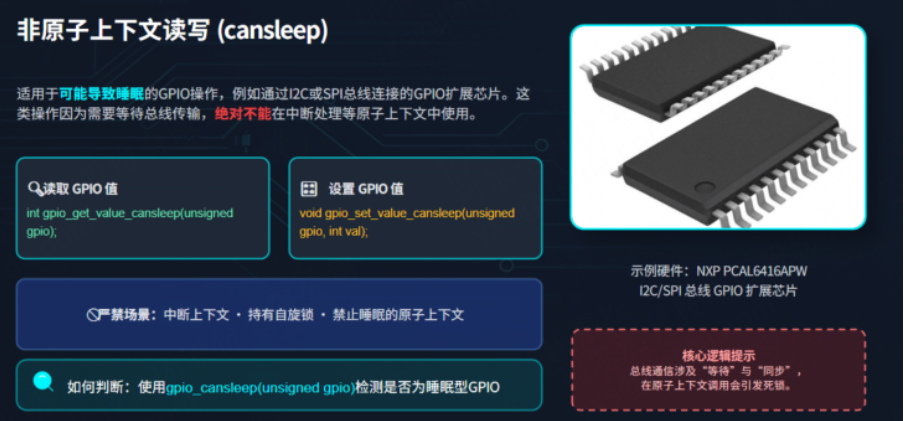
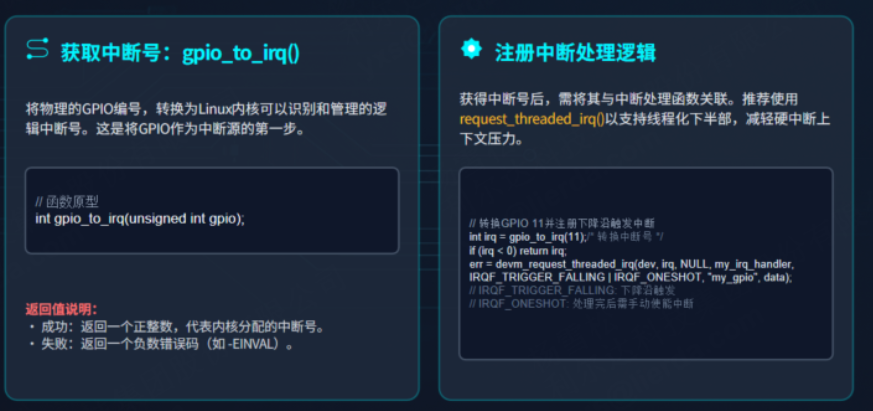

# 总目录
[[瑞星微RK3506_linux学习]]
路径：/home/linux/rk3506_linux6.1_sdk_v1.2.0/kernel-6.1/include/linux/gpio.h

```C++
static inline int gpio_get_value(unsigned int gpio)
{
        return __gpio_get_value(gpio);
}

static inline void gpio_set_value(unsigned int gpio, int value)
{
        __gpio_set_value(gpio, value);
}

static inline int gpio_cansleep(unsigned int gpio)
{
        return __gpio_cansleep(gpio);
}

static inline int gpio_to_irq(unsigned int gpio)
{
        return __gpio_to_irq(gpio);
}

static inline int irq_to_gpio(unsigned int irq)
{
        return -EINVAL;
}
```
# 学习目标：
- 掌握传统整数型 GPIO 接口的核心 API：`gpio_request()`/`gpio_free()`、`gpio_direction_input()`/`gpio_direction_output()`、`gpio_get_value()`/`gpio_set_value()`
    
- 理解该接口的局限性（如无属主信息、易冲突、不支持复杂配置）
    
- 能将基于整数接口的旧驱动代码，迁移到基于描述符的现代接口
    
- 学会在兼容旧内核的场景下合理使用传统接口

基于整数的接口最为人所熟知。GPIO用整数标识，GPIO上需要执行的每个操作都使用该整数。以下是包含传统GPIO访问函数的头文件：
```C
#include <linux/gpio.h>
```
使用步骤：
1. 注册：gpio_request （cat /sys/kernel/debug/gpio ）
    
2. 输出方向：gpio_direction_output
    
3. 电平配置：gpio_get_value
    
4. 中断：goio_to_irq

# 一、GPIO的申请和配置

## 1.1 申请GPIO
使用`gpio_request()`函数来申请并获取GPIO的使用权：

```C
int gpio_request(unsigned gpio, const char *label);
```

参数说明：

- `gpio`：要使用的GPIO编号
    
- `label`：给这个GPIO起个名字（比如在系统文件`/sys/kernel/debug/gpio`里显示的名字）
    

**注意**：必须检查返回值。返回0表示成功，负数代表出错。

## 1.2 释放GPIO

使用完GPIO后，用`gpio_free()`释放资源：

```C
void gpio_free(unsigned int gpio);
```

## 1.3 检查GPIO有效性 --- 对申请的检查

使用`gpio_is_valid()`提前确认GPIO编号是否合法：

```C
bool gpio_is_valid(int number);
```

## 1.4 设置GPIO方向

- **输入模式**：用`gpio_direction_input()`设置：
    
- **输出模式**：用
    

```C
int gpio_direction_output(unsigned gpio, int value);
```

- 0 → 初始低电平
    
- 1 → 初始高电平
# 二、GPIO值的读写

## 2.1 原子上下文（如中断处理）

这类GPIO直接通过内存访问（比如芯片内置GPIO），不会导致等待：

```C
static int  gpio_get_value(unsigned gpio) ---- 输入模式读取
void gpio_set_value(unsigned int gpio, int value);   ---- 输出模式设置电平
```
## 2.2 非原子上下文（如I2C/SPI总线）



这类GPIO需要等待操作完成（可能会暂停程序）：

```C
static int gpio_get_value_cansleep（unsigned gpio）; 
void gpio_set_value_cansleep（unsigned gpio，int value）;
```

**关键区别**：后者函数名带有`cansleep`，表示可能需要等待，不能在中断处理中使用。

# 三、GPIO转中断



## 3.1 获取中断号

用`gpio_to_irq()`将GPIO编号转为中断号：

```C
int gpio_to_irq(unsigned gpio);
```

## 3.2 注册中断处理

获取中断号后，用`request_irq()`或`request_threaded_irq()`注册处理函数：

```C
// 示例代码
int gpio_int = ...; // 通过设备树等获取的GPIO编号
int irq_num = gpio_to_irq(gpio_int); // 转换为中断号

// 注册中断处理函数（这里用线程式中断为例）
error = devm_request_threaded_irq(&client->dev, irq_num,
    NULL, my_interrupt_handler, // 无上半部，下半部是自定义函数
    IRQF_TRIGGER_RISING | IRQF_ONESHOT, // 触发条件：上升沿，单次触发
    input_dev->name, my_data_struct); // 中断名称和数据指针

if (error) {
    // 处理注册失败
}
```

**关键参数说明**：

- `IRQF_TRIGGER_RISING`：设置为上升沿触发
    
- `IRQF_ONESHOT`：确保中断处理完成后立即释放中断线