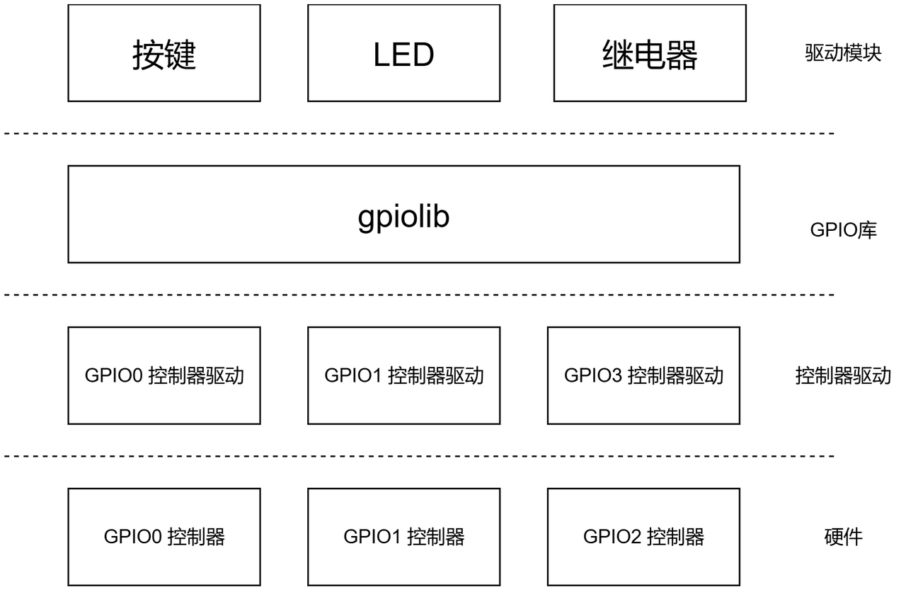
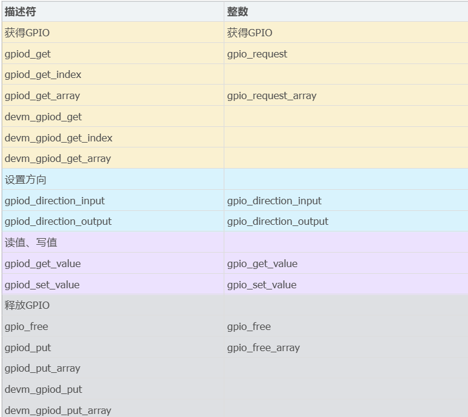
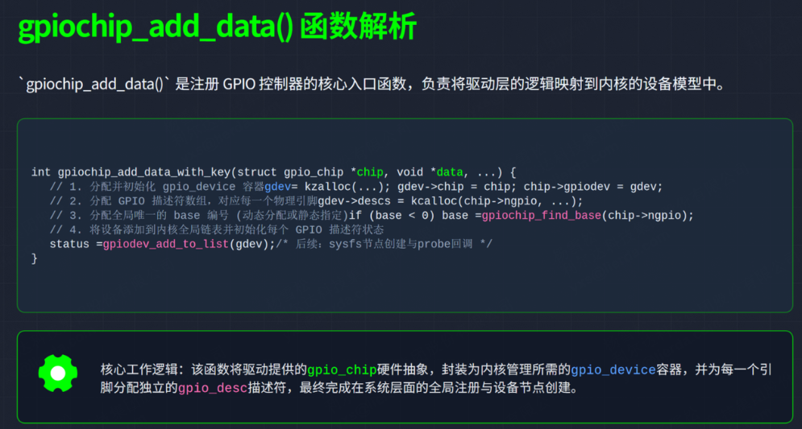

# 总目录
[[瑞星微RK3506_linux学习]]
GPIO控制器驱动编写其实就是三步走：

1. 根据芯片有多少个GPIO控制器，就创建多少个gpio_chip结构体（比如芯片有3个GPIO控制器，就建3个结构体）
    
2. 针对每个GPIO控制器的硬件寄存器，写出对应的操作函数（比如设置高低电平、读取状态这些功能）
    
3. 把这些gpio_chip结构体一个个注册到系统里，用gpiochip_add这个接口完成注册
    

这个注册函数实际是调用gpiochip_add_data，参数就是你写好的gpio_chip结构体。如果有多个GPIO控制器，就需要像循环一样逐个调用这个函数，把每个控制器的信息都挂载到系统里。
# 一、GPIO子系统的层次

## 1.1、GPIOLIB向上提供的接口对比
基于描述符的GPIO接口与基于整数的GPIO接口对比：
include/asm-generic/gpio.h

### 1.2.1、gpiochip_add_data
`gpiochip_add_data()`函数用于向内核注册一个GPIO控制器芯片(`gpio_chip`)，使其管理的GPIO引脚可以被系统使用。

# 二、重要的3个核心数据结构

