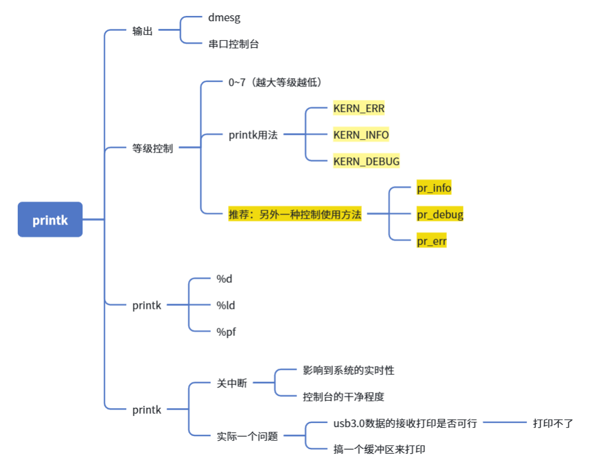
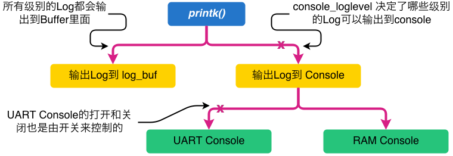
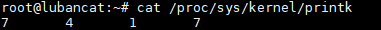
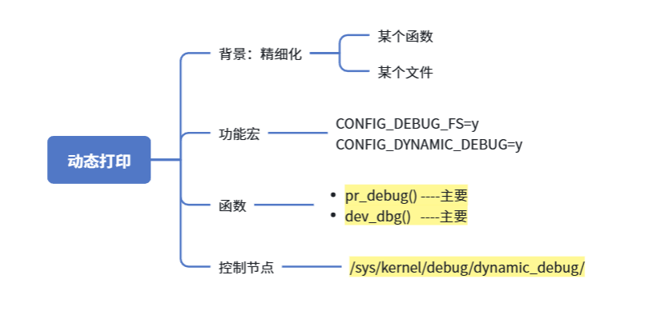

# 一、printk 说明
在开发`Linux device Driver`或者跟踪调试内核行为的时候经常要通过`Log API`来`trace`整个过程，`Kernel API printk()`是整个`Kernel Log`机制的基础`API`，几乎所有的`Log`方式都是基于`printk`来实现的。 当然，利用`printk`还有一些需要注意的地方，在详细讲述之前先分析一下`printk()`实现，大致流程如下图所示：

- 串口控制台：（右边分支）
    - 系统里面日志会自动输出前台
    - dmesg
    - 受日志等级的控制（但他控制不了咱们的LOG日志）
- ADB USB登录（左边分支）
    - dmesg
    - 缺点：log_buf（有大小）、环形buf（会循环覆盖，老的日志会被覆盖）



从上图可以看出，`printk`的流程大致可以分为两步：
学习笔记/picture/瑞星微RK3506芯片-Linux内核学习/19_驱动开发调试手段/printk打印流程.png
- 将所有`Log`输出到内核的`Log Buffer`，该`Log Buffer`是一个循环缓冲区，其地址可以在内核中用`log_buf`变量访问
- 根据设定的`Log`级别决定是否将`Log`输出到`Console`
基于以上内容，我们打印的`Log`最终会走向两个位置：
- `Log Buffer`：该`Buffer`里面的内容可以存储在`/proc/kmsg`
- `Console`：`Console`的实现可以有很多，目前我们用到的有`UART Console`（串口）和`RAM Console`。通向`UART Console`的`Log`会在对应的`UART`端口打印出来。

对于`Console Log`，不可避免的对系统性能有影响。所以对于`Console Log`设置了两道关卡
- 第一个是对`Log`级别进行过滤，只能输出高优先级的`Log`；
- 第二个是为`UART`设置单独的开关，在不必要的时候可以将其关闭以提高系统性能。这里提到了`Log`优先级，那什么是`Log`优先级呢？

# 二、printk 日志等级设置
Linux 内核为printk定义了8个打印等级，`KERN_EMERG`等级最高，`KERN_DEBUG`等级最低。在内核配置时，有一个宏来设定系统默认的打印等级 `CONFIG_MESSAGE_LOGLEVEL_DEFAULT`，通常该值设置为`4`，那么只有打印等级高于`4`时才会打印到终端或者串口。 `[kern_levels.h](https://git.kernel.org/pub/scm/linux/kernel/git/torvalds/linux.git/tree/include/linux/kern_levels.h?id=HEAD)`

```C
#define KERN_EMERG      KERN_SOH "0"    /* system is unusable 紧急事件，一般是系统崩溃之前的提示消息 */
#define KERN_ALERT      KERN_SOH "1"    /* action must be taken immediately 必须立即采取行动 */
#define KERN_CRIT       KERN_SOH "2"    /* critical conditions 临界状态，通常涉及严重的硬件或者软件操作失败 */
#define KERN_ERR        KERN_SOH "3"    /* error conditions 报告错误状态，经常用来报告硬件错误 */
#define KERN_WARNING    KERN_SOH "4"    /* warning conditions 对可能出现问题的情况进行警告，通常不会对系统造成严重问题 */
#define KERN_NOTICE     KERN_SOH "5"    /* normal but significant condition 有必要的提示，通常用于安全相关的状况汇报 */
#define KERN_INFO       KERN_SOH "6"    /* informational 提示信息，驱动程序常用来打印硬件信息 */
#define KERN_DEBUG      KERN_SOH "7"    /* debug-level messages 用于调试信息 */ 
```
一个有`8`个等级，从`0`到`7`，优先级依次降低。 通常通过修改`/proc/sys/kernel/printk`来设置`printk`打印。
```C
cat /proc/sys/kernel/printk
7       4       1       7

//关闭所有的内核打印
echo 1 > /proc/sys/kernel/printk

cat /proc/sys/kernel/printk
1       4       1       7
```


`4`个值的含义依次如下：
- `console_loglevel`（阀门）：当前`console`的`log`级别，只有更高优先级的`log`才被允许打印到`console`；
- `default_message_loglevel`（默认printk函数的等级）：当不指定`log`级别时，`printk`默认使用的`log`级别；
- `minimum_console_loglevel`（命令行能设置的最大等级）：`console`能设定的最高`log`级别；
- `default_console_loglevel`（默认值）：默认的`console`的`log`级别。

另外，关于`printk`格式化字符串形式，参考`[printk-formats.txt](https://www.kernel.org/doc/Documentation/printk-formats.txt)`
使用`dmesg`命令，可以显示之前所有的打印信息，常配合`grep`来查找历史纪录。


# 三、动态打印
区别：动态打印，-----> 默认不打印默认不会输出到控制台、log buff

- 好处：日志控制会更加的**精准**。
- 背景：printk的日志等级-全局，我就把整个日志等级打开，日志量偏多，干扰太多。
- 场景：**高速设备模块调试（不能商品化）**。 （正常运行，不需要日志，调试时候需要日志定位问题，但printk影响性能、干扰太多）
  

- 场景补充：你开发了一个驱动，写驱动，你要留足以分析当前驱动的运行状态的日志。
    - 不仅要开发功能，你还有给自己留证据。
    - 为了不影响整机的性能，只能选动态打印
  

## 一、deconfig 功能配置

--> 配置的是板卡的deconfig
所在目录：~/rk3506_linux6.1_sdk_v1.2.0/kernel-6.1/arch/arm/configs/vanxoak_hd_rk3506g_hmi_nand_defconfig
```C
CONFIG_DEBUG_FS=y
CONFIG_DYNAMIC_DEBUG=y
```
## 二、dynamic debug参数介绍
目录：`Documentation\admin-guide\dynamic-debug-howto.rst`
if CONFIG_DYNAMIC_DEBUG is set, then all
动态打印：（printk）
- ==pr_debug()----主要==
- ==dev_dbg() ----主要==
- print_hex_dump_debug()
- print_hex_dump_bytes()
- calls can be dynamically enabled per-callsite.


|      | 参数<br> | 作用<br>                                                             |
| ---- | ------ | ------------------------------------------------------------------ |
|      | p      | ==enables== the pr_debug() callsite.                               |
|      | f      | Include the function name in the printed message                   |
| <br> | I      | Include line number in the printed message                         |
|      | <br>m  | Include module name in the printed message                         |
|      | t      | Include thread ID in messages not generated from interrupt context |
|      | _      | No flags are set. (Or’d with others on input)                      |

## dynamic 动态打印转为printk正常打印
原厂经常会让你对某个.c 加下面这四句话
动态打印 ----> printk
`c`文件开头添加如下代码：
```C
#undef dev_dbg
#define dev_dbg dev_info
#undef pr_debug
#define pr_debug pr_info
```