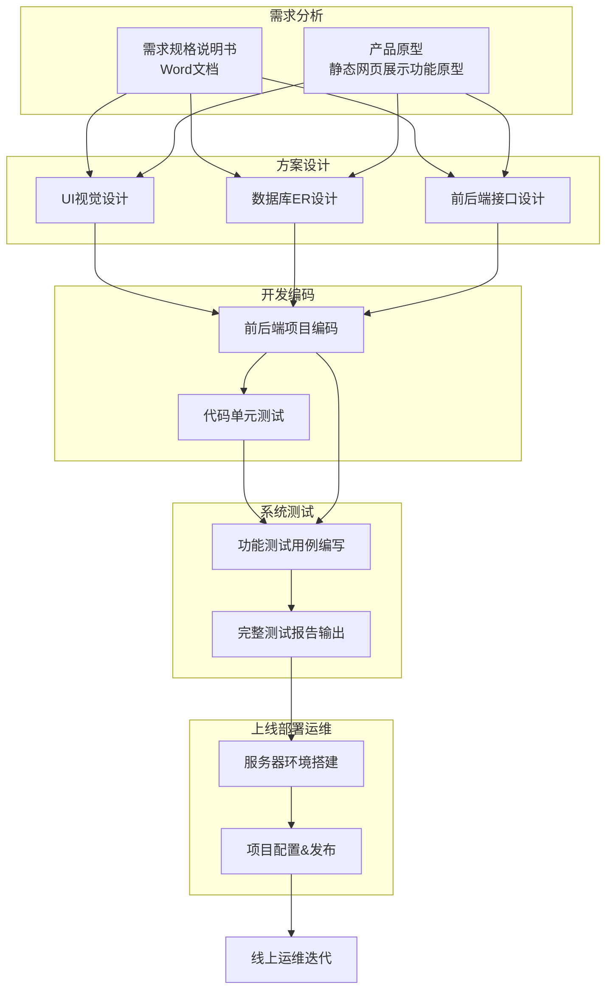

# 软件开发流程

```mermaid
flowchart TB 
	%% 需求阶段 
	subgraph 需求分析 
		A1[需求规格说明书<br/>Word文档]
		A2[产品原型<br/>静态网页展示功能原型] 
	end 
	%% 设计阶段 
	subgraph 方案设计 
		B1[UI视觉设计] 
		B2[数据库ER设计] 
		B3[前后端接口设计] 
	end 
	%% 开发编码 
	subgraph 开发编码 
		C1[前后端项目编码] 
		C2[代码单元测试] 
	end 
	%% 系统测试 
	subgraph 系统测试 
		D1[功能测试用例编写] 
		D2[完整测试报告输出] 
	end 
	%% 部署运维 
	subgraph 上线部署运维 
		E1[服务器环境搭建] 
		E2[项目配置&发布] 
	end 
	%% 收尾闭环节点 
	F[线上运维迭代] 
	%% 流程连线（全部指向具体节点，杜绝子图直接连线导致偏移） 
	A1 --> B1 
	A1 --> B2 
	A1 --> B3 
	A2 --> B1 
	A2 --> B2 
	A2 --> B3 
	B1 --> C1 
	B2 --> C1 
	B3 --> C1 
	C1 --> C2 
	C2 --> D1 
	C1 --> D1 
	D1 --> D2 
	D2 --> E1 
	E1 --> E2 
	E2 --> F
```

